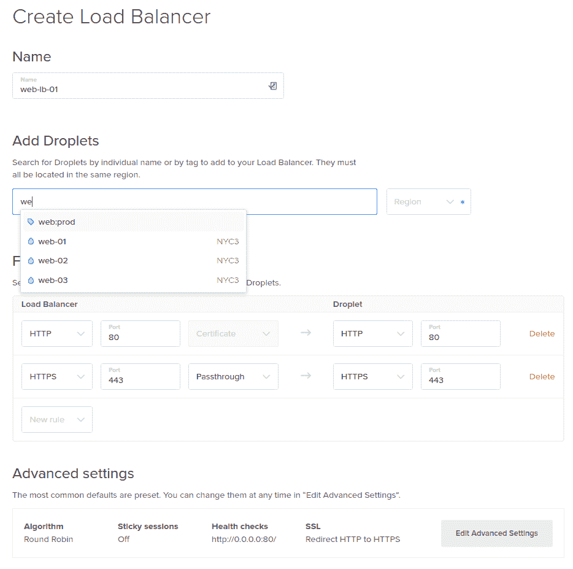

# DigitalOcean 现在提供负载平衡服务

> 原文：<https://thenewstack.io/digitalocean-upgrades-load-balancing/>

云服务提供商 [DigitalOcean](https://www.digitalocean.com/) 已经推出了负载平衡器，这是一项为客户提供的服务，用于在其基础设施中分配流量，以实现其生产工作负载的 100%正常运行时间。

DigitalOcean 首席执行官 Ben Uretsky

“交付将会很容易，”DigialOcean 的首席执行官 [Ben Uretsky](https://www.linkedin.com/in/benuretsky/) 在三藩市的一次采访中说。"本质上，你拉进三个领域，你就开始运行了."负载平衡器的价格为每月 20 美元。

乌雷特斯基和去年 6 月[加入团队的首席技术官](https://thenewstack.io/digitaloceans-new-cto-doesnt-process-sake-process/)茱莉亚·奥斯丁表示，今年会有很多产品加入；[负载平衡器](https://www.digitalocean.com/products/load-balancer/)是第一个。

Uretsky 解释说，从早期建立一个最佳实践环境可以让你随着成长而扩展。他说，对于刚起步的人来说，负载平衡是朝着这个方向迈出的一大步。一些企业只是将所有东西都转储到一台服务器上就可以启动并运行，但是这在系统中建立了技术债务。然后当业务增长时，昂贵的问题就暴露出来了。

“他们可以建立自己的负载平衡器，”奥斯汀说，“但谁愿意这样做。去构建你的应用程序；我们会让一切保持最新。我们抓到你了。”

Julia Austin，DigitalOcean 首席技术官

根据 Uretsky 的说法，DigitalOcean 的服务目标是既面向需要一台或几台虚拟服务器的个人，也面向需要可靠、强大基础设施的生产企业。“顾客的规模从蚂蚁到恐龙都有，”他说。

大约一半的客户出于个人需要使用 DigitalOcean，从运行个人博客到《我的世界》服务器，再到在一个受限制的国家设置 VPN 访问网飞。他们的许多客户都是开发人员，他们想要一个开发环境来学习一门新语言或尝试一些工作之外的新功能。

对于这些开发人员来说，最低的成本(0.007 英镑/小时，仅在“小滴”或虚拟服务器实际使用时收费)和收费的透明性意味着他们可以启动服务器，加载他们的代码，然后离开。DigitalOcean 网站不仅有博客和教程，还有许多“一键操作”的环境，这些环境都是预先配置好的，随时可以使用。

## 避免技术债务

“你正在试图搞清楚你的项目的下一步,”乌雷特斯基解释道,“如果你不想浪费时间来设置和布置环境，数字海洋可能值得一看。”。Node.js 、 [WordPress](https://wordpress.org/) 、Python、MySQL 和 PHP 都是其最流行的预配置环境。

在天平的另一端是企业，从小规模，如需要网站的美甲沙龙，一直到从基于网络的服务、任何“即服务”产生收入的在线公司，当然还有移动应用程序。

据该公司称，处于“恐龙”端的大型公司已经根据 DigitalOcean API 自动化了他们的整个基础设施，并且每月花费超过六位数的费用来虚拟化他们的整个后端。今天发布的负载平衡器允许这些客户在高可用性配置中运行。

奥斯汀解释说，他们面临的挑战是如何带来强大的功能，但又让它变得如此简单，任何人都可以利用它。使用 DigitalOcean 的公司不需要整个 IT 部门或开发/运营团队来正确运作。例如，Droplets 可以由一个人安装和运行。

“如果你是技术人员，想了解细节，我们会给你工具，”她说。“但如果你不是，你不必。它的运行无需干预。”

毫无疑问，Uretsky 说，云和虚拟化是目前构建应用程序的更聪明的方式，但另一方面是后端的复杂性。“一家刚刚起步的公司不需要投资裸机，”奥斯汀补充道。

该公司专注于用户体验，让入门变得“非常简单”，但也在价格和性能方面构建了可扩展性，一直到企业级功能。

## 人工孵化的鱼苗或小鸟

DigitalOcean 最适合刚刚起步的公司，他们没有在硬件或遗留系统上投入时间。软件即服务(SaaS)公司和初创公司是他们的目标受众。奥斯汀说她的部分任务是建立一个销售团队。迄今为止，它们的增长是有机的。

去年，[启动了孵化项目](https://thenewstack.io/digitalocean-offers-lift-startups-accelerator-program/)，为初创公司提供风险投资。Hatch 提供培训、指导、优先支持和其他创始人、加速器和投资者的社区，以及每年 10 万美元的诱人数字海洋信用。

它计划为 bootstrap 公司推出一个类似的项目，Uretsky 认为这些公司会更重视 10 万美元的信贷。这将是一个独特的产品；其他云公司也有孵化器项目，但它们和 Hatch 一样，需要风投的支持。乌雷特斯基说，由于 Hatch 计划得到了压倒性的积极回应，该计划一直在增加新的风险投资公司，并吸引比现有客户更大、更成熟的公司。他们希望在今年晚些时候启动 bootstrap 计划。

乌雷特斯基和奥斯汀的团队有一个目标。“我们希望新公司在创办公司时，将我们视为理想之地。GitHub 是你存储代码的地方，Twillio 是你给用户发消息的地方，Stripe 是你处理支付的地方，DigitalOcean 是你运行应用的地方。”

DigitalOcean 是新堆栈的赞助商。

通过 Pixabay 的特征图像。

<svg xmlns:xlink="http://www.w3.org/1999/xlink" viewBox="0 0 68 31" version="1.1"><title>Group</title> <desc>Created with Sketch.</desc></svg>