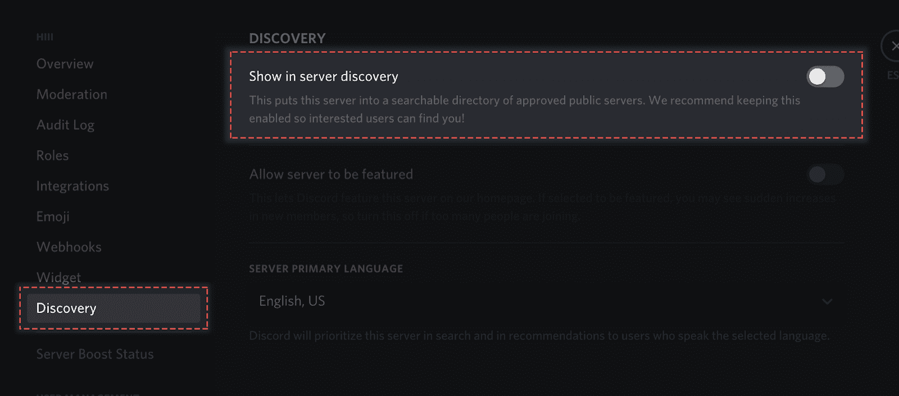
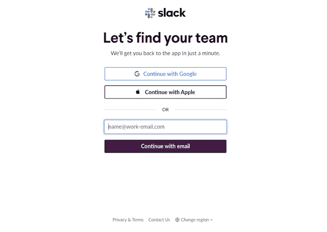
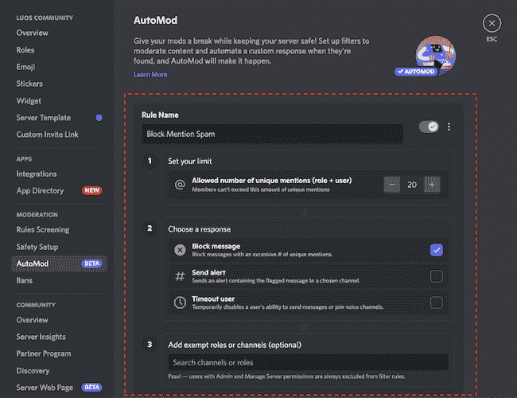
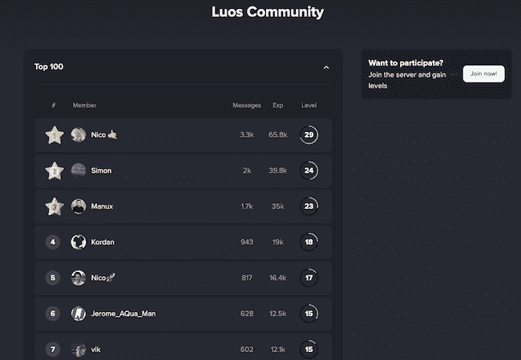
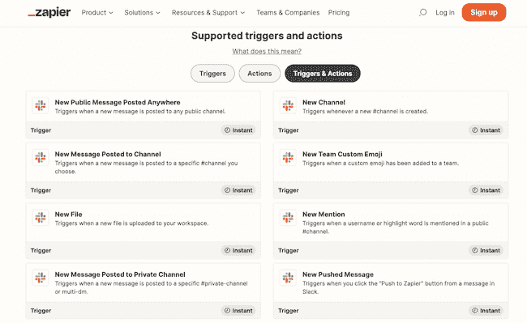

# 不和谐与懈怠:哪个对你的团队有利？

> 原文：<https://thenewstack.io/discord-vs-slack-which-is-right-for-your-team/>

作为一个项目团队，围绕一个想法开发一个社区的愿望肯定不止一次出现过。它允许你集中关于你的项目、你的观众、他们的问题以及如何解决它们的知识。这也让你可以与理解你所做的社区成员直接交流，并从互相帮助中获益。

除了开源项目本身之外，我们与 Luos 微服务协调器(orchestrator)的一个主要问题是了解嵌入式和边缘领域的开发人员所面临的期望和问题。我们需要建立一个社区与他们交流，让他们互相学习和帮助。

我们知道我们需要一个工具来与我们的社区交流，市场上有两个主要工具: [Discord](https://discord.com/) 和 [Slack](https://slack.com/) 。虽然我们觉得两者都不错，但我们不能仅仅通过阅读他们的文档和营销材料来做出决定。

所以我们决定通过尝试这两者来做一个 A/B 测试。

## 了解和理解你的观众的习惯

了解和理解你的观众的习惯是第一个关键因素。

在我们的案例中，我们通过确保这个社区看起来和感觉起来都是嵌入式和边缘开发人员的好去处来构建这个社区。团队中的许多人都是开发人员，他们与我们分享想法，以便我们始终与目标受众保持联系，而不是致力于对我们来说“太营销废话”的想法。

对你的社区消费习惯进行或咨询其他研究，以了解他们如何互动，访问和消费信息，这对你作为社区建设者来说是一个真正的好处，因为你的行为将为社区做出贡献。

## 不和谐与懈怠:极客与企业

首先要做的是了解你的受众的习惯。他们通过什么渠道或工具交流信息？

我们在三个月的时间里同时测试了不和谐和懈怠，观察到不和谐与懈怠相比发生了戏剧性的重大变化。

2020 年被 Salesforce 收购的 Slack 就是一个很好的例子，它是在企业世界中变得更加流行的消息应用程序，试图让电子邮件过时。

至于不和谐，它有不同的焦点:游戏玩家、极客和工作时间以外的娱乐。

给定每个工具的目标定位，我们的受众的知识使 Discord 在我们的目标优势列表上比 Slack 多了一分。

要找出哪种工具最适合你的社区，你可以先通过 Discord 的“发现”功能，看看其他服务器是否与你的主题相关。如果是的话，这表明你对自己的工作领域感兴趣。第二，用 LinkedIn 问你想感兴趣的人用什么平台。这会给你一个有代表性的样本来评估。

在我们的案例中，根据我们的统计，我们的大多数观众已经有了一个不和谐的账户。

## 不和谐档案的匿名性

重要的一点是你的成员的身份。对我们的观众来说，认同和匿名是积极的。

对于许多人来说，这些社区在他们的空闲时间被咨询，个人希望脱离他们在现实世界中的生活，通常更喜欢假名而不是他们的名字/公民的名字。这种匿名化允许每个人参与交流，而无需添加与维护个人声誉或工作关系相关的过滤器。

这种匿名虽然被归类为一种优势，但也可能需要适度的问题。一些不太在意自己形象的议员可能会失礼。审核工具将会很有用(稍后在审核工具部分会有更多的介绍)。

在社区创建者方面，有许多工具可以分析你的受众，根据他们在不和谐或懈怠时的留言了解他们的兴趣和问题，同时保持匿名。

## “发现”功能

除了简单的邀请链接，Discord 还提供了其他方式来发现服务器，如 [登录页面](https://discord.com/servers/luos-community-902486791658041364) 、Discord Discovery 和 [外部网站](https://top.gg/en/servers/902486791658041364) ，这些网站也引用您的社区，帮助建立其受众。

激活发现模式—不和谐

除了外部网站之外，Slack 不提供本地搜索引擎来搜索服务器。这个人需要提前知道要加入哪个服务器，并且必须能够访问它。Slack 用来连接其他空间的主要功能是帮助找到您的团队的功能。它非常面向企业。

寻找工作空间—空闲时间

## 简化登录

在 Slack 上，一个人需要为每个 Slack 工作空间创建一个带有电子邮件和密码的帐户。Discord 的好处是，对于同一个 Discord 账号，一个成员可以通过接受正在加入的社区的规则，加入任意多的服务器。比较简单。

## 审核工具

当一个社区开始快速发展时，比如 Luo(每月增长 50%)，你就需要准备好控制不受欢迎的/行为不端的成员。

这就是这两个平台之间的巨大差异。在 Slack 的理念中，加入工作空间的人是受信任的人邀请的成员。因此，我们在懈怠中看到的本土中庸特征要少于不和谐。

在 Discord 中，一个名为 AutoMod 的自动机器人解决了许多与审核相关的问题，例如阻止垃圾邮件、主动提及(通知)、粗俗词汇、NSFW(对工作不安全)内容和被 Discord 归类为垃圾邮件的帐户。这个最新的特性很有趣，是 Slack 中没有的。

每个 Discord 帐户都有一个应用程序基于其在不同服务器上的活动进行的评估。如果该帐户被其他服务器禁止或归类为垃圾邮件，当它向您的社区发送消息时，也会被归类为潜在的垃圾邮件，有时会隐藏消息的内容。

来自垃圾邮件发送者的不和谐的隐藏消息

它很容易配置，并大大减少了不必要的消息发送和交换的数量。例如，通过将此功能与更全面的社区登录设置相结合，您可以要求可信终端(移动)验证和 2FA(双因素身份验证)。

## 参与游戏化

这里的目标不是把你的社区变成一个商场，而是想办法奖励或吸引你的成员，鼓励他们参与进来。在不和谐中，我们添加了一个由 MEE6 支持的外部机器人，允许我们将交流游戏化。每个成员根据他们在社区中的参与程度被分配一个级别。您发送的消息越多，您获得的等级就越多。

第六届颁奖台不和谐

在 Slack 中，通过像 Zapier 或 IFTTT 这样的外部连接，您将能够免费配置简单的操作来欢迎新成员或为某个特定事件(生日、在社区中的天数等)祝贺某人。).

Zapier 可用于 Slack 的触发器和动作

## 外部连接和应用程序(机器人、消息、报告等。)

在这两种情况下，Slack 和 Discord 都受益于工具的外部连接来定制他们的社区。在这种情况下，Slack 在 [Slack 应用目录](https://slack.com/apps) 中有超过 2500 个应用可用，Discord 在几周前推出的 [Discord 应用目录](https://support.discord.com/hc/en-us/articles/9360431966359) 中有超过 2300 个应用可用。

在我们的例子中，当一个成员在我们的 Discord 上发帖时，我们使用机器人自动为他们分配一个角色(communicator role ),并在他们到达我们的服务器时发送一些消息来欢迎他们并把他们介绍给我们的服务器。角色的分配由 MEE6 管理，消息的发送由我们自己编写的机器人处理。

要衡量我们社区的发展，Discord 开发者门户控制面板非常有用。

Slack 管理面板给出了一些统计数据，但更多的是关于社区参与度，而不是保持度，因为它更关注根据渠道发送和阅读的消息数量。

无论使用什么平台，参与度和 UX 都是至关重要的(死服务器综合症，没有人可以交谈的无休止的对话)

参与本身不能根据平台来判断，因为它来自社区创建者提出的想法。另一方面，这两个平台不提供相同的经验和工具箱来有效地进行这种合作。

每一个可能对你的社区有害的影响，例如死亡服务器效应或加入一个什么都没发生的社区的印象，都可以通过编程的机器人来避免，这些机器人启动私人消息讨论，鼓励成员畅所欲言。

加入一个大型社区(Luos 大约有 7000 名成员)的主要影响之一是，你可能会觉得自己面临着无休止的对话，不知道如何介入和畅所欲言。对于这一点，Discord 通过开发论坛功能找到了答案。通过实现它，您可以将讨论通道专用于类似论坛的主题组织。成员可以快速看到他们感兴趣的话题，并与其他人进行互动。

Discord 提供了大量定期更新，以定制其社区并改善用户体验。

一个目前处于测试阶段的是主页功能，它允许一目了然地看到 Discord 频道上的交流，正在组织的活动以及当前连接的成员。

Discord 最近还发布了一个服务器管理员可以直接访问的外部应用程序目录。例如，有些应用程序允许社区游戏化，检索统计数据和程序机器人，如发起测验。

## 结论

了解你的受众和测试可能是回答在不和谐与懈怠之间做出选择的最佳结论或解决方案。

根据我们的经验，我们相信不和谐让我们比 Slack 更快地发展我们的社区。

有了 Discord 提供的最新功能，社区体验只会变得更好。我们邀请您加入我们的 Discord 社区，看看我们是如何实施这里介绍的一些方法的，并参与对话:。

<svg xmlns:xlink="http://www.w3.org/1999/xlink" viewBox="0 0 68 31" version="1.1"><title>Group</title> <desc>Created with Sketch.</desc></svg>