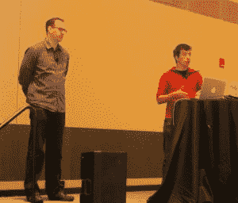

# 在发现希格斯玻色子后，CERN 将 OpenStack 与 Kubernetes 集成在一起

> 原文：<https://thenewstack.io/discovering-higgs-boson-cern-integrates-openstack-kubernetes/>

一个科学项目的美妙之处在于，它迫使参与者以新的、未尝试过的方式解决更大的问题，不管这个项目是以绕地球运行的模块为中心，还是以地下狭窄的环形走廊中的亚原子粒子为中心。太空计划促使美国宇航局创造新的方法来设想计算机的工作方式。“软件”是美国宇航局工程师想出来的一个口头禅，指的是做机械工作的数字程序。肯尼迪航天中心和喷气推进实验室外装满服务器的集装箱成为世界上第一批云的种子。

在瑞士，欧洲核子研究组织(CERN)运营着 T2 大型强子对撞机。大约五年前，LHC 的研究人员证实了一种理论粒子的存在，这种粒子就是希格斯玻色子，它是由亚原子水平的对称性理论预测的。

然而，欧洲核子研究中心也抽出时间在计算机领域进行创新。该组织目前将其数据中心设施外包给几家公司，包括一家利用真正创新的冷却系统的公司，该系统涉及将其服务器完全浸入矿物油中。

现在，CERN 与 Rackspace 合作，Rackspace 是第一家从 NASA 云实验中脱颖而出的商业公司，[OpenStack 由此诞生](http://readwrite.com/2010/07/18/openstack-rackspace-and-nasa-n/)，CERN 为 open stack 提供了一个测试平台，以通过前一平台的原生 [Magnum 组件](https://wiki.openstack.org/wiki/Magnum)与 [Kubernetes](/category/kubernetes/) 开源容器编排软件集成。他们在不分裂原子的情况下解决了积分问题。

在 2015 年底，CERN 需要一种方法来有效地在整个欧洲的数据中心(包括从其他服务提供商租赁的数据中心)中分配工作负载。正如 CERN 工作人员 [Ricardo Rocha](https://www.linkedin.com/in/ricardo-rocha-739aa718/?ppe=1) 周三在波士顿举行的 2017 年 OpenStack 峰会上告诉与会者的那样，Magnum 是当时少数几个将容器编排与 OpenStack 集成的选择之一，因此它在 2016 年初开始在 Magnum 的基础上建立容器服务。

“梦龙也有可能选择集装箱发动机。这对我们来说非常重要，”罗卡说。“我们有一群人在推动 Kubernetes 我们有已经在使用 Mesos 的人群；其他人只是使用普通的 Docker，他们希望依赖 Docker API，Swarm 在这方面有很大的潜力。我们希望它易于使用，这样人们就不必了解如何配置集群的复杂模板。”

Rackspace 的杰出建筑师阿德里安·奥托帮助 CERN 启动了这个项目。周三在波士顿向与会者发表演讲时，奥托回答了[我们在本次会议预告中提出的](https://thenewstack.io/openstack-summit-2017-will-kubernetes-stealing-show/)一个问题:Magnum 发生了什么？

“Magnum 是一项 OpenStack 服务，允许您作为云用户创建一个运行容器编排引擎的集群，”Otto 说道。“它允许您使用现有的云凭据来创建这些集群。因此，如果您已经是 OpenStack 用户，并且正在创建虚拟机或卷或其他云资源，您可以使用用于创建这些资源的相同帐户来创建这些群集。您可以选择创建哪种群集，因为实际后端是模块化的。”

这个选择给了 CERN 在集群中混合容器编排器的选择。Rocha 告诉与会者，虽然该组织目前运营着大约 40 个 Kubernetes 集群，但它还运营着大约 20 个 Docker Swarm 集群和 5 个 Mesosphere DC/OS 集群。

Otto 解释了 OpenStack 可能为容器化提供更完整的解决方案，而不仅仅是作为 IaaS 提供商的 orchestrator 的另一个主要原因:Magnum 支持多租户。([hyper . sh 项目也试图为 Kubernetes 提供多租户](https://thenewstack.io/hyper-sh-mixes-containers-hypervisors-something-called-hypernetes/)，但它是通过混合来自 Magnum 和其他 OpenStack 组件的代码来实现的)。

“所以你可以拥有并行的、相同时间的或不同类型的集群，”Otto 继续说道，“但是它们保证永远不会彼此共享同一个内核。这对于安全安装非常重要。由于 Magnum 的工作方式，您不仅可以在控制层(您可能已经习惯了您最喜欢的流程编排系统)实现多租户，还可以在整个云中实现多租户。”

OpenStack 老手习惯于使用 [Heat 组件](https://wiki.openstack.org/wiki/Heat)通过模板来配置资源。正如 Otto 解释的那样，这是一个文件工件，呈现给 orchestrator 以产生一个堆栈。“这种模式的缺点，”他继续说道，“是它没有以一种可被所有云用户重用的方式来表示。为了生成堆栈，每个用户都需要有自己的文件工件。”

这是因为 OpenStack 最初没有预见到在环境中创建环境的需求，其中包含的环境是常见和短暂的事物的模型，而不是独特、特殊和不可摧毁的。因此，对于 Magnum，OpenStack 引入了一个 API 资源，管理员可以将其作为公共资源公开。然后，其他用户可以借用该资源来生产集装箱化集群。

是的，这可能不是新信息，至少就已发表的文献而言是这样。但是对于一些正在研究为什么 orchestrator 可能需要基础架构堆栈以及为什么 orchestrator 可能需要基础架构堆栈的人来说，旧的信息为新的解决方案指明了方向。虽然 Kubernetes 经常作为基础设施解决方案提供，包括来自[open stack 的一些好朋友](https://thenewstack.io/self-driving-infrastructure-makes-internet-secure/)，但许多组织需要建立像公共云而不是像谷歌(具体来说，像谷歌内部)那样工作的私有云。

我问 Ricardo Rocha，CERN 对其基础设施进行了哪些创新，这些创新的好处可能会在上游与社区的其他人分享。

通过 CERN 与 Rackspace 联合开发的 OpenLab，该组织现在正在为 Magnum 项目做上游贡献，Rocha 回应道。“实际上，我们在 CERN 有一位合作人员[ *[Tim Bell](http://superuser.openstack.org/articles/openstack-magnum-on-the-cern-production-cloud/)* ]，他成为了 Magnum 的一部分，并一直在贡献我们内部需要的所有功能。

然后还有这些附带项目，比如与 [Cinder](https://libcinder.org/) 的集成，对 [libstorage](https://thenewstack.io/emc-pushes-alternative-dockers-persistent-storage-volumes/) 的贡献，这是 Swarm 用来提供 Cinder 支持的库。我们已经为 Kubernetes 的 OpenStack 驱动程序做了几个补丁。我们正在深入社区与他们合作。这对 OpenStack 非常有效，我们希望对其他项目也这样做。"

这是一个坚定的，坚实的，显然是一个工作的例子，一个组织不仅致力于公共利益，而且改善人类。哦，对了，还有 Rackspace。用工作代码回答用户的询问，就像开源软件设计的那样。也许某些国家缺乏太空计划，但它可能不再需要一个国家来推动数据中心的发展。

特征图像:希格斯玻色子衰变到四μ子(CERN)。

<svg xmlns:xlink="http://www.w3.org/1999/xlink" viewBox="0 0 68 31" version="1.1"><title>Group</title> <desc>Created with Sketch.</desc></svg>