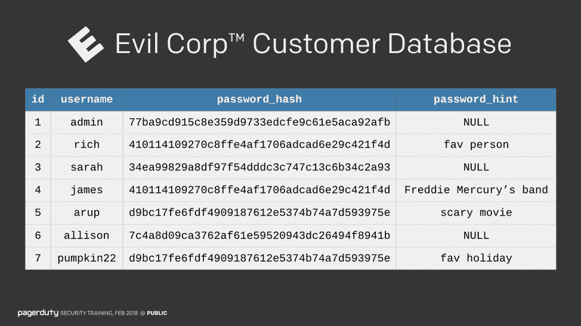
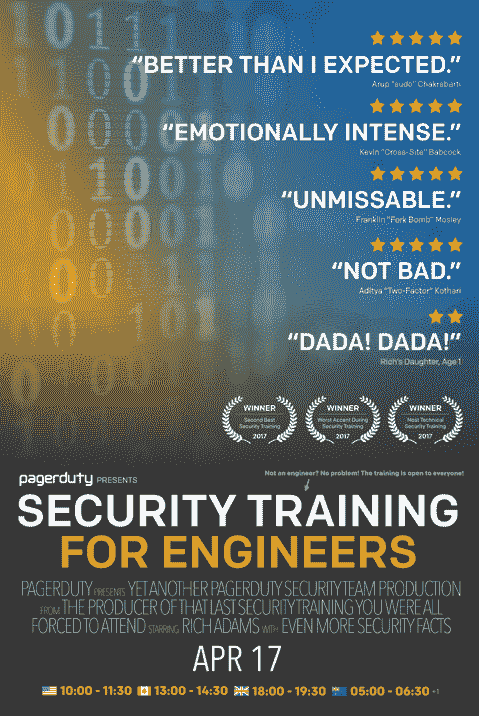
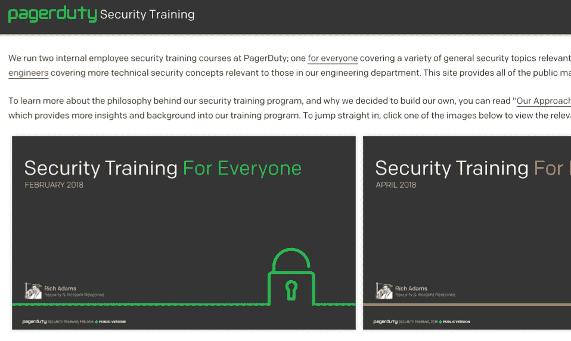

# 传播知识:PagerDuty 开源其安全培训

> 原文：<https://thenewstack.io/disseminating-knowledge-pagerduty-open-sources-its-security-training/>

这是由[page duty](https://www.pagerduty.com/)发起的关于[传播事故响应知识](https://thenewstack.io/pagerduty-open-sources-its-incident-response-best-practices/)的系列文章中的第二篇。

 [里奇·亚当斯

Rich Adams 是 PagerDuty 的安全和事故响应高级工程师。在加入 PagerDuty 之前，他从事过广泛的系统工作，从为 Gracenote 和 Sony 开发音乐应用程序，到为航空业开发行李系统。尽管他坚持说如果你的包丢失了，那也不(完全)是他的错。](https://www.pagerduty.com/) 

安全是硬道理。

您可以让整个部门致力于保护您的组织免受攻击者的攻击，利用行业标准的最佳实践锁定他们的所有应用程序，并防御持续的威胁。保卫公司是一项永无止境的任务；你总是保持警惕。但是攻击者只需要通过一次。就一次。他们将不可避免地通过最薄弱的环节进入——不幸的是，这些环节通常是你的员工。

您可以让尽可能多的安全工程师来解决这个问题，但事实是，针对攻击者的最佳整体防御是让您组织中的每个人都接受过针对最常见的安全威胁的良好培训。当您的所有员工都接受了安全工程师的基本培训时，事情就变得简单多了。

但是和保安一样，保安培训也很辛苦。

在我的职业生涯中，我参加过许多类型的强制性安全培训。大多数人登录一个网站，花两个小时观看几个虚构的、令人畏缩的角色扮演场景的视频。

然后我被迫回答了一组选择题。踢球者？为了找到正确答案，我尝试了无数次。不足为奇的是，我还没有遇到过这样的人，他们觉得自己的时间花得值，他们学到了任何东西，更不用说任何有用的东西。

即便如此，我也能理解为什么这种类型的培训在整个行业都很普遍:它们不需要太多的前期投资，而且让公司出于合规原因跟踪参与情况变得很容易。但是，尽管他们可能勾选了合规性复选框，但如果您的员工没有学到任何东西，您公司的安全状况就没有得到改善。

## 传呼机值班的安全培训

我们想在 PagerDuty 以不同的方式做事，所以我们决定建立自己的 [安全](https://sudo.pagerduty.com/) [培训](https://sudo.pagerduty.com/) 课程。我们没有遵循通常的安全培训计划，也没有给员工一堆他们需要遵守的规则，而是专注于教导我们的员工攻击者是如何思考的。简而言之，我们发现展示比讲述更好。

我们的培训建立在几个关键原则上，但我们最终只是希望人们集中注意力，而不觉得这是一件苦差事，并觉得他们的时间花得很值，他们确实学到了一些新东西。(有关我们的原则和培训结果的更多详情，请查看“ [我们的员工安全培训方法](https://www.pagerduty.com/blog/security-training-at-pagerduty/) 。))

我们遵循的原则是:

1.  教为什么，而不仅仅是什么；
2.  不要回避技术细节；
3.  让任何技能水平都可以使用它；
4.  搞笑是没问题的。

作为我们如何应用这些原则的快速示例，让我们来看看密码。大多数安全培训和其他文章都会告诉你应该总是选择长的随机密码，并且永远不要与任何人分享。

但是有多少培训课程教你如何破解密码呢？这就是我们采取的方法——我们发现，向我们的观众展示攻击者破解密码是多么容易，比仅仅告诉我们的员工选择“好”密码有更大的影响。

培训结束后，我们的大多数同事都告诉我们，看到密码被破解是多么地令人大开眼界，但我们知道培训真的很成功，因为他们中的许多人不久后就改用密码管理器来管理所有密码。

用简单的例子来教员工如何破解密码，比简单地告诉他们选择好的密码要有效得多。

另一个例子:作为一名员工，你收件箱里最害怕收到的邮件之一并不是复杂的网络钓鱼企图；这是一份 90 分钟强制性会议的邀请函，会议名为“每个人的安全培训”仅仅阅读电子邮件的主题就足以让人们的眼睛变得呆滞，因为他们对行业内的安全培训通常需要什么有着先入为主的观念。

虽然发送这样的电子邮件是不可避免的，但我们希望展示我们有趣的一面，并消除任何担心这将是一次正常、无聊的训练。所以我们制作了一些假的电影海报，挂在我们的办公室周围，因为增加一点乐趣可以激发培训的热情，这意味着人们更容易注意到。

电影海报风格的定制海报张贴在传呼台办公室周围，宣传培训内容。

你可能在想，“这很好，但是你为什么要告诉我这些呢？这对我有什么影响？”不同于大多数其他组织，他们更喜欢保持内部安全培训的私密性，因为他们害怕让攻击者知道他们是如何培训员工的，我们在 PagerDuty 采取了不同的方法。

就像我们的事件响应文档一样，我们看到了与整个社区分享我们的内部实践的巨大好处。因此，不仅我们的内部 [安全事件响应指南](https://response.pagerduty.com/during/security_incident_response/) 是开源的，我们的安全培训也是如此。

任何人都可以免费使用我们所有的安全培训材料。来源是 GitHub 上提供的 [，和我们的事件响应培训一样可以在一个](https://github.com/PagerDuty/security-training)[预制的网站](https://sudo.pagerduty.com) 上查看。我们有两个培训课程:一个是为我们全体员工开设的，另一个是为工程师开设的。尽管工程课程更具技术性，但我们鼓励所有员工都参加，不过，我们不会强制非工程师参加。

PagerDuty 的开源安全培训。

但是，即使有我们所有的培训材料和指导方针，事实是安全仍然很难。虽然开发引人入胜的培训材料至关重要，但它永远无法保证 100%的安全性(提示:没有什么能做到)。

我们的培训收到了好评如潮，不断有人评论说它与其他公司的培训有多么不同，比其他公司的培训更有趣。但你不能把训练扔给别人，然后就收工了。持续培训非常重要，无论是让您的员工了解您看到的一些最新网络钓鱼攻击和关键指标，还是通过在办公室周围放置各种带闪光灯的设备来享受安全意识月，看看是否有人报告这些攻击。

保卫公司仍然是一项永无止境的任务——但拥有一支训练有素的员工队伍无疑会让它变得更容易。

好奇想了解更多？ [查看自己的培训](https://sudo.pagerduty.com) 。

通过 Pixabay 的特征图像。

<svg xmlns:xlink="http://www.w3.org/1999/xlink" viewBox="0 0 68 31" version="1.1"><title>Group</title> <desc>Created with Sketch.</desc></svg>