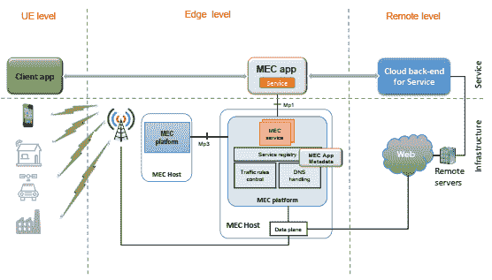
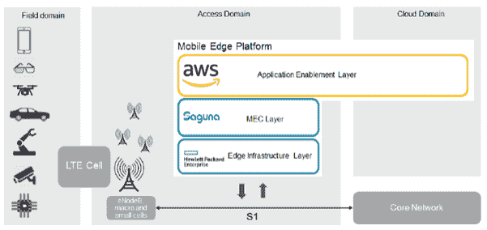

# 面向边缘服务交付的分布式应用架构

> 原文：<https://thenewstack.io/distributed-application-architecture-for-edge-based-service-delivery/>

[Sagar Nangare](https://twitter.com/sagarnangare)

[Sagar Nangare 是科技博客作者，专注于数据中心技术(网络、电信、云、存储)和边缘计算、物联网、机器学习、人工智能等新兴领域。他目前在浦那担任 Coredge.io 的产品营销总监。](https://twitter.com/sagarnangare)

交付给端点的基于软件的服务由不同的子应用组件组成。目前，任何此类服务都使用典型的客户端-服务器架构来执行，并使用传统的网络，这些网络要么是专有企业网络，要么是宽带网络，要么是专用租用线路。到目前为止，我们已经看到了向基于微服务的架构的巨大转变，以推动更快的开发时间和使用容器的小软件模块的独立管理。此外，无服务器功能已经开始付诸实践。所有这些应用程序都是为延迟和高吞吐量不是大问题的网络而设计的。

但是现在，编写应用程序时应该考虑更多的技术因素，如网络状态以及应用程序将在哪个节点上执行。

随着网络向 5G 发展，5G 将基于软件，并允许应用程序在用户设备或生成数据的位置附近运行，整体服务的架构和开发(使用多个软件应用程序构建)应过渡到新的模式。

ETSI 标准机构围绕多路访问边缘计算([ETSI·MEC](https://www.etsi.org/technologies/multi-access-edge-computing))成立了一个工作组，以解决理想边缘计算环境的这些关键要求。最近[发布了一份白皮书](https://www.etsi.org/images/files/ETSIWhitePapers/etsi_wp20ed2_MEC_SoftwareDevelopment.pdf)，为基于 MEC 的边缘云软件开发提供指导。

ETSI MEC 提供了所需的边缘计算框架，以促进服务提供商和应用程序开发商的新范式。MEC 使应用程序开发人员能够设计服务，服务中的应用程序可以获得有关其运行时环境的信息，了解环境的特征以调整应用程序的行为来获得所需的输出。此外，通过 MEC，应用程序可以利用带宽信息在运行时请求必要的网络资源，以可控和可预测的方式提供低延迟和高吞吐量。

简而言之，如果实施了中间边缘节点，则旨在从数据中心向最终用户设备提供“X”用例的服务中的应用程序组件在其路径上具有不同的计算和性能要求。因此，软件开发人员必须以这样一种方式来设计服务，即在每一层，应用程序都应该为特定的操作改变其行为，并保持网络特征(流量、安全策略等)的结合，而且主要是在运行时。MEC 为此提供了边缘平台，因此提供给最终用户的软件服务应该符合标准，并根据网络起伏优化其执行。

图-MEC 推出的新应用程序开发范例。

根据 MEC [白皮书](https://www.etsi.org/images/files/ETSIWhitePapers/etsi_wp20_MEC_SoftwareDevelopment_FINAL.pdf):“端到端服务可以分为三个应用或组件:终端设备组件、边缘组件和远程组件。”这些应用程序在三个不同的基础架构层进行管理。但是，这种类型的分布式服务部署适合应用程序组件的开发人员吗？应用程序开发人员能否在网络和中央云的边缘获得快速开发和部署的轻松环境？

终端设备组件是在数据生成设备上执行的轻量级应用程序。通常，低级计算操作，如管理数据传输、小任务等都在这一层进行管理。边缘组件应该为整体服务交付提供广泛的能力，并且应该对终端设备的延迟需求高度敏感。远程组件或云可用于不需要敏捷交付条款的任务。

去年，AWS、HPE 和萨古纳网络(Saguna Networks)合作开发了一个概念验证(PoC ),并发布了一份[白皮书](http://48e1o32g8c0u32va4n3tw9qg-wpengine.netdna-ssl.com/wp-content/uploads/2018/02/AWS-HPE-Saguna-White-Paper-A-Platform-for-Computing-at-the-Mobile-Edge-.pdf),概述了使用移动边缘计算的应用支持生态系统。该白皮书的重点是利用现有的移动网络基础设施来建立一个平台，以支持 5G 的新一轮创收应用。一个解决方案利用 [AWS Greengrass](https://aws.amazon.com/greengrass/) ，它为 MEC 平台带来了 AWS edge 应用程序，因此开发人员可以轻松参与应用程序开发。

有了它，平台服务提供商或企业可以使用运行在 HPE Edge line 硬件上的 [Saguna](https://www.saguna.net/) Edge Cloud MEC 软件解决方案，轻松部署 MEC 并管理其移动网络架构内的边缘应用。

图:AWS，萨古纳，HPE 边缘应用交付平台。

除了 AWS 的产品之外， [Azure Stack](https://azure.microsoft.com/en-in/overview/azure-stack/) 也可以作为一个选项提供，有多种基础设施和 MEC 层的选项。最近，AT & T [在 2019 年世界移动通信大会上宣布了关于使用 Azure Stack 的 PoC 的](https://www.zdnet.com/article/mwc-2019-at-t-tests-5g-and-edge-computing-with-microsoft-azure/)

## 摘要

我们已经看到了在容器到来和 IT 公司开始采用 CI/CD 之后软件应用程序开发的革命。现在，随着许多企业和技术供应商的重点开始转向边缘，新的架构可能会随着分布式应用程序具有不同类型的延迟要求的不同环境而发展。管理这种跨平台的分布式应用程序是目前行业面临的最复杂的挑战之一。基于边缘的环境中的服务的目标应该是拥有合适的应用程序开发环境，以便为最终用户提供更快的创新。

来自 Pixabay 的公共公司的特征图像。

<svg xmlns:xlink="http://www.w3.org/1999/xlink" viewBox="0 0 68 31" version="1.1"><title>Group</title> <desc>Created with Sketch.</desc></svg>