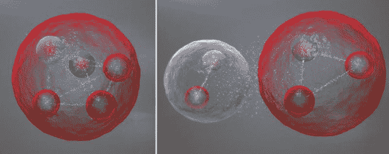
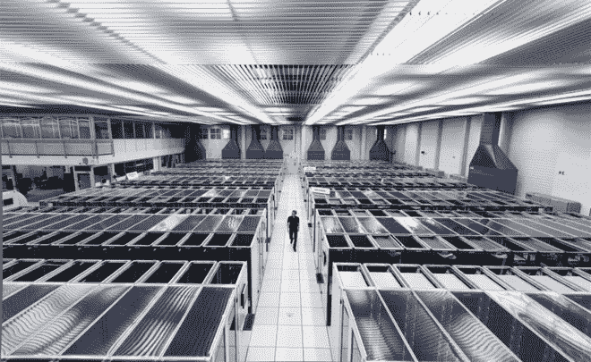

# 工作中的分布式计算:6 亿次碰撞在粒子物理学中发现“五夸克”

> 原文：<https://thenewstack.io/distributed-computing-at-work-600-million-collisions-to-make-a-pentaquark-discovery-in-particle-physics/>

当我们看到科学家们如何利用分布式基础设施做出惊人的发现时，我们有时会想起现代大规模计算带来的力量。上周欧洲粒子物理研究所的大型强子对撞机的一项发现很好地说明了这一点。

它来自科学家上周在欧洲粒子物理研究所的大型强子对撞机上发现的“[五夸克](https://en.wikipedia.org/wiki/Pentaquark)，作为正在进行的 [LHCb(大型强子对撞机“美丽”)实验](http://home.web.cern.ch/about/experiments/lhcb)的一部分。根据维基百科，五夸克是一种假想的[亚原子粒子](https://en.wikipedia.org/wiki/Subatomic_particle "Subatomic particle")，由四个[夸克](https://en.wikipedia.org/wiki/Quark "Quark")和一个反夸克[结合在一起](https://en.wikipedia.org/wiki/Bound_state "Bound state")组成。五十年来，科学家们一直在对难以捉摸的五夸克进行理论研究，但这标志着研究人员首次发现了它存在的明确证据。

“五夸克不只是任何新粒子，”LHCb 发言人盖伊·威尔金森在[新闻稿](http://home.web.cern.ch/about/updates/2015/07/discovery-new-class-particles-lhc)中解释了这种粒子的奇异状态。“它代表了一种聚集夸克的方式，即普通质子和中子的基本成分，这种方式在过去 50 多年的实验研究中从未观察到。研究它的性质可以让我们更好地理解普通物质，即构成我们所有人的质子和中子，是如何构成的。”

## 意外突破

这一发现几乎出乎意料，当时科学家们正在研究另一种粒子的碰撞后粒子衰变数据，这种粒子被称为“底部λ重子”，一种三夸克粒子。“这完全是一个意外，”[Sheldon Stone 说，他是纽约锡拉丘兹大学的物理学家，也是最近研究](http://www.insidescience.org/blog/2015/07/21/party-five-physicists-discover-long-sought-%E2%80%98pentaquark%E2%80%99-stroke-luck)的合著者。“[五夸克]发现了我们。”

此外，五夸克似乎有两种形式:一种是五个夸克紧紧地束缚在一个包中，另一种是夸克松散地束缚在两个类似“分子状态”的包中，尽管科学家们仍然不清楚具体情况。

## 新的基础设施使之成为可能

但是，如果没有支撑整个 LHC 项目的大规模新技术基础设施，这些见解就不可能实现。首先，在 27 公里(16.7 英里)长的粒子加速器中，每秒约 6 亿次粒子碰撞产生了大量数据——这些数据被记录为一系列电子信号，并被发送到 CERN 数据中心进行数字重建。每年大约产生 30pb 的“碰撞事件”数据，科学家必须梳理和分析这些数据，以找到像五夸克这样的粒子。

为了解析这些海量的信息，CERN 从 2002 年开始就使用了一个遍布全球的[分布式计算网格](http://home.web.cern.ch/about/computing)，这个网格为超过 8000 名物理学家提供了几乎即时的数据访问。这个计算网格建立在万维网的基础上，万维网起源于欧洲粒子物理研究所，是科学家共享信息的一种方式。在现场，其数据中心每天处理大约 1pb 的数据，使用 11，000 台服务器和 100，000 个处理器内核——而在场外，[全球 LHC 计算网格](http://home.web.cern.ch/about/computing/worldwide-lhc-computing-grid) (WLCG)每天处理超过 200 万个作业。

这种惊人的技术基础设施和分布式计算网络使得对宇宙结构的这些前所未有的发现成为可能。我们渴望更深入地了解物质的组成成分——进而了解宇宙的意义——这是无限的，而这些微观层面的探索由宏观层面的相互联系来维持是合适的，这使得那些深刻的揭示成为现实。欧洲核子研究中心[有更多信息。](http://home.web.cern.ch/)

图片[通过](http://home.web.cern.ch/) CERN。

<svg xmlns:xlink="http://www.w3.org/1999/xlink" viewBox="0 0 68 31" version="1.1"><title>Group</title> <desc>Created with Sketch.</desc></svg>