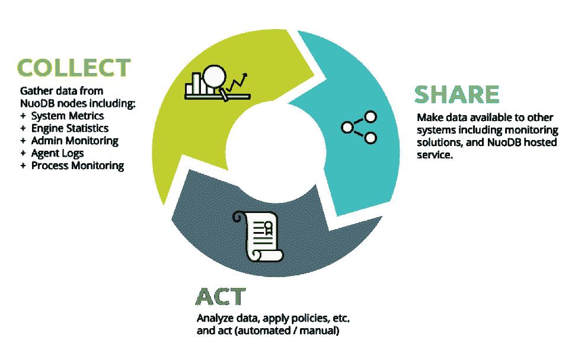
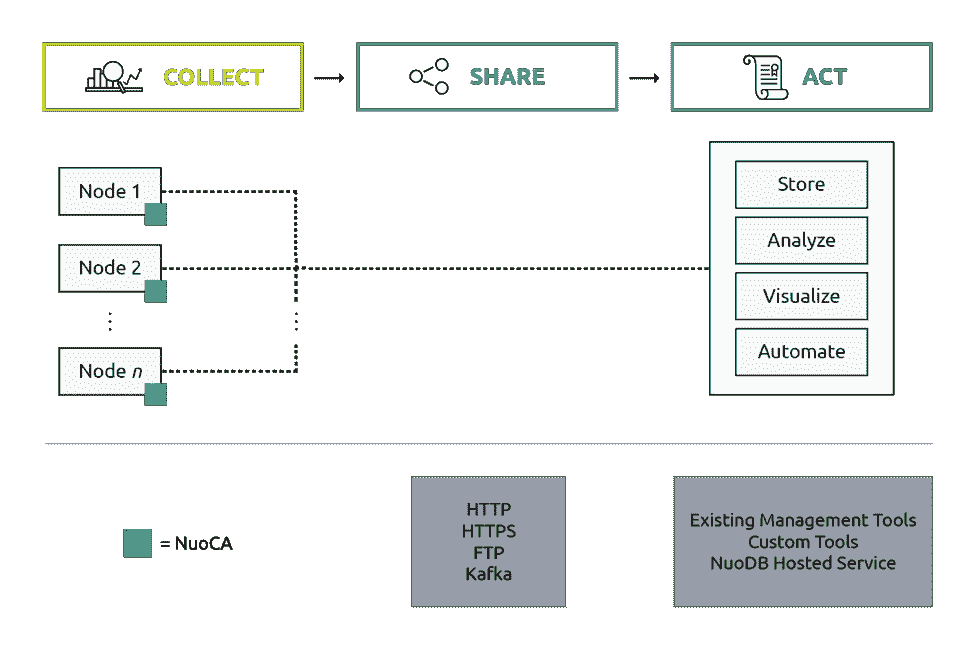
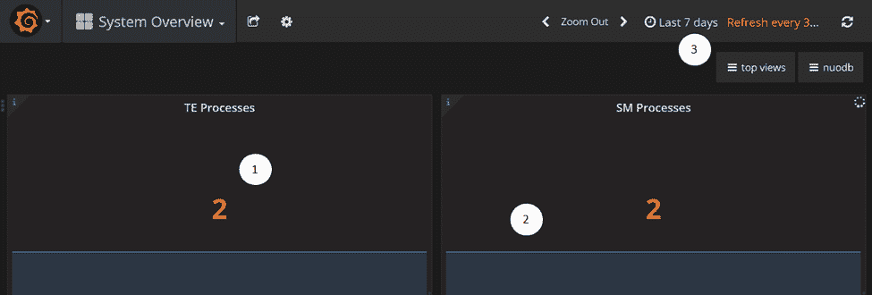
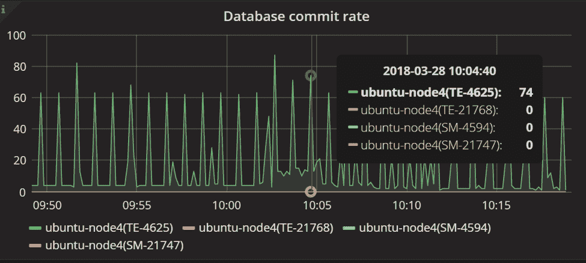
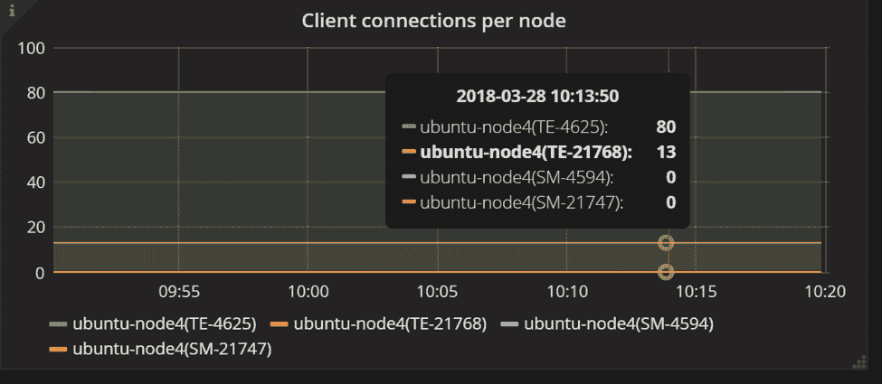
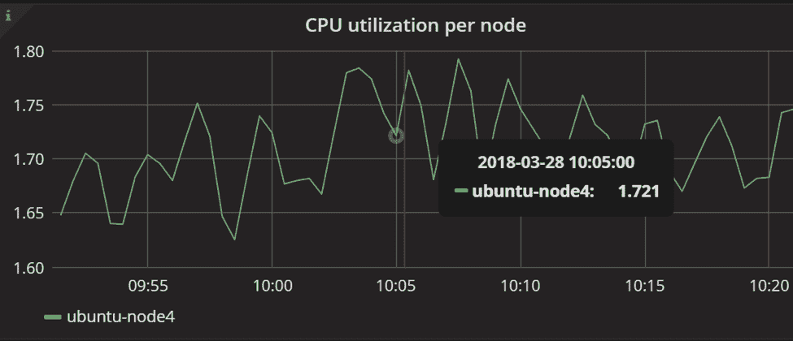
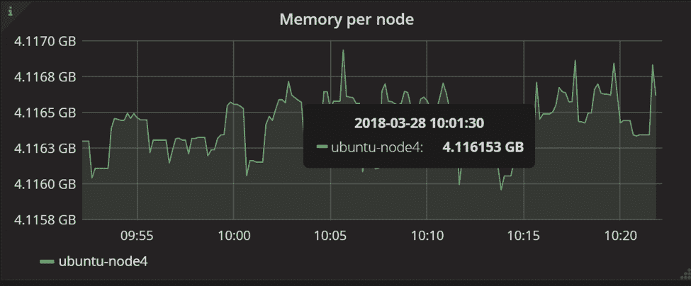

# 借助 NuoDB Insights 实现分布式数据库性能、运行状况和优化

> 原文：<https://thenewstack.io/distributed-database-performance-health-and-optimization-with-nuodb-insights/>

作为负责客户成功的高管，我可能对客户如何使用我们的产品以及他们的困难所在有着最深入、最实际的了解。我们一再收到的一个请求是，如何更好地访问系统级和域级指标和数据，以帮助优化 NuoDB 实现的资源和部署。

这就是为什么我很兴奋地介绍 [NuoDB Insights](https://www.nuodb.com/product/insights) ，现在可以在 Linux 版本的 NuoDB 3.01 和更高版本中使用。所以，事不宜迟，让我们来谈谈基础知识。

## 为什么选择 NuoDB Insights？

 [努奥德布·德克·汉姆斯特拉

Dirk 负责客户的成功，专注于确保数据库部署成功，客户满意度高。德克于 2014 年加入 NuoDB，此前他在微软工作了 10 年，负责全球 100 强客户。在此之前，他在成熟和初创公司担任了 20 多年的销售和服务管理职位，包括 IBM、微软、Vitria Technology 和 IONA Technologies。他在这些公司的主要行业重点是医疗保健和电信公司。](https://www.nuodb.com/) 

开发 NuoDB Insights 是为了优化数据库操作和系统配置。借助 NuoDB Insights，您可以更好地:

*   随着时间的推移，评估您的 NuoDB 配置的运行状况
*   确定使用模式并根据需要调整配置
*   了解硬件利用率以确保正确的操作环境

为了实现这一目标，NuoDB Insights 的设计和构建有两个主要目标:

*   提供单一、标准化的方式来收集、共享和处理来自 NuoDB 配置的监控数据
*   支持与现有监控框架的集成

通过 Insights，数据库管理员(DBA)和运营团队可以获得一个 [NuoDB 域](http://doc.nuodb.com/Latest/Default.htm#About-Domains.htm)及其物理环境(内存、磁盘、网络)的单一聚合视图，无论他们在哪里运行。一个 NuoDB 域是一组 NuoDB 主机的集合，这些主机被配置为协同工作以支持 NuoDB 进程。NuoDB Insights 提供了对系统运行状况、问题识别和解决、容量管理和性能管理的可见性。该工具实现了任务的自动化，例如 NuoDB 配置的通知和生命周期管理。

## NuoDB Insights 是做什么的？

具体来说，NuoDB Insights 从 NuoDB 数据库和系统环境中收集相关数据，并提供时间序列指标和事件监控数据，以便 DBA 和运营团队了解和控制 NuoDB 域。默认情况下，NuoDB Insights 是关闭的，必须在开始收集数据之前打开。如何操作的说明可以在[这里](https://www.nuodb.com/product/insights)找到。

## NuoDB Insights 组件

NuoDB Insights 由三个逻辑元素组成:收集、共享和行动。作为 Insights 的基础，NuoDB 收集代理(NuoCA)是一个在每个 NuoDB 节点上运行的进程，用于收集 NuoDB 及其运行系统上的近实时监控和事件数据。

洞察力逻辑分解

NuoCA 使用使用开源监控工具 [Zabbix](https://www.zabbix.com/) 收集的系统数据来扩充它从 NuoDB 进程和日志文件中收集的数据。收集的数据包括生命周期事件(进程的开始和停止)、域信息和来自 NuoDB 的数据(SQListener 信息)以获得系统中工作的详细信息。

NuoCA 是一个管道架构，有三个不同的阶段:输入、转换、输出。信息由输入级收集，然后流到转换级，再流到输出级。NuoCA 还有一个灵活的插件架构。插件类型有“输入”、“转换”或“输出”Insights 插件具有开放的架构，任何人都可以通过添加到 GitHub 上的 [NuoCA 项目中，使用额外的转换或集成插件来扩展系统。](https://github.com/nuodb/nuoca)

NuoCA 可以通过不同的通信方式将监测数据发送到不同的目的地。NuoCA 输出可以存储在内部或发送到托管服务。支持使用 HTTP 和 https 连接的标准通信，但也提供包括 [Elasticsearch](https://www.elastic.co/products/elasticsearch) 和 [Kafka](https://kafka.apache.org/) publisher 在内的替代选项。

通过支持基于标准的通信，NuoCA 允许集成现有的监控和管理工具，如 [SUMO Logic](https://www.sumologic.com/) 、 [CA 应用性能管理](https://www.ca.com/us/products/ca-application-performance-management.html)或[网络安全管理软件产品](http://www.solarwinds.com/)。这些工具提供了对数据进行分析、可视化和操作的工具。

此外，数据可以发送到任何时间序列引擎，如 ElasticSearch 或 [InfluxDB](https://www.influxdata.com/) 进行进一步的分析和操作。存储后，可以使用许多工具访问数据，例如，生成仪表板、网络图等。NuoDB 使用 ElasticSearch 和 Grafana 提供免费的托管服务来监控数据。启用 Insights 时，会提供您在该仪表板上的唯一 URL。下图显示了 Insights 组件的概述。

洞察组件

下面是默认的 NuoDB Insights 仪表板的概述。下面的例子讨论了系统配置、SQL 操作的细节和系统资源。

## 配置

NuoDB Insights 提供了按时间映射的正在运行的 NuoDB 配置的聚合视图。活动配置数据有助于控制云和内部的生命周期管理。数据点可用于评估配置的健康状况，确定使用模式，并根据需要进行调整。

下图显示了运行两个事务引擎(te)和两个存储管理器(SMs)的 NuoDB 域的视图；这是一种冗余配置，即使在(例如)SM 停止时也将继续运行。当提供位置信息时，您可以看到机器在哪里运行:例如，在您的数据中心和像 AWS 这样的云环境中。图表底部的线条(2)显示配置在过去七天内没有变化(3)。仪表板允许您在时间线上放大和缩小，以获得一段时间内的总体概述或非常详细的数据。

配置

## 数据库活动

下图更详细地显示了数据库正在进行的工作。该面板显示了所有系统进程的数据库提交数量。此时，只有节点 4(一个 TE)正在执行工作，每秒处理大约 60 次提交。

数据库提交速率

下面显示的数据库活动是由 93 个客户端连接跨两个 te 生成的。随着时间的推移，与流程的联系一直是稳定的，但有所偏差；一个 TE 拥有 93 个连接中的 80 个。这种配置工作得很好，但是，通常您会在 TEs 之间寻找一个更平衡的连接分布。

客户端连接

NuoDB Insights 旨在捕获特定于 NuoDB 的数据，但又足够通用，可以用应用程序提供的数据丰富这些数据，从而获得完整的视图。通过让应用程序将数据写入日志文件，然后配置 NuoCA LogStash 输入插件以接近实时地从该日志文件中收集数据，可以收集应用程序数据点。

## 系统

NuoDB Insights 还有助于了解硬件基础设施组件(如 CPU、内存和磁盘)的利用率。收集这些数据点有助于确保解决方案的正确操作环境。收集磁盘容量、内存使用和 CPU 消耗等关键指标。

下图显示了特定节点(TE)在 25 分钟时间间隔内的 CPU 使用情况。通常，TE 的性能受 CPU 限制。数据显示，TE CPU 消耗几乎没有波动，并且有可用的容量来做更多的工作。

CPU 使用率

下图显示了同一时间范围内同一 TE 使用的内存。节点的内存使用量变化很小，这提供了另一个数据点，即系统资源的使用在可接受的范围内。

内存使用

查看系统数据点(如 CPU 消耗和内存使用)补充了来自数据库的警报，有助于评估硬件配置是否支持 NuoDB 的健康环境。

## 摘要

NuoDB 等分布式系统增加了对聚合监控数据的需求，从而使数据库管理员和运营团队能够了解并控制配置。NuoDB Insights 提供了一种标准的方法来收集、共享和处理来自 NuoDB 的监控信息。Insights 可以与现有的监控工具集成，并提供一个开放的架构来使用插件添加更多的集成点。本文中讨论的仪表板仅显示了 NuoCA 收集的一小部分数据，在即将发布的版本中，我们将添加关于数据库活动(TPS、回滚、插入、更新)、系统数据点和通信数据的信息。

<svg xmlns:xlink="http://www.w3.org/1999/xlink" viewBox="0 0 68 31" version="1.1"><title>Group</title> <desc>Created with Sketch.</desc></svg>