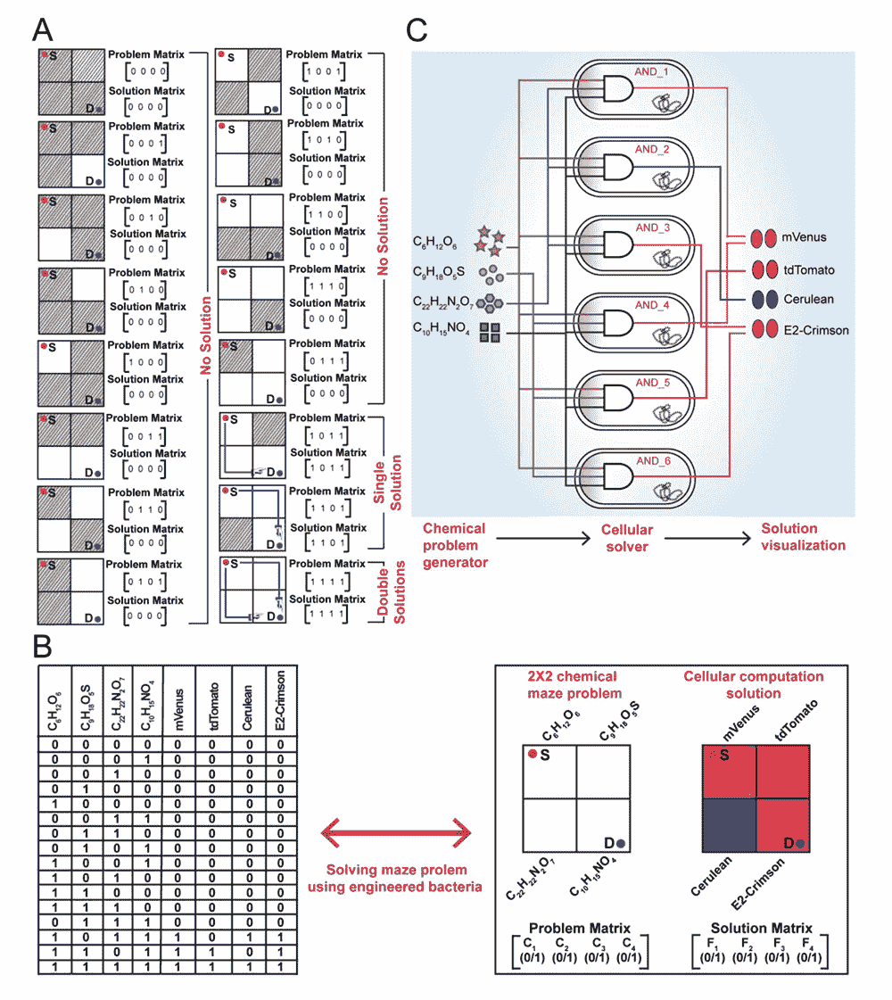

# 分布式大肠杆菌生物计算机解决迷宫问题

> 原文：<https://thenewstack.io/distributed-e-coli-biocomputer-solves-maze-problems/>

分布式计算的概念已经存在了几十年，换句话说，就是用一个组件位于不同网络计算机上的系统来解决问题。这种分布式系统更具可扩展性、容错性和弹性，因为即使系统的另一部分发生故障，网络中的其他节点也可以继续工作。与独立机器相比，分布式系统还可以提供更多的计算能力，可以用来完成惊人的壮举，如帮助[物理学家发现新粒子](https://thenewstack.io/distributed-computing-at-work-600-million-collisions-to-make-a-pentaquark-discovery-in-particle-physics/)，帮助公民科学家潜在[在宇宙中发现外星智能的迹象](https://thenewstack.io/distributed-supercomputing-before-the-cloud-the-legacy-of-setihome/)。

虽然我们通常会将分布式计算与由微芯片、金属和塑料制成的电子机器联系起来，但也有可能使用生物计算机建立分布式系统，正如来自印度加尔各答 Saha 核物理研究所的一组研究人员最近的工作所显示的。他们的发现发表在《美国化学学会合成生物学》杂志上，概述了研究小组如何在六种不同类型的人工合成大肠杆菌中分配解决一系列计算问题的任务，这些问题以网格结构、化学生成的迷宫的形式出现。

随着纳米生物技术领域的发展，生物计算机在过去几十年里有了显著的进步，基因工程工具变得更加复杂，合成和测序 DNA 的成本也降低了。

通过修补像蛋白质和 DNA 这样的生物成分，专家们可以使用这些分子来创造有机计算机，这些计算机可以被“编程”来解决相对简单的计算问题——尽管速度通常比电子计算机慢得多。然而，生物计算机有很大的潜力，因为与电子计算机相比，它们将使用更少的能源，并且可以轻松地同时解决更复杂的问题。

## 化学迷宫

在这个迷宫解决实验中，萨哈研究所的团队没有使用物理意义上的有墙迷宫。相反，他们使用四种化学物质——葡萄糖、异丙基β-D-1-硫代半乳糖苷、脱水四环素和 N-酰基高丝氨酸内酯——来创建抽象的化学版本的 2X2 迷宫。

这个想法是用四种化学物质的不同组合为每个试管设置一个“迷宫”，总共有 16 种不同的迷宫配置。在这里，各种迷宫问题被表示为一个“化学空间”，网格左上角的正方形充当迷宫的起点，右下角的正方形充当出口。网格的每个部分都可以打开或关闭，这取决于存在的化学物质。

“在这里，我们通过在迷宫的每个位置分配化学物质来产生抽象的迷宫问题，其存在与否定义了‘障碍’或‘开放空间’。因此，通过化学物质提出了一个数学问题，”研究小组解释说。

> 工程细菌由六种不同的遗传逻辑电路组成，分布在六个细胞群体中，通过表达或不表达四种不同的荧光蛋白来处理化学信息和解决问题。

然后，研究小组设计了不同组的大肠杆菌，每组都有不同的基因“电路”，可以检测和评估这些化学物质。然后，被操纵的细菌进入试管“迷宫”处理化学信息，以便“解决”它们。

“我们创造了六组分子工程细菌，它们在混合群体中充当‘解算器’，”研究人员说。“工程菌由遗传逻辑电路组成，通过这些电路实现了求解算法。“解算器”处理化学信息，并通过表达荧光蛋白产生溶液，发光细菌显示溶液路径。如果没有解决方案，系统就会变得黑暗。”

在将细菌“解算器”添加到每个试管中并等待 48 小时以查看试管是否亮起以指示已解迷宫后，该团队随后将他们的发现转化为数学[真值表](https://en.wikipedia.org/wiki/Truth_table)，使用 1 和 0 来绘制出不同迷宫配置中所有可能的逻辑表达式。

2X2 迷宫的所有可能解决方案，白色为“开放”路径，数学上表示为“1”，灰色为“封闭”路径，表示为“0”。b)用 0 和 1 表示迷宫解的输入-输出“真值表”矩阵。c)显示细菌迷宫“解算器”(输入)和 4 种荧光蛋白(输出)的细胞设计的图表。

## 分布式生物计算的力量

令人惊讶的是，该团队基于细菌的计算机通过物理证据正确地显示，除了同时解决它们之外，16 个迷宫中只有 3 个实际上是可解的。该团队指出，从数学上讲，这是一件非常复杂的事情，他们将这一成就归功于他们的系统将电路功能分布在六种类型的工程细胞中。

“我们的工程细菌由六种不同的遗传逻辑电路组成，分布在六个细胞群体中，处理化学信息，并通过表达或不表达四种不同的荧光蛋白来解决问题，”该团队说。“有趣的是，从数学角度来看，这样的计算并不简单。使用化学物质生成这种抽象的数学迷宫，并用工程细菌解决它们，可能会激发细胞计算和信息处理的新可能性。”

正如该团队的工作所表明的那样，在未来设计计算能力更强的生物计算机时，实施分布式方法可能有巨大的潜力，这样它们就可以共享信息，更有效地进行越来越复杂的计算。

“这个迷宫解决任务是生物分布式计算的一个例子，其中总的计算任务分布在具有六种不同遗传回路的六个不同细胞群体中，”该团队说。“理论上，通过增加输入、输出和遗传电路的数量，这里使用的一般策略可以扩大到更大的迷宫问题。”

除此之外，研究人员可能有一天还会利用生物进化背后的自然优化过程来进一步推动生物计算机——可能会扩大它们的规模，并将它们与自然环境相结合，以解决当今一些最大的问题，如优化农业产量以提高粮食安全，甚至应对气候变化——这是一项巨大的任务，即使对传统计算机来说也是如此。

更多阅读团队[论文](https://pubs.acs.org/doi/full/10.1021/acssynbio.1c00279)。

<svg xmlns:xlink="http://www.w3.org/1999/xlink" viewBox="0 0 68 31" version="1.1"><title>Group</title> <desc>Created with Sketch.</desc></svg>