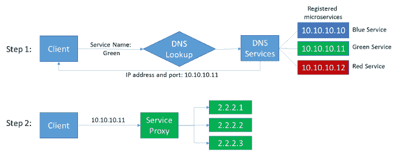
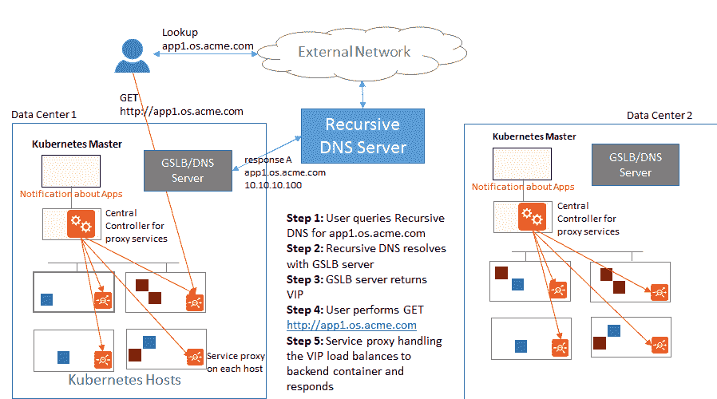

# 分布式结构:基于容器应用的新架构

> 原文：<https://thenewstack.io/distributed-fabric-new-architecture-container-based-applications/>

围绕容器技术的应用程序开发领域有一种明显的兴奋感。容器将应用程序开发的灵活性和速度提升到了一个新的水平，使开发人员能够将大型整体应用程序分解为小型、可管理的微服务，这些微服务可以相互通信，更容易测试和部署，并作为完整的应用程序更高效地运行。然而，容器还要求管理这些微服务和应用的应用服务的新架构，特别是在服务发现方面——定位和消费这些微服务的服务。

## 容器技术和微服务革命

 [兰加·拉贾戈帕兰

Ranga 是 Avi Networks 的首席技术官和联合创始人，是多种高性能分布式操作系统以及网络和存储数据中心产品的架构师和开发人员。在担任 CTO 之前，他是思科数据中心业务部门的高级主管，负责 Nexus 7000 产品线的平台软件。Ranga 通过收购 Andiam 加入思科，他是 SAN-OS 操作系统的首席架构师之一。Ranga 在 SGI 开始了他的职业生涯，他是 Origin 系列 ccNUMA 服务器的 IRIX 内核工程师。他拥有斯坦福大学电气工程理学硕士学位和印度皮兰尼 BITS EEE 工程学士学位。](https://avinetworks.com/) 

传统上，应用程序是作为一项庞大的技术构建的，驻留在单个设备上，由 IT 部门管理。当需要构建或添加新的应用程序或功能时，管理、配置和重新设计负载平衡、安全性、可见性和客户端之间的通信的繁琐流程会使流程陷入停滞，从而大大延迟应用程序开发的进步和更新。

然而今天，开发人员可以通过基于容器的应用程序将这些单片应用程序分解为微服务。曾经静态和不可移动的应用程序现在被分成轻量级的、可管理的、多个部分或容器，一旦组合起来就提供了应用程序的构建块。容器可以从根本上影响和提高开发速度和部署应用程序的灵活性，公司发现这非常有用和有趣。但这也给管理这些广泛应用的服务发现带来了新的问题和挑战。

开发人员希望专注于开发他们的应用程序，而不必考虑底层连接和网络服务问题。服务发现提出了一个网络挑战，它会使容器技术的采用变得复杂和缓慢。对于代理和应用程序服务来说，有一种架构方法是非常重要的，这种方法可以为组织提供一个灵活的网络服务框架来部署利用容器技术构建的应用程序。

## 构建服务发现的体系结构

以前，管理托管在单个位置的单个应用程序提供了一种相对简单的服务发现方法，并且很容易定位或部署新的应用程序功能到单个应用程序。虽然容器方法通过将应用程序分解成自治的功能组件来简化开发，但是由数十或数百个容器代表的端点数量的爆炸以及它们短暂的本质使得服务的发现更加复杂。

> 分布式结构可以高效、经济地处理容器化应用的服务发现。

让我们假设一个客户访问一个购物网站，并在她的购物车中放置一件商品:当她到达收银台时，例如，必须找到并访问收银台和计费微服务，以便客户完成交易。当它们分布在不同的服务器、容器甚至不同的位置时，这可能会非常困难。随着更新的开发和部署——比如引入新的支付服务——到容器集群中，找到这些依赖性也是至关重要的。

DNS 与负载平衡器的结合是当今使用最广泛的服务发现机制。当创建或更新新服务时，DNS A 记录将服务名称映射到虚拟 IP 地址。实际的虚拟 IP 地址由一个负载平衡器托管，该负载平衡器接受传入的连接并将客户端负载分散到应用程序实例中。

有时 [DNS A 记录](https://webhostinggeeks.com/guides/dns/)可以映射到多个虚拟 IP 地址，其中每个虚拟 IP 地址在不同的站点提供服务。根据客户端位置、服务可用性或负载或任何此类组合，将传入的客户端请求定向到站点。对 DNS 的任何更改，如 CNAME 记录或添加更多站点，都需要手动配置 DNS，这通常需要数周时间才能解决。

同样，对应用程序实例的任何更改都需要手动配置负载平衡器，这需要数周时间才能解决。使用这些传统方法，部署、发现和添加微服务或微服务实例既耗时又容易出错，而且非常困难。

随着容器变得越来越主流，开发者和公司应该专注于创建创新的应用，而不是为这些应用设计管道。

## 服务发现的架构选项

微服务应用的灵活服务发现架构是什么样的？让我们探索一些负载平衡器部署选项。

首先，公司可以选择集中式负载平衡器或代理。在这种情况下，传统的负载平衡器设备位于网络边缘，接收来自客户端的 DNS 或 HTTP 请求，接触各种容器和服务以找到它们，然后响应这些客户端请求。

虽然这是在单片应用程序时代的传统做法，并且在一对一环境中工作得相当好，但是在今天的微服务环境中，在多个容器和服务器上有数十个或数百个微服务，以这种方式进出流量变得极其麻烦和低效。

第二，公司可以采取“侧车”方法，在每个集装箱旁边放置一个负载平衡器。这个客户端负载均衡器采用一种非常精细的方法来发现服务，以便高效地定位服务。然而，在微服务应用程序的情况下，多个容器可以位于多个服务器上(一些服务器可以运行多达 50 个容器)。试图在这些位置中的每一个位置放置负载平衡器是非常麻烦的，并且可能非常昂贵，更不用说管理和配置每个负载平衡器的挑战了。

然而，有一种新的方法可以高效、经济地处理这些应用程序的服务发现。

在这种称为分布式结构的方法中，单个代理在微服务集群的每个节点上运行。每个代理充当容器之间和服务器之间发生的每个交互的网关。当微服务或外部客户端试图访问目标微服务时，代理会解析将目标服务名称映射到其虚拟 IP 地址的 DNS 查找请求。

随后，当微服务或外部客户端连接到虚拟 IP 地址以访问目标服务时，代理接受该连接并将负载分布到目标微服务的实例上。如果每个服务器有一个代理，那么必须在该服务器的容器中执行的所有事务都要通过该代理才能到达该服务器内部或另一个服务器上的服务。

中央控制器还集成了容器编排，如 Mesos、 [Docker 统一控制平面](https://thenewstack.io/dockers-universal-control-plane-goes-public-beta/)或 [Kubernetes](/category/kubernetes/) 。下图显示了描述 Kubernetes 环境中跨两个数据中心的架构的高级图表:

Kubernetes 环境中服务发现的灵活架构。

控制器协调南北向和东西向分布式负载平衡器。它查询 Kubernetes 主服务器，获取服务端口信息，并在 DNS 中为服务端口创建“SRV”记录。它还为应用程序分配虚拟 IP，在 DNS 中创建 A 记录，并将策略推送到分布式负载平衡器。

控制器还确保添加到容器集群的新服务被自动发现，并且新服务代理实例被放置在集群中新委托的节点上。所需的 DNS 条目是根据群集的状态自动动态创建或修改的。分布式结构还可以发现现有的服务依赖关系，包括在添加新服务时服务必须如何交互。

容器现在使公司和开发者能够快速开发应用程序，测试和部署它们，并快速有效地更新它们。基于容器的方法不再是静态的，它为服务发现带来了新的、有趣的问题，这些问题是传统的应用服务体系结构无法负担得起或有效解决的。相反，网络架构师发现，位于容器集群旁边的代理的轻量级分解数据层在管理网络服务的交付方面可能是有用且高效的。

有了这个新的架构，公司就可以在基于容器的环境中创建真正创新的应用了。

Docker 和 Mesosphere 是新堆栈的赞助商。

通过 Pixabay 的特征图像。

<svg xmlns:xlink="http://www.w3.org/1999/xlink" viewBox="0 0 68 31" version="1.1"><title>Group</title> <desc>Created with Sketch.</desc></svg>