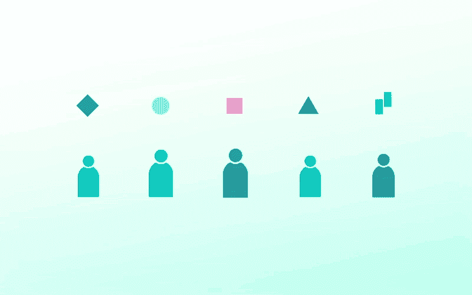

# 分布式团队，分布式应用程序:云世界中的协作

> 原文：<https://thenewstack.io/distributed-teams-distributed-applications-collaboration-in-a-cloud-native-world/>

[Mike Winters](https://www.linkedin.com/in/wints/?originalSubdomain=de)

[Mike Winters 在过去的五年里一直在 Apache Flink、Camunda 和 now Garden.io 等开源项目背后的公司担任产品和社区管理职务。他花了大量时间思考和撰写新兴技术对各种形式和规模的组织的影响。他是俄亥俄州人，目前居住在德国柏林。](https://www.linkedin.com/in/wints/?originalSubdomain=de)

几乎在任何领域，异步协作都需要两种类型的工具:

*   通用通信工具(如 Zoom、Slack 和 Trello)
*   为工作产品做出贡献的特定角色工具(例如，用于内容的 Google Docs、用于 UI/UX 设计的 Figma、用于数据科学的 KNIME 和 Databricks)

还记得在“过去”作为一组利益相关者中的一员，合作完成一篇复杂的文章是什么样的吗？就像，你知道的，用微软 Word 附件发送电子邮件并启用“修订”功能？

没有人能真正确定他们是否在处理最新的文件。当队友同时被编辑时，冲突就会出现。缺少字体或 Microsoft Office 版本过时可能会阻止用户投稿。

当基于网络的文字处理器成为标准时，这些问题中的大部分神奇地消失了。改进的通信工具(更好的视频会议、更好的聊天)不可能产生几乎相同的影响——用户需要专门为手头的任务创建的协作工具。

特定领域的工具可以确保每个贡献者:

*   拥有工作产品的最新版本(以及相关的变化)
*   可以相信一个文件或文档无论其硬件、操作系统等如何，其外观和行为都是一样的。

换句话说，团队保证**访问**和**一致性**。

访问和一致性对于任何团队都很重要，尤其是对于分布式团队，有效的协作和交流需要额外的努力。“分布式团队”可能意味着一家员工遍布全球的远程优先公司，一家团队遍布庞大校园的硅谷巨擘，或者一家过去共用一间办公室，但由于全球疫情而无限期在家工作的初创公司。

## 云原生应用开发的访问和一致性

在 [Garden](https://garden.io) ，我们的使命是让开发人员和 DevOps 团队能够轻松构建、排查和测试云原生应用(我们在这里将其定义为由松散耦合、独立开发和部署的服务组成的应用)。

当与我们的用户一起工作时，我们有机会观察许多不同组织的[软件开发过程](https://thenewstack.io/category/cloud-native/)。我们认为我们对访问和一致性对于云原生开发团队意味着什么有很好的理解。

**访问**意味着每个开发人员都知道应用程序的当前拓扑以及不同组件之间的关系——包括他们没有参与的服务。获得这些信息并不依赖于与合适的人交朋友，也不依赖于逐渐积累没有写在任何地方的机构知识。

一致性意味着每个开发人员都可以创建测试和预览环境，这些环境与他们的队友使用的环境完全相同，并且尽可能与生产环境相似。没有在每台笔记本电脑上表现不同的拼凑在一起的本地环境的集合，因此不可能进行一致的协作。

为了使这个想法更加具体，让我们在一个严重依赖异步协作的场景中讨论访问和一致性:onboarding。在软件开发中，“入职”可以有几个不同的维度，例如:

1.  让一名新员工快速上手(我们从人们那里听说，让一名开发人员完全上手一个复杂的分布式应用程序可能需要六个月的时间)
2.  与新分配的现有内部团队合作，构建作为应用程序一部分的服务
3.  开始一个项目，聘请外部开发机构来编写代码，而测试和正在进行的操作将在内部管理(这是许多大型组织的常见做法)

当我们谈到良好入职体验的重要性时，我们不仅仅是在谈论一名新团队成员需要多长时间才能变得“富有成效”入职培训的很大一部分是确保新队友感到融入其中，在他们熟悉一个令人生畏的多层项目时建立他们的信心。

是的，提供我们所定义的“访问和一致性”从技术角度给了开发人员完成工作所需的一切，但它也发出了信号，“嘿，我们正在努力支持你，并让你了解我们团队正在发生的事情。”

## 云原生开发人员(或团队)入职时的考虑事项

如果您打算在项目开始时为开发人员或团队提供访问和一致性，您需要考虑哪些主题？

*   **应用程序的当前状态以及不同服务之间的关系。**如果一个开发人员将要编写服务，这些服务是已经存在的应用程序的一部分，他们需要知道每个服务是如何构建、测试和部署的。也许这被一堆非正式的 READMEs 所覆盖，没有人正式拥有，因此没有人主动更新。或者这也许只存在于“伦敦办公室的查理”或“数据团队的丹娜”等等的脑袋里。
*   **开发人员在开发过程中需要了解和管理的与相邻服务的依赖关系。**此外，如果他们有问题或有人无意中中断了他们的服务，应该联系谁。
*   **了解他们的服务和应用程序将如何被测试。**更好的是，一个开发人员应该能够在他们的开发过程中运行你将在更下游运行的相同测试(包括集成测试)，以便缩短反馈循环。
*   **如何将应用程序拓扑和不同服务之间的关系传达给团队的其他成员。如果一个开发人员正在构建新的服务(或者从头开始构建一个完整的应用程序)，他们应该如何记录这一点，并让团队的其他成员了解他们正在做的事情，以便每个人都知道如何正确地进行长期测试和故障排除？**
*   **开发人员应该如何分享他们的工作，以便团队成员可以对其进行审查。**有些功能需要手动测试和检查。一个开发人员如何共享一个应用程序的工作版本来进行测试，以使它对其他人的行为和对他们的行为完全一样？

## 访问和一致性:一种可能的方法

我们并没有打算专门为这个开发人员入职场景构建 Garden。相反，随着应用程序变得更加分散，我们更普遍地关注开发人员必须处理的测试和故障排除方面的低效问题。

但是碰巧的是，使单个开发人员更容易测试和排除故障的相同工具也能使团队更容易协作。我们将在这里给出一个简要的概述(我们的核心产品是免费和开源的，所以我们鼓励你[查看一下](https://github.com/garden-io/garden)如果你想深入了解的话)。当然，我们的观点只是考虑开发人员的访问和一致性的一种方式。

所以，我们的方法是:

1.  **栈的每一部分都描述了它是如何构建、测试和部署的:**栈的每一部分都有一个花园配置文件(容器图像、掌舵图、函数等)，而不是一个庞大的、项目范围的文件。负责给定组件的开发人员负责他们的配置文件。
2.  Garden 收集这些配置文件，并将它们编译成一个名为堆栈图的 DAG。堆栈图捕获不同组件之间的所有依赖关系，以及不同部分需要构建和测试的顺序。它是堆栈各部分之间关系的完整视图——就像活文档，可用于向项目中的任何人传达应用程序拓扑。
3.  **开发者可以构建命名空间测试和预览环境。**这些环境基于堆栈图，因此它们总是最新的，并反映了完整的应用程序。开发人员还可以使用单一命令运行集成测试套件，或者在机构内部或与您的团队共享预览环境，以保证每个人都有一致的审查体验。Garden 还可以从现有的 CI 管道中构建一个测试环境，然后对每个 PR 运行自动化测试。

所有开发人员——无论是您组织的成员还是外部机构的成员——只需保持他们服务的配置文件是最新的。

Garden 负责将这些文件放在一起，并提供应用程序以及相应的开发和测试环境的大视图。

参与项目的每个人都保证了可访问性和一致性。

图片由 Garden 提供。

目前，新堆栈不允许直接在该网站上发表评论。我们邀请所有希望讨论一个故事的读者通过[推特](https://twitter.com/thenewstack)或[脸书](https://www.facebook.com/thenewstack/)访问我们。我们也欢迎您通过电子邮件发送新闻提示和反馈: [feedback@thenewstack.io](mailto:feedback@thenewstack.io) 。

<svg xmlns:xlink="http://www.w3.org/1999/xlink" viewBox="0 0 68 31" version="1.1"><title>Group</title> <desc>Created with Sketch.</desc></svg>