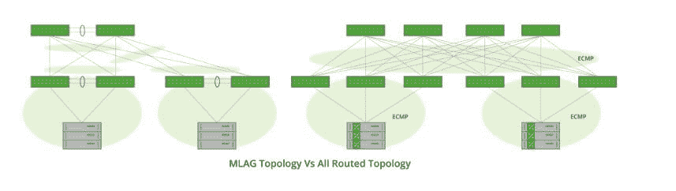
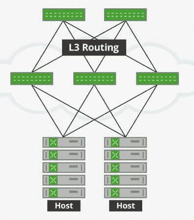
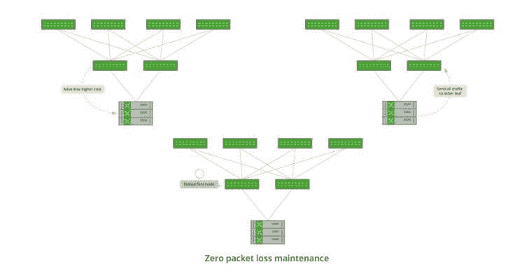

# 通过在主机上路由来避开第 2 层网络的陷阱

> 原文：<https://thenewstack.io/ditch-pitfalls-layer-2-networks-modern-data-center-design/>

如果您在 IT 部门工作，您可能非常熟悉对意外停机进行故障排除，这种意外停机是由简单的交换机升级或在网络上安装新服务器引起的。虽然私有云和公共云的现代数据中心设计已经从传统的第 2 层网络快速发展到第 3 层中心叶脊柱架构，但我们中的许多人仍然在处理来自 L2 技术的头痛问题，如多机箱链路聚合( [MLAG](http://ethancbanks.com/2014/03/27/the-ethernet-switching-landscape-part-04-multichassis-link-aggregation-mlag/) )、第一跳冗余协议( [FHRP](http://www.routerfreak.com/ccna-fhrp-hop-redundancy-protocols/) )和生成树协议( [STP](http://www.omnisecu.com/cisco-certified-network-associate-ccna/spanning-tree-protocol-stp-convergence.php) )。

如果有一种方法可以提供 MLAG 可以提供的冗余，而又没有其脆弱性和维护窗口风险，那会怎么样？

## 数据中心设计的历史:从桥接到路由

 [JR 河流

JR 是 Cumulus Networks 的联合创始人兼首席技术官，负责公司、技术和产品方向。自从以太网只能在同轴电缆上运行以来，JR 就参与了网络建设。他参与了当时一些最基础的网络产品，从 3Com 早期的网络接口卡到思科的交换和路由产品。JR 早期在谷歌参与自主开发的网络，并担任思科统一计算系统的系统架构副总裁，这两者都有助于调整他对现代数据中心网络的看法。](https://www.cumulusnetworks.com/) 

在数据中心体系结构的早期，数据中心的入口点由一对聚合交换机组成，这些交换机与主干网一起运行路由协议，并且是连接服务器的 L2 域的宇宙中心。最初，服务器直接连接到这些聚合交换机；然而，数据中心规模的增加导致了大型 L2 交换结构。当时，许多应用程序非常“L2 意识”；他们依赖 L2 进行应用程序/服务发现和心跳等操作，以至于像 vMotion 这样的技术只能迁移 L2 身份，并且只能在 L2 域中工作。随着规模的增长，行业对生成树协议(基于 VLAN 的生成树、快速生成树等)进行了调整，并创建了绑定、MLAG 和虚拟机箱等技术。如今，最先进的 L2 数据中心设计由基于 MLAG 的叶脊柱组成。

在此过程中，服务提供商和 webscale 公司意识到这些 L2 网络具有糟糕的故障特征，难以排除故障，并且无法扩展。他们研究了计算机科学，认识到像光纤通道和 Infiniband 这样的互连依赖于高度并行的网状结构；就像您可以使用 IP 路由构建 L3 网络一样。他们开始缩小 L2 域的规模，以保持在一个服务器机架内。与此同时，应用程序已经发展到使用 IP 进行服务发现和内务处理，这部分是为了拓宽它们的使用案例，还因为“IP 套接字”是所有应用程序框架中的基本通信工具。

在我的职业生涯中，我见过一些公司直接路由到他们的主机。然而，这种情况很少，部分原因是由于对可用软件的舒适性以及路由存在的配置复杂性。路由套件的成熟解决了第一个问题，开放最短路径可用( [OSPF](http://searchenterprisewan.techtarget.com/definition/OSPF) )和边界网关协议( [BGP](http://searchtelecom.techtarget.com/definition/BGP) )的引入使配置变得极其简单。

## 为获胜在主机上路由

主机上的路由是现代数据中心设计中采用行业标准 L3 协议的自然延伸。通过利用路由协议 OSPF 或 BGP，将 L3 足迹进一步扩展到您的数据中心，一直扩展到服务器，这意味着您可以一劳永逸地解决 MLAG 和 STP 问题。它让您最终实现以更高速度运行的更具弹性的网络。

通过在主机上进行路由，您获得了数据中心运营的两个巨大优势:从结构中优雅地移除交换机以进行维护的能力，以及通过拥有两个以上的 tor 来增加带宽冗余。

L2 网络的运行方式使得没有办法在不造成中断和导致一些流量损失的情况下影响数据流。采用 MLAG 和 LACP 的最复杂的部署也面临这种命运，同时还依赖于非标准的协议交互。像 OSPF 和 BGP 这样的路由协议允许节点通过通知网络的其余部分绕过它们进行路由来优雅地将自己从数据流中移除；实现网络设备的安全和结构化滚动升级。

L2 网络也是建立在任意两点之间只有一条路径的前提上；这是生成树协议的基础。多年来，业界已经提出了诸如 bonding 和 MLAG 之类的机制来对此进行改进；然而，他们都还在与自然抗争。

相比之下，L3 网络设计为允许和鼓励多路径。美国计算机科学家范·雅各布森(Van Jacobson)曾经告诉我，互联网的设计是为了让一个大城市遭受直接攻击时，系统仍能正常运行。当通过主机上的路由应用这一特性时，数据中心架构师可以使用简单的、基于标准的工具在其网络中构建额外的带宽和冗余。

[主机上的路由](https://cumulusnetworks.com/routing-on-the-host/)在构建基础设施以支持基于容器的应用程序时提供了一个优雅的架构。架构师可以在主机上使用路由，在使用本地 Docker 网络时通告覆盖端点，或者在提供容器时使用网络插件动态通告各个容器。

## 现场:现代数据中心设计的新黄金标准

主机上的路由可供社区中的任何人[下载](https://cumulusnetworks.com/routing-on-the-host/)。我们有几个客户一直在使用 L3 运行他们的数据中心。

电子邮件营销软件提供商 [Campaign Monitor](https://www.campaignmonitor.com/) 已经使用主机上的路由来大大提高其网络中关键服务的可用性。最大的好处是添加了未编号的 Quagga BGP，并消除了 MLAG、FHRP 和 STP 等 L2 技术。

总部位于瑞士的非营利性互联网服务提供商 [SWITCH](https://www.switch.ch/) 是另一家使用主机上的路由来消除其环境中的 MLAG 和生成树的公司，同时仍然为主机提供冗余。 [Cumulus Quagga](https://github.com/CumulusNetworks/quagga) 的无编号 OSPF 为组织带来了网络灵活性，使之成为他们的核心功能。在带有 Cumulus Quagga 的主机上部署路由提高了整体系统可用性，同时简化了操作和故障排除。

最后，作为在线 3D 打印服务的推动者， [Shapeways](http://www.shapeways.com/) 在主机架构上部署路由，以实现网络可靠性、可扩展性和可用性，从而实现其弹性和简单性目标。由此产生的系统使 Shapeways 能够服务于他们的高要求客户和合作伙伴，无论是现在还是随着他们的业务继续增长。

由 Cumulus enhanced Quagga 软件包支持的主机上的路由是在整个数据中心实现强大、灵活和网络级可靠性的一种方式。宣布独立于深夜故障排除和 L2 数据中心可能比你想象的更有可能。

<svg xmlns:xlink="http://www.w3.org/1999/xlink" viewBox="0 0 68 31" version="1.1"><title>Group</title> <desc>Created with Sketch.</desc></svg>