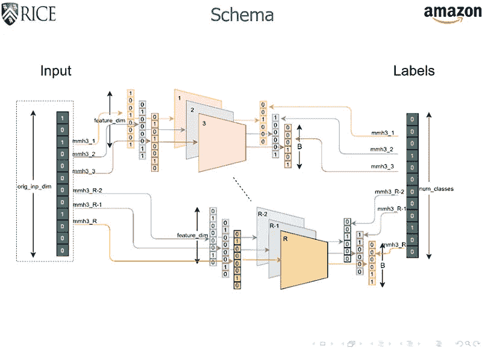

# 分而治之:分布式深度学习在搜索中效率成倍提高

> 原文：<https://thenewstack.io/divide-and-conquer-distributed-deep-learning-exponentially-more-efficient-in-search/>

对于许多人来说，网上购物已经成为一个更好的选择，而不是从一个商店跳到另一个商店，花几个小时寻找某个尺寸或最好的价格。毕竟，网上购物简单方便:输入搜索词，瞧！— 一页又一页的可能产品选择——不用出门就能找到。

但是你有没有想过当你输入搜索词时，在幕后发生了什么？检索这些搜索结果可能需要什么样的计算资源，尤其是当像亚马逊这样的公司据说在全球销售超过 30 亿件产品的时候？正如人们可能想象的那样，训练一个神经网络来理解用户的[语义意图](https://en.wikipedia.org/wiki/User_intent)，然后从如此巨大的搜索空间中搜索、学习并产生相关结果，这将需要大量的计算能力——导致一个系统在未来很难扩大规模，特别是随着越来越多的产品被添加，以及传统的[基于硅的硬件难以跟上](/farewell-moores-law/)。

用专业术语来说，专家称之为极端分类问题，因为这个问题有太多可能的结果。为了解决这个问题，莱斯大学的研究人员设计了一种简单而巧妙的“分治”算法，与其他大规模深度学习技术相比，训练时间快了 7 到 10 倍，内存占用少了 2 到 4 倍。这些结果是从亚马逊搜索数据集的测试中收集的，该数据集包含大约 7000 万个查询和超过 4900 万个产品。

莱斯大学计算机科学助理教授、[论文的](https://arxiv.org/pdf/1910.13830.pdf)作者之一、 [Anshumali Shrivastava](https://www.cs.rice.edu/~as143/) 说:“我们利用了极端分类和[压缩感知](https://en.wikipedia.org/wiki/Compressed_sensing)(一种信号处理技术)的基本联系，提出了一种指数级廉价的训练和推理算法。“最令人兴奋的是，该算法天生具有令人尴尬的并行性。因此，尽管更便宜，它也是无限可扩展的:我们可以最佳地使用计算能力。一般来说，本质上的算法改进很少是硬件友好的。通常情况下，情况正好相反。”

## “搜索空间的指数缩减”

该算法被称为“通过哈希合并的平均分类器”或 MACH，其卓越的效率来自于它使用了一种被称为 [count-min sketch](https://en.wikipedia.org/wiki/Count%E2%80%93min_sketch) 的概率数据结构。在不涉及太多数学细节的情况下，该算法使用[通用哈希](https://en.wikipedia.org/wiki/Universal_hashing)将大量的类别减少为更少数量的并行和独立的分类任务，处理更少但不变的类别。

Shrivastava 告诉我们:“我们的程序很简单，但非常反直觉，除非你看到它背后的数学。”该过程包括将对象(或产品)随机组合到“[箱”](https://en.wikipedia.org/wiki/Bin_(computational_geometry))中，并训练分类器来预测箱，而不是对象。在推断期间，预测的箱概率被组合以识别对象。”

为了理解这在实际中可能如何工作，该论文的主要作者，Tharun Medini，以网上购物为例，提出了一个有趣的思想实验:“让我们保守估计产品的数量为 1 亿。传统方法将查询和所有 1 亿个产品投射到一个密集的[向量空间](https://en.wikipedia.org/wiki/Vector_space)。为了检索最相关的产品，这些方法对所有产品向量执行最近邻搜索。这一步需要大量的计算，而且通常很浪费。”

MACH 没有对 1 亿个产品进行培训，而是采取了一种不同的方法，将所有 1 亿个产品随机放入三个容器中。然后，马赫创造了另一个“世界”，并再次将 1 亿件产品随机分类到三个不同的箱子中。最值得注意的是，随机排序的 1 亿个产品的分布在每个世界都是不同的。为每个世界训练一个分类器，以便仅将搜索分配给三个箱，而不是其中的产品。

“现在，一个搜索被输入到第一个分类器，它显示 bin，”Medini 继续说道。相同的搜索被馈送到第二分类器，并表示箱 1。最可能的类是这两个容器中的公共类。所以我们需要看看这两个箱子之间可能的交集。通过创建六个类(每个世界三个)，我们将搜索空间减少到整个产品空间的 1/9(1/3 x 1/3)。如果我们再增加一个有三个箱子的世界，我们就有了 1/27 的公共搜索空间，而代价只是九个类。通过支付线性成本，我们得到了搜索空间的指数级缩减。因此，我们的方法比以前的方法更有效。”

该小组目前正在努力扩展 MACH，以应对计算密集型挑战，如[预测蛋白质结构](/harvards-new-open-source-ai-algorithm-simplifies-protein-folding-puzzle/)或定位基因组序列。正如该团队所指出的那样，由于他们的算法将计算需求降低了几个数量级，因此，它可以在提高任何处理大量可能结果的深度学习模型的效率方面发挥至关重要的作用——无论是在线搜索相关产品，还是处理问题的自然语言处理模型。

Shrivastava 指出:“可能还有其他几个人工智能问题存在类似的减少。”“未来，我们应该睁大眼睛，寻找其他可以让人工智能更高效的基本数学工具。我们不能指望硬件能应付指数级增长的需求。他指出[最近的报告](https://arxiv.org/abs/1906.02243)表明训练一个人工智能模型“在其一生中可以排放五辆汽车那么多的碳，因此迫切需要找到[节能的机器学习算法](https://thenewstack.io/check-your-ml-carbon-footprint-with-the-machine-learning-emissions-calculator/)。保持人工智能发展的最大希望是找到更聪明、更有效的算法。"

[https://www.youtube.com/embed/zHXy-AlzSxQ?feature=oembed](https://www.youtube.com/embed/zHXy-AlzSxQ?feature=oembed)

视频

阅读团队的[论文](https://arxiv.org/pdf/1910.13830.pdf)，或者在 [Github](https://github.com/Tharun24/MACH/) 上查看马赫的代码。

图片:莱斯大学

<svg xmlns:xlink="http://www.w3.org/1999/xlink" viewBox="0 0 68 31" version="1.1"><title>Group</title> <desc>Created with Sketch.</desc></svg>