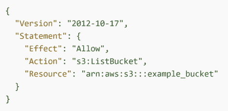
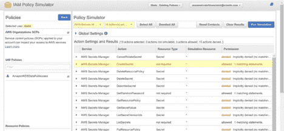
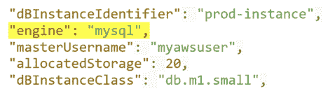
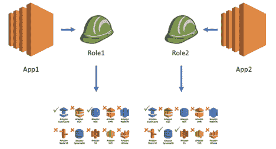
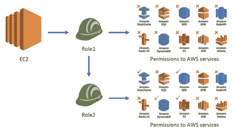

# Amazon Web Services 的 DIY 访问安全性

> 原文：<https://thenewstack.io/diy-access-security-for-amazon-web-services/>

 [迈克尔·多林斯基

迈克尔·多林斯基是云安全提供商 Ermetic 的 CTO。他在领导 IT 安全产品研发团队方面拥有 20 多年的经验。此前，Michael 是 Aorato 的联合创始人和副总裁，Aorato 为微软活动目录服务创建了一个行为监控防火墙。在 2014 年被微软收购后，Michael 领导了 Aorato 集团，在那里他扩展了 Microsoft-ATA 和 Azure-ATP 安全产品，以支持全球 10，000 多家企业客户。他的职业生涯始于以色列国防军的网络情报部门。](https://www.linkedin.com/in/michaeldolinsky/?originalSubdomain=il) 

到目前为止，大多数安全专业人员都熟悉云共享责任模型。就其核心而言，这意味着云服务提供商(CSP)负责云的安全，客户负责保护他们放在云中的数据。我们以亚马逊网络服务(AWS)为例。

亚马逊弹性计算云(Amazon EC2)被归类为基础架构即服务(IaaS)，因此需要客户执行所有必要的安全配置和管理任务。这包括管理他们的数据(包括加密选项)、对他们的资产进行分类，以及使用 IAM 工具来应用适当的权限。

考虑上面陈述中的最后一个要求，“应用适当的权限”这有时也称为强制最低特权访问。从表面上看，在 AWS 中实施适当的权限或最低特权应该是简单明了的。

它包括监控每个身份(用户、计算机或应用程序)实际使用的权限，将此活动与分配的权限进行比较，并使用分析数据来确定角色和权限的大小。通过不断地重新检查环境并删除过多的权限，随着时间的推移，可以获得并维护最少的权限。

实际上，这说起来容易做起来难。这是因为管理角色不足以实现最小特权。即使像理解授予单个人类用户的权限这样简单的任务也可能极其复杂。

AWS 政策允许委托人列出 S3 存储桶

为了理解如何在 AWS 中评估和理清用户和应用程序权限，让我们看一些常见的场景和概念，包括角色合理调整、角色分割和角色链接。以及如何使用本机 AWS 工具(Policy Simulator、Access Advisor 和 CloudTrail)来实现最小权限。

## 政策模拟器

几年前推出的 AWS Policy Simulator 有助于自动化权限管理。这个免费工具允许管理员选择任何 AWS 实体(IAM 用户、组或角色)和服务类型(即关系数据库服务或 S3 存储桶),并自动评估用户对所选特定服务的权限。

虽然政策模拟器非常有用，但它还远未成熟。例如，它没有审查用户可能承担的所有角色及其策略，没有考虑 ACL 或权限边界。

此外，策略模拟器不允许为了评估哪些用户可以(直接或间接)访问特定资源(例如，S3 桶)而反转查询。此操作必须手动执行，或者通过编写专有脚本来执行。

在 IAM 策略模拟器中识别允许和拒绝的权限

## 访问顾问和合理调整

接下来，让我们考虑角色的合理调整，这需要确保给定的角色只拥有履行其业务职能所需的权限。AWS 提供了一个名为 Access Advisor 的本机工具，用于调查给定角色访问的服务列表，并验证其使用情况。

考虑一个简单的例子，其中一个应用程序正在使用一个有权访问 Amazon RDS 和 S3 服务的角色，但是只使用一个 MySQL 实例。访问顾问将显示亚马逊 RDS 是唯一访问的服务。这将使我们能够删除过多的 S3 权限。但是，它没有列出访问了 RDS 服务(即 MySQL)中的哪些资源。这将阻止我们删除环境中所有数据库的现有和不必要的权限。Access Advisor 提供了一些基本功能，但显然还不够。

## 云迹救援

继续这个例子，下一步是限制这个角色的权限，使它只提供对 MySQL 资源的访问，而不是属于 RDS 服务类型的所有资源。进一步说，我们可能应该限制角色对特定数据库实例的访问。这需要理解角色所执行的活动的能力，这可以使用第三个 AWS 工具 AWS CloudTrail 来完成。

来自 CloudTrail 日志条目的快照

## 角色分割

在一个不同但非常常见的场景中，两个不同的应用程序共享相同的角色。像以前一样，假设这个角色有访问 Amazon RDS 和 S3 服务的权限。如果一个应用程序正在使用 MySQL 数据库，而另一个应用程序正在访问 S3 存储桶，Access Advisor 将显示角色中定义的所有服务实际上都在使用。

现在的挑战是确定这两个应用程序中的每一个是否需要访问角色中定义的所有资源，以及“实际上”需要什么类型的访问，以便根据需要调整权限。由于 Access Advisor 中没有这种粒度级别，因此有必要搜索 CloudTrail 日志，并将这些日志与从运行应用程序(如 EC2、Lambda、ECS)的计算基础架构中获得的日志相关联。

在我们的示例中，由于每个应用程序使用不同的服务集来实现最低特权，我们需要为每个应用程序分配不同的角色，这一操作称为角色分割。只有在我们拆分了原始角色，并为每个应用程序分配了自己的角色之后，我们才能执行合理的规模调整。

将一个宽泛的角色分成两个细粒度的角色

## 角色链接

在我们的最后一个场景中，假设一个应用程序承担一个没有任何敏感权限的角色(我们称之为 Role1)。然而，这个角色有权限承担一个不同的、更有特权的角色(为了保持一致，我们称之为角色 2)，这个角色有权限访问各种服务，比如 Amazon ElastiCache、RDS、DynamoDB 和 S3。我们将这种场景称为“角色链”

更复杂的是，“角色链”可以包含两个以上的角色。在这种情况下，如果不能映射 AWS 帐户内部以及帐户之间的角色链，就不可能理解和正确调整访问权限。试图用本地 AWS IAM 工具做到这一点实际上是不可能的。

角色链接，其中角色 1 有权承担特权角色 2

正如我们已经看到的，在 AWS 中使用本机或自己动手的工具来管理身份和访问是极其复杂、耗时且容易出错的。然而，与错误配置和过度访问权限相关的数据泄露风险[已被很好地记录下来](https://resources.infosecinstitute.com/lessons-learned-the-capital-one-breach/)。

随着组织扩展其云足迹，用户和应用程序倾向于累积远远超过技术和业务需求的权限。监控和补救这一权限“缺口”需要专门构建的自动化解决方案。

亚马逊网络服务是新堆栈的赞助商。

通过 Pixabay 的特征图像。

<svg xmlns:xlink="http://www.w3.org/1999/xlink" viewBox="0 0 68 31" version="1.1"><title>Group</title> <desc>Created with Sketch.</desc></svg>