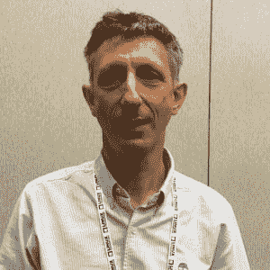
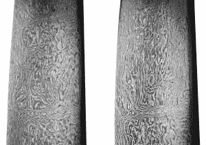

# DNA:永远不会过时的长期数据存储格式

> 原文：<https://thenewstack.io/dna-long-term-data-storage-format-will-never-go-obsolete/>

一段时间以来，数字档案工作者一直担心数字存储的短暂性。你怎么能把重要文档托付给任何一种存储技术呢？这种技术很可能在一二十年内就过时了。现在一些研究人员正在研究利用自然界自身的数字存储机制， [DNA](https://ghr.nlm.nih.gov/primer/basics/dna) (脱氧核糖核酸)进行长期数据保留。

在上周于北卡罗莱纳州罗利举行的 Linux 基金会保管库存储会议上，欧洲生物信息研究所(EBI)的研究员 Nick Goldman(T6)谈到了使用 DNA 作为长期存储格式的可行性，这是一个及时的谈话，不仅因为这是在一个存储会议上，而且因为星期一是 DNA 日。

“我们谈论的是真正的长期目标。这不仅仅是让存储在未来可用，而是让它在一年后、10 年后、100 年后或 1000 年后可用，”Goldman 说。

他解释说，DNA 作为一种存储格式有一些天然的优势。它很紧凑。它持续很长时间。维护起来很便宜。最棒的是，DNA 是人类的遗传物质，这意味着，只要人类活着，就会有 DNA 阅读器。

“它永远不会过时，”戈德曼谈到 DNA 时说。“每隔几年，就会有新的设备出现。但只要有人关心自己的健康，这种媒介就永远是可读的。”

本质上，DNA 由四种组成分子组成，即缩写为 A、C、G 和 t 的核苷酸。在基因组中，它们被束缚在一个链状分子中，延伸到数十亿个碱基，就像乐高积木一样。遗传密码是通过字母的排序获得的。

“贯穿地球上 35 亿年的进化，DNA 被用于基因组，以保存活生物体中每个细胞所需的所有过程和分子的信息，”Goldman 说。

基因组的双螺旋排列也提供了一个坚固的复制格式。这是两条相同的基因组链粘在一起，提供了稳定性和复制 DNA 信息的简单方法。“打开螺旋，用每一边作为模板制作一个新的副本，现在你的副本数量已经翻了一番，”高盛说。

我们已经开发了很好的技术来读取基因组。一个新系列的基因组阅读机器[即将上市](https://www.theguardian.com/science/2015/oct/15/handheld-dna-reader-revolutionary-and-democratising-say-scientists)，可以拿在手中。将 DNA 样本放入溶液中，将一滴溶液放入机器中，然后通过 USB 连接到计算机获取结果。写 DNA 还不太划算([目前估计](http://www.popsci.com/future-dna-hard-drive)每 MB 大约 12，000 美元)，但是如果扩大到大规模生产的需要，这些成本应该也会下降。

理论上，没有理由任何二进制代码不能用一系列 DNA 片段来表示。为了测试 DNA 作为存储机制，Goldman 的小组想出了一个基本代码来转换任何二进制的 0 和 1 的集合，这样它们就可以用一系列的 DNA 片段来表示。高盛承认，编码算法是“真正的本科生的东西”，设计出来只是为了证明编码是可能的。

> “因为我们会一直读取 DNA。总会有读者”

他们将许多不同的数字对象编码到 DNA 片段中，包括一张校园照片，一份马丁·路德·金“我有一个梦想”演讲的音频文件，一份詹姆斯·沃森和克里克·弗朗西斯[著名的第一篇描述 DNA 螺旋结构的论文](https://www.templateroller.com/template/1795962/molecular-structure-of-nucleic-acids-a-structure-for-deoxyribose-nucleic-acid-j-d-watson-f-h-c-crick.html)的 PDF 副本，以及一份莎士比亚所有十四行诗的文本副本。然后他们能够解码并完美地恢复所有这些信息。

据 Goldman 所知，这个实验是第一次将信息编码到 DNA 上，并成功无误地解码。

当然，这全是 1 和 0，但高盛的生物学家同行仍然感到惊讶。“你可以储存照片。你也能储存声音？这太神奇了！”他们告诉高盛。

一家名为[安捷伦](http://www.genomics.agilent.com/en/home.jsp)的公司编写的测序代码不到一兆字节。它在试管中到达高盛的办公室，看起来只不过是容器内部的一层灰尘。“DNA 本身在室温下只是灰尘。在我们处理的数量中，这几乎是看不见的，”Goldman 说。

类似的工作正在同时进行。哈佛大学的一个研究小组与 Technicolor 合作，[编码了有史以来第一部科幻电影之一](http://www.dailynews.com/science/20150810/this-harvard-scientist-is-coding-an-entire-movie-onto-dna)，1902 年的《[登月之旅](https://www.youtube.com/watch?v=BNLZntSdyKE)来自华盛顿大学和微软[的研究人员刚刚在 DNA 上编码了一系列图片](http://www.washington.edu/news/2016/04/07/uw-team-stores-digital-images-in-dna-and-retrieves-them-perfectly/)，其中许多是猫的图片。

高盛的团队确实遇到了一些挑战。读者在解读含有一长串重复核苷酸的片段时有些困难。因此，编码算法被修改，这样就不会有重复的元素。研究人员还发明了一个索引系统，该系统将建立 DNA 读取的顺序。

高盛是 DNA 数据存储过程商业化的早期启动计划的一部分。要在商业规模上做到这一点，仍需要将写入性能提高三到四个数量级。这是完全可行的，因为在过去的 15 年中，读取 DNA 的速度已经提高了 6 个数量级。

还需要更复杂的编码技术。高盛表示,[喷泉码](https://www.ma.utexas.edu/users/voloch/Homework/MacKay05.pdf)很适合这种格式。

“这里的想法是，在一个有点像喷泉的系统中，信息被吐出来，你在下面放一个桶来收集一些传输。如果代码运行良好，你可以相当快地重建整个信息，”Goldman 说。“这与 DNA 模型很好地合作，在 DNA 模型中，你对一些 DNA 链进行排序，直到你得到完整的信息。”

## 时代的智慧

捕捉人类多年来的知识是一件非常困难的事情，而数字时代对此毫无帮助。

大马士革钢剑刃(1750-1794)，来自“伊朗的武器和盔甲”，作者 Rahil Alipour，Ata Abadi，Moshtagh Khorasani。

大马士革钢是中东以其强度而闻名的一种钢材，它的制造公式现在基本上已经失传了。“这在过去是一个有用的产品，我们只是失去了信息，”高盛说。

我们现在还有哪些信息想要保存数百年？很有可能我们没有保留它。我们当中有多少人还在使用 20 年前才存储数据的软驱阅读器？光盘的[寿命可能最多只有几十年](http://www.makeuseof.com/tag/cds-truth-cddvd-longevity-mold-rot/)。

就寿命而言，你无法打败旧的学校录音格式，即使它们没有新的同类产品所提供的可搜索性或信息密度。英国仍然使用[羊皮纸，或小羊皮来记录它的法律](http://www.bbc.com/news/magazine-35569281)。戈德曼还提供了一系列位于孔庙的石板的例子，这些石板在 17 世纪被用来记录诗歌，至今仍清晰可辨。

DNA 为长期储存提供了一些吸引人的属性。它是信息密集型的——非常小。充满 DNA 的试管相当于一百万张光盘。

DNA 的另一个明显优势是它可以持续非常非常长的时间。我们已经对死于 20，000 年前的长毛猛犸象、60，000 年前的野牛和几十万年前的马进行了 DNA 测序。在所有这些案例中，DNA 都随着时间的推移而降解，但仍有足够的 DNA 来重建整个基因组。

“那些不是精心准备的样品。他们只是被冻死在寒冷地方的马，”戈德曼说。“你不需要一直重写。只要你喜欢，它就会一直呆在那里。”

为了保持 DNA 完整，它需要在一个相当干燥和凉爽的环境中。例如，我们希望保存数千年的信息可以保存在类似于[斯瓦尔巴全球种子库](https://www.croptrust.org/what-we-do/svalbard-global-seed-vault/)的地方，这是一个储存种子以保护生物多样性的国际合作项目。

Goldman 解释说，解码 DNA 本身并不是一个复杂的过程。你不需要数百个磁盘驱动器，序列插入它来制作一个拷贝。相反，你只需将试管 DNA 进行聚合酶链式反应(PCR)，这是一种模仿活细胞发生的化学过程。“你运行两分钟，得到两份拷贝。然后再运行两分钟，得到四份拷贝，再运行一分钟，得到八份拷贝，”戈德曼说。

最重要的是，只要人类对自己的福祉感兴趣，DNA 就永远不会成为过时的格式，

“因为我们会一直读取 DNA。总会有读者的，”戈德曼说。

通过 Pixabay 的特征图像。

<svg xmlns:xlink="http://www.w3.org/1999/xlink" viewBox="0 0 68 31" version="1.1"><title>Group</title> <desc>Created with Sketch.</desc></svg>