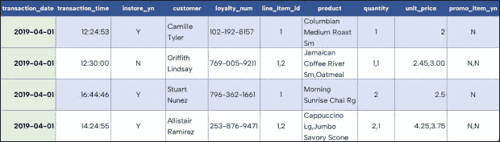
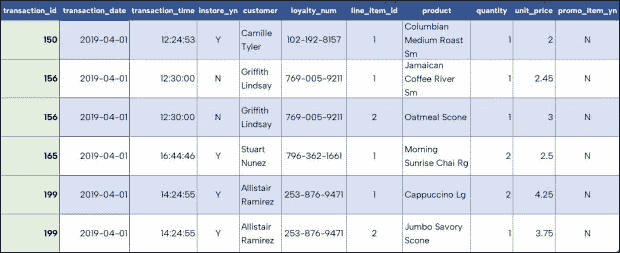
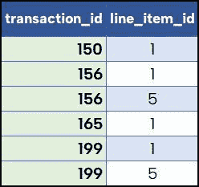
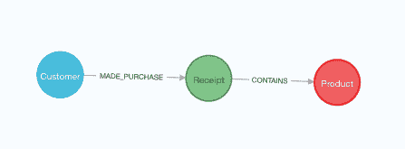
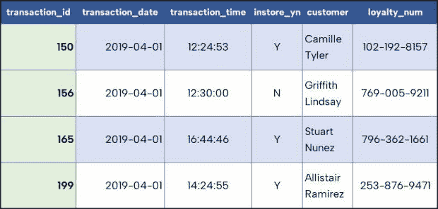
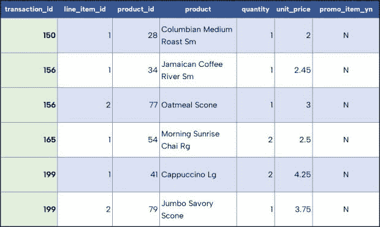
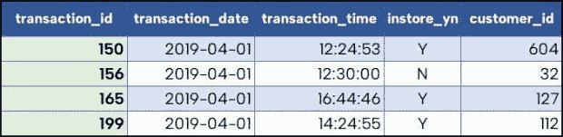
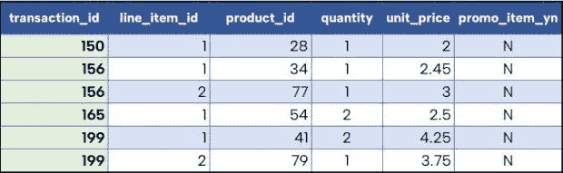
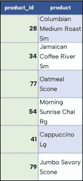
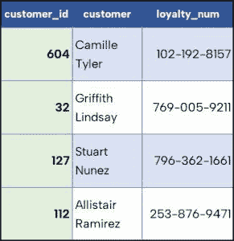

# 我们还需要数据标准化吗？

> 原文：<https://thenewstack.io/do-we-need-data-normalization-anymore/>

一位来自大学的数据库教授教我的学生将 E. F. Codd 的大型共享数据的三种范式记忆为“密钥，整个密钥，除了密钥什么都没有。”在信息技术中担任许多不同角色的人——包括开发人员、数据库管理员、领域建模人员、业务涉众——经常会接触到数据规范化。对他们来说，正常化就像呼吸一样正常。

**然而，随着数据库环境变得越来越多样化，硬件变得越来越强大，我们可能想知道数据标准化的实践是否还有必要。我们是否应该为[优化数据存储和查询](https://www.google.com/search?q=what+I+learned+site%3Athenewstack.io&sxsrf=ALiCzsbDxy-Hg9cDMZlrzXR4uGQ5nmFreg%3A1665604768646&ei=oBxHY8D8JuKE0PEP3_uJgAI&ved=0ahUKEwjAzMikvdv6AhViAjQIHd99AiAQ4dUDCA4&uact=5&oq=what+I+learned+site%3Athenewstack.io&gs_lp=Egdnd3Mtd2l6uAED-AEBSNUOUABY7g1wAHgAyAEAkAEAmAFLoAHoBqoBAjE04gMEIEEYAOIDBCBGGACIBgE&sclient=gws-wiz)而烦恼，以便返回最少的数据量？如果是这样，是否某些数据结构使得解决这些问题比其他问题更重要？**

## 什么是数据规范化？

[数据规范化](https://thenewstack.io/its-time-to-normalize-cyberattack-data/)的过程优化了关系数据库中的[数据结构](https://thenewstack.io/category/data-2/)，以确保数据完整性和查询效率。它通过一系列规定的步骤来规范化结构，产生所谓的“范式”，从而减少冗余并提高准确性。数据规范化的核心是帮助避免在创建新数据( **Insert** )、更新现有数据( **Update** )或删除数据( **Delete** )时出现的数据异常。

这种异常给保持数据值同步(完整性)带来了挑战。规范化步骤需要验证外键(到相关数据的链接)，将不相关的实体与其他表分开，并将行和列作为统一的数据对象进行检查。虽然[标准化步骤的完整列表](https://www.softwaretestinghelp.com/database-normalization-tutorial/)相当严格，但我们将重点关注那些在业务实践中最常用的步骤:

1.  第一范式(1NF)
2.  第二范式(2NF)
3.  第三范式(3NF)

最近偶然发现一个咖啡店数据集，似乎很适合我们。表 1 展示了来自存储库的数据。我还使用这个样本数据创建了一个 [GitHub 存储库，它与](https://github.com/JMHReif/data-normalization)向顾客销售的食品和饮料项目有关。

表 1。收据表为非标准化数据

是什么让这个数据有问题？如果我们试图在这个数据中插入一个新行，我们可能会无意中产生一个重复的客户。更糟糕的是，为了避免这样做，我们必须收集关于客户、产品和收货日期/时间的所有信息。如果我们需要更新或删除收据上购买的产品，我们需要对列表中的每个产品列进行排序以找到值。

## 第一范式—密钥

对于我们的“键，整个键，只有键”中的第一步，一个表应该有一个主键(一个单独的列或一组列)，以确保每一行都是唯一的。一行中的每一列也应该只包含一个值——换句话说，没有嵌套表。在书面分类账中，表 1 中的一些列可以被认为是*业务关键字*或*自然关键字*。但是它们不会是主键，因为它们都不能保证 1)是唯一的，并且 2)是存在的。

我们的示例数据集需要一些工作才能达到第一范式(1NF)。虽然我们可以获得日期/时间或日期/时间/客户组合的唯一行，但引用生成某种唯一值的行通常要简单得多。让我们通过向收据表添加一个 **transaction_id** 字段来实现这一点。

还有几行订购了不止一个项目( **transaction_id 156** 和 **199** )，所以有几列的行项目有不止一个值。我们可以通过将具有多个值的行分成单独的行来纠正这一点。这产生了表 2 所示的 1NF 数据。

表二。第一范式的收据表(1NF)

表 3。表 2 中的关键值

对于 1NF 数据，复合(多列)关键字通过组合 **transaction_id** 和 **line_item_id** 来唯一标识一行，因为一张收据不能包含编号为 1 的多个行项目。表 3 描述了表 2 的一部分，归结为那些主键值。

这两个值的每个组合都是唯一的。我们已经将第一范式应用于我们的数据，但我们仍然有一些潜在的数据异常。如果我们想添加一个新的收据，我们可能需要创建多个行，这取决于它包含多少行项目，并在每行上复制 **transaction_id** 、 **date** 、 **time** 和其他信息。更新和删除会导致类似的问题，因为我们需要确保所有受影响的行数据都是一致的。

现在，[如果我们从一开始就使用一个图形数据库](https://thenewstack.io/the-3-underrated-strengths-of-a-native-graph-database/)，那么产生的用于制作我们的表 1NF 的关系将如图 1 所示。

图一。图形数据库如何从第一范式投射关系。

在这里，你可以看到三个独立的对象，分别描述了**客户**、**收据**和**产品**。行项目信息存储在**收据**的每个元素和每个关联的**产品**之间的关系中。

## 第二范式—整个密钥

第二范式确保每个非键列完全依赖于整个键。对于有多列作为主键的表来说，这是一个更大的问题，比如我们的咖啡收据表。

对于 2NF，我们需要评估表 1 中的每个非键字段，看看我们是否有任何部分依赖关系——换句话说，非键列是否只依赖于键的一部分，而不是整个键。由于 **transaction_id** 和 **line_item_id** 构成了我们的主键，所以让我们从 **transaction_date** 字段开始。交易日期取决于交易 ID，因为同一交易 ID 不能在另一天再次使用。但是，交易日期根本不取决于行项目 ID。行项目可以跨交易、天数甚至客户重复使用。

好了，我们已经发现表 1 不遵循第二范式，但是**客户**列呢？客户不依赖于交易 ID 和行项目 ID。如果有人给我们一个交易 ID，我们将知道哪个客户进行了购买，但是如果给我们一个行项目 ID，我们将不知道该收据属于哪个客户。毕竟，多个顾客可能在他们的收据上订购了一、二、六件商品。**客户**字段链接到**交易 id** (假设多个客户不能分割收据)，但是客户不依赖于行项目。我们需要修复这些部分依赖关系。

最直接的解决方案是为订单行项目创建一个单独的表，将仅依赖于 **transaction_id** 的列留在接收表中。第二范式中的更新数据类似于下面的表 4 和表 5。

表 4。第二范式(2NF)的收据表。

表 5。第二范式(2NF)的收货行项目表。

现在让我们测试一下我们的更改是否解决了问题，并且遵循了第二范式。对于表 4 中的收据数据， **transaction_id** 成为唯一的主键。交易日期基于 **transaction_id** 是唯一的，同样 **transaction_time** 也是唯一的。这样，一个交易 ID 只能有一个日期和时间。

订单不能同时放在店内和店外，因此是否在店内购买的值取决于 **transaction_id** 。因为客户不能分割收据，所以每笔交易也会给我们一个唯一的客户。最后，如果有人给了我们一个交易 ID，我们就可以识别附加在它上面的一个客户忠诚度号码。

接下来是表 5 中的收货行项目。行项目依赖于与之相关的交易(收据),所以我们在行项目表中保留了交易 ID。 **transaction_id** 和 **line_item_id** 的组合成为我们在行项目表上的组合键。 **Product_id** 和 **product** 根据交易和行项目共同确定。单个交易 ID 不会告诉我们是哪种产品(如果收据包含购买的多种产品)，单个行项目 ID 不会告诉我们参考的是哪种购买(不同的收据可能订购相同的产品)。这意味着**产品 id** 和产品值依赖于整个密钥。

我们还可以将数量与**事务 id** 和**行项目 id** 相关联。收据或行项目 id 中的数量可以相同，但是两个键的组合为我们提供了一个数量值。如果没有**交易标识**和**行项目标识**字段，我们也不能唯一地标识我们的**单价**或**促销项目标识**列值。

## 第三范式—除了密钥什么都没有

尽管表 4 和表 5 满足第二范式，但仍存在一些数据异常。如果我们试图为购买或新客户创建新产品，我们不能在当前的表中创建它们，因为我们可能还没有与它们相关联的收据。如果我们需要更新一个产品或客户(例如，在输入错误或名称改变的情况下)，我们需要用这些值更新所有的行项目行。如果我们想删除一个产品或客户，我们不能，除非我们删除收据或行项目引用他们。

为了解决这些问题，我们需要转向第三范式(3NF)，它确保非键字段只依赖于键。换句话说，它们不依赖于其他非键字段，从而导致传递依赖。

在我们的收据表(表 4)上，我们需要检查非键字段(除了 **transaction_id** 之外的所有字段)，以查看这些值是否依赖于其他非键字段。 **transaction_date** 、 **transaction_time** 和 **in_store_yn** 的值既不基于彼此也不基于相关联的客户或忠诚度号码而改变，因此它们完全依赖于密钥。

但是客户信息呢？如果客户发生变化，**忠诚度 _ 数量**的值可能会发生变化。例如，如果我们需要删除或更新购买的客户，忠诚号也需要一起删除或更新。所以，**忠诚度 _ 数量**依赖于**客户**，这是非关键字段。这意味着我们的收据表不在 3NF 中。

我们的收据行项目表(表 5)怎么样？数量、单价和促销项目价值不会因彼此的价值而变化，也不会因产品信息而变化，因为这三个字段说明了购买时项目的价值。但是，**产品**依赖于**产品 id** ，其值会根据被引用的产品 id 而变化。所以这个表也需要一些更新来符合 3NF。

同样，解决这些问题的最佳方法是将相关的列提取到不同的表中(这里表示为表 6、7、8 和 9 ),并留下一个引用 ID(外键)来链接原始表和新表。我们消除了插入、更新和删除时的数据异常，减少了数据冗余，提高了存储和查询效率。

表 6。第三范式(3NF)接收关系表

表 7。第三范式(3NF)收货行项目表

表 8。第三范式(3NF)乘积表

表 9。第三范式(3NF)客户身份表

## 关系数据库之外的规范化

这是我们开始时使用的相同数据，但在 3NF 形式中，它看起来完全不同。虽然随着时间的推移，3NF 版本将在重构操作中保持更好的表完整性，但我们已经花费了宝贵的项目时间来使普通的常识性数据在关系环境中可操作。

在日常生活中，一张收据可能包含交易信息、客户详细信息和购买的产品等部分。当我们开始这个项目时，我们可能已经起草了这样一个收据的白板版本，将所有这些部分映射到数据模式中。然而，我们刚刚看到，一个普通人最初可能记录在单个分类账中的数据是如何被分解成四个实体的，每个实体都有代表它们之间依赖关系的键。

在我们之前基于表 2 中 1NF 数据的图模型中，我们非常自然地设计了这些相同的实体，没有任何艰苦的过程步骤。在图上下文中，我们消除了表示依赖关系的键，以及许多数据完整性问题，因为关系是图数据模型的内置组件。我们还减少了对主键的担心，因为我们使用了业务键，而不是仅仅为了确保唯一行而生成的主键。

这个数据规范化过程的例子是一个小咖啡店。想象一下，与引导自动驾驶汽车行驶在高速公路上或计划应对国家/全球危机相关的数据会有多么复杂，需要付出多大的努力。当然，我们不能将如此关键的决策委托给具有时间密集型过程(如规范化)的数据模型。然而，遗留项目和新项目每天都依赖于关系数据库结构。

随着我们继续与各种数据系统进行交互，我们将会遇到一些数据规范化的需求。Graph 不是也不应该是唯一的数据解决方案。然而，我们当然可以将[数据规范化视为关系模型的责任](https://neo4j.com/blog/new-normal-what-i-learned-graphconnect-2022/?utm_source=TNS&utm_campaign=Q322&utm_content=contributed220817TNS01)。

## 从这里的哪里

<svg xmlns:xlink="http://www.w3.org/1999/xlink" viewBox="0 0 68 31" version="1.1"><title>Group</title> <desc>Created with Sketch.</desc></svg>