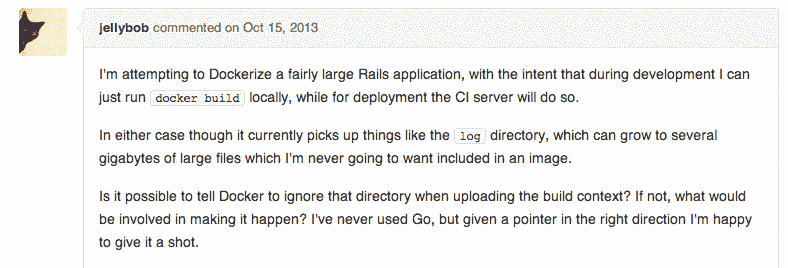

# Docker 1.1 发布了，它有一个新的“忽略”功能

> 原文：<https://thenewstack.io/docker-1-1-released-and-with-it-a-new-ignore-functionality/>

6 月，在 Docker 1.0 发布之前，首席执行官兼创始人 Solomon Hykes 对我说，在 1.1 版本中将会有**。** dockerignore 功能。[Docker 1.1 现已上线](https://www.mirantis.com/blog/best-of-2019-announcing-docker-enterprise-3-ga/)并且信守承诺，开发人员现在可以在他们的`Dockerfile`旁边添加一个“`.dockerignore`文件，Docker 将在向守护程序发送构建上下文时忽略该文件中指定的文件和目录。这里有一个[的例子](https://github.com/dotcloud/docker/blob/master/.dockerignore)。其他值得注意的更新包括:

*   容器现在在提交时会暂停。
*   开发人员现在可以跟踪容器的日志。
*   tar 存档现在可以作为上下文传递给`docker build`。

我们写了很多关于 Docker 的帖子。当然，还有其他的话题，但是对轻量级容器技术的需求几乎是无法满足的。但开发者在开发应用程序时的经验很好地说明了它的年轻。这是意料之中的事，但随着它越来越受欢迎而带来的兴奋却常常被忽视。

与开发人员的对话和对 GitHub 上正在进行的线程和项目的审查显示了一些问题，特别是在上传到 Docker 开发人员环境中如何管理文件，以及在生产环境中管理容器的复杂性。

Space Monkey 的 Murphy Randle 在一篇帖子中描述了如何避免 NFS 挂载/卷的痛苦，这是他在 Docker 中开发应用程序时通常需要的。当时，他决定建立一个开发者环境，他知道这个环境对小应用来说是可行的，但对大应用来说却不可行。当使用 Docker 文件来自动化构建 Docker 映像的过程时，问题就变得很明显了。但是 Randle 写道，当加载大量 node_modules 目录时，它变得非常慢。

在 5 月份的一次在线采访中，Randle 表示，当发出`docker build` 命令时，docker 客户端会将包含 docker 文件的文件夹的全部内容上传到 docker 守护进程。“当它只是一点点源代码时，这是超级快的，但当你的应用程序依赖于数兆字节的 node_modules 时，它需要很长的时间才能实现快速迭代。”这是在 [GitHub](https://github.com/dotcloud/docker/issues/2224) 上的一个长帖子中提到的问题，现在已经导致了。 dockerignore 更新。 线程以此开始:  Docker 在整个 Docker 生态系统中进行了改进，包括对 Docker 引擎、Docker Hub 及其文档的更新。总的来说，不是一个主要的版本，但更多的是对一个仍在发展的开源技术的评论。

<svg xmlns:xlink="http://www.w3.org/1999/xlink" viewBox="0 0 68 31" version="1.1"><title>Group</title> <desc>Created with Sketch.</desc></svg>