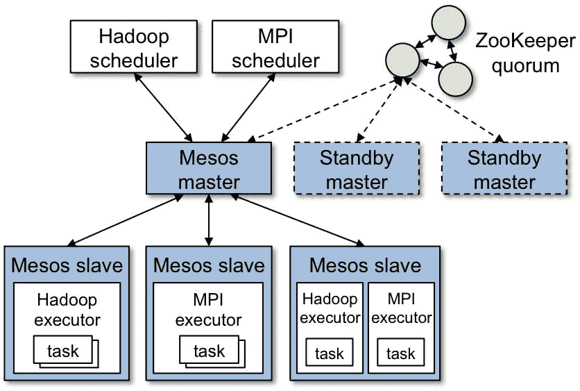
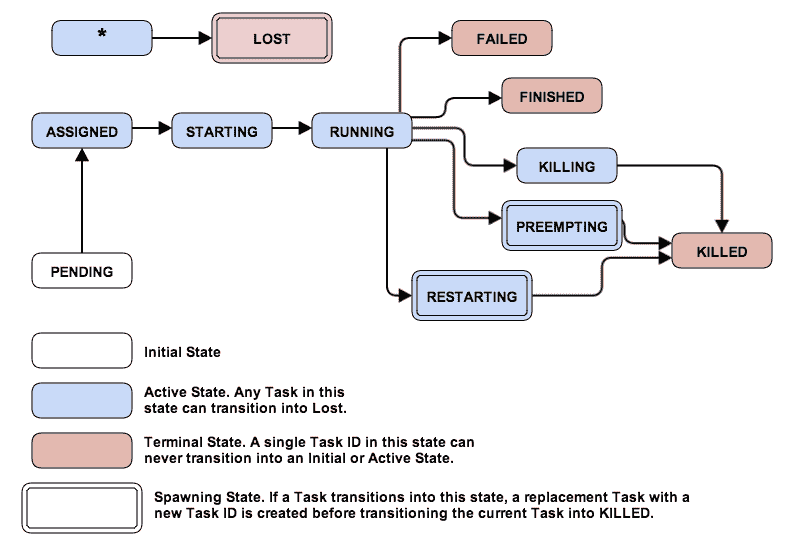
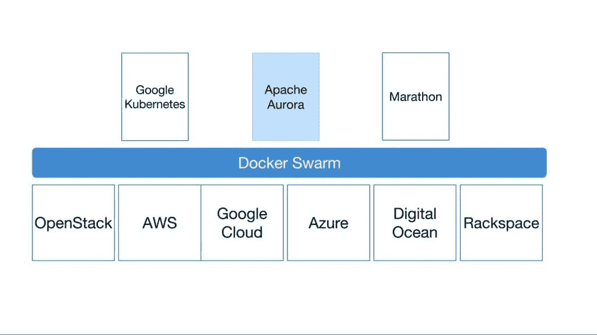

# 码头工人以有助于采购的方式进入大规模集装箱业务流程

> 原文：<https://thenewstack.io/docker-acquires-conductant-fall-orchestration-oligarchy/>

容器正在革新软件开发，Docker 不仅在大规模使用容器方面开辟了一条道路，而且在如何运输、构建和测试应用程序方面也开辟了一条道路。随着基于容器的解决方案的兴起，Docker 为企业中使用容器的人员开发了集群管理软件 Docker Swarm。

周四，Docker 在大规模解决容器编排方面采取了下一步措施，宣布收购了 Conductant，这是一家正在构建 Apache Aurora 容器编排软件的公司。Aurora 是基于 Borg 软件的，至少在它的总体架构上是这样，Borg 软件是 Google 为管理自己的容器操作而开发的。

为了理解这一收购的意义，有必要了解一下 Conductant 背后的历史，直到周四，该公司仍主要以秘密模式运营。

Conductant 的联合创始人比尔·法纳(Bill Farner)曾在谷歌的 Borg 工作，然后在 2009 年加入 Twitter，当时微服务刚刚开始崭露头角。管理大规模的微服务对 Twitter 来说是一个挑战，这让法纳反思了他与谷歌博格合作的时间。

## 它始于博格人

什么是[谷歌博格](https://research.google.com/pubs/pub43438.html)？简而言之，Borg 是设计用来大规模管理集群的软件。从某种意义上来说，它是现在所知的极光项目之父。Google Borg 旨在最大限度地提高运行数千台机器的人的高可用性，它为开发人员提供了进程隔离、最短的故障恢复时间和调度。

Farner 在 Google Borg 第一次看到以高可用性集群为中心的编排平台在工作，并在与 Google 分道扬镳后将这个想法带到了 Twitter。法纳着手在接下来的六年里为 Twitter 建立类似的东西，一路上与 [Apache Mesos](https://mesos.apache.org/) 合作。

Apache Mesos 内部基础设施

Twitter 的工程团队很快意识到使用 Mesos 作为其新集群管理平台的一部分的好处。on-board Mesos 有助于更好地简化任务，如协调、工作、部署，当然还有调度。通过关注运营层面的开发，团队能够充分发挥 Mesos 的潜力，将其作为新平台的粘合剂。

结果就是前面提到的 [Project Aurora](https://aurora.apache.org/) ，一个成熟的集群管理系统，用于大规模运行服务。作为 2013 年的开源软件，Apache Aurora 拥有一个蓬勃发展的开发社区，帮助改进和构建该平台。

可伸缩性是 Aurora 开发团队的一个重点，尽管 Farner 在 Docker 博客上的一篇文章中指出，定义技术和组织规模之间的差异是关键。Aurora 现在为 Twitter 上的数十万个集群供电，Farner 将该项目推向了一个新的高度。

任务生命周期 Apache Aurora

2015 年，法纳与[钟志文](https://www.linkedin.com/in/davidchungsf)和[约翰·西罗伊斯](https://www.linkedin.com/in/john-sirois-29a5321)共同创立了一家公司，将极光商业化，名为 Conductant。Chung 之前在谷歌和 Zynga 的经验，加上 Sirois 自己在谷歌的时间，导致三人制定了一个目标，即在项目规模扩大时，快速简化交付代码的过程，而不需要臃肿的经理团队。

在大规模部署微服务时，灵活性、速度和部署简易性至关重要。这些因素是导致 Conductant 团队在 Docker 上重新设想一个编排平台的一些构建模块，该平台不仅可以整合来自 Google Borg 的技术，还可以整合来自 Aurora 和 Mesos 的技术，以帮助开发人员管理他们在 Docker 上运行的微服务车队。

## 与 Docker 一起实现梦想

自从[周四的公告](https://blog.docker.com/2016/03/docker-welcomes-aurora-project-creators/)以来，Docker 没有浪费时间来想出如何将 Aurora 集成到 Docker 中的想法——特别是 Docker Swarm。将 Aurora 和 Docker Swarm 作为基础设施的一部分，企业可以利用这两个平台的强大功能来管理微服务。因此，这将为 Docker 用户提供稳定性、部署便利性以及更多优势。

Apache Aurora 与 Docker Swarm 的示例集成，通过 Docker

Farner、Chung 和 Sirois 继续使用最近发布的 [Docker Cloud](https://www.docker.com/products/docker-cloud) 平台进行以运营为中心的开发。对于那些有兴趣了解更多关于大规模部署容器的人，Docker 将于 2016 年 3 月 7 日举办 [Swarm Week](https://goto.docker.com/swarm-week.html) ，为期一周的活动将帮助开发人员和工程师了解更多关于使用 Docker Swarm 作为其基础设施的一部分。

随着越来越多的公司继续以极快的速度开发应用程序，跨容器基础设施的高可用性编排解决方案的需求显而易见。我们很想知道你找到了哪种最适合你的解决方案。参加我们的[容器协调调查](https://thenewstack.io/container-orchestration-survey/)，让我们听到您的声音。

Docker 是新堆栈的赞助商。

通过 Pixabay 的特征图像，通过 Docker、Apache Aurora 和 Apache Mesos 的嵌入图像。

<svg xmlns:xlink="http://www.w3.org/1999/xlink" viewBox="0 0 68 31" version="1.1"><title>Group</title> <desc>Created with Sketch.</desc></svg>