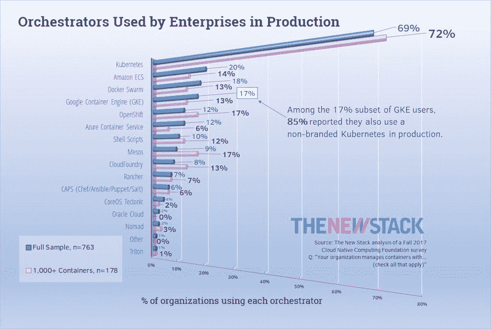

# 哪个码头工人？通过收购 CoreOS，Red Hat 的目标是成为 Kubernetes 公司

> 原文：<https://thenewstack.io/docker-acquiring-coreos-red-hat-aims-kubernetes-company/>

编者按:新堆栈的

[Lawrence Hecht](https://thenewstack.io/author/lawrence-hecht/)

为本报告提供研究材料。

由于周二宣布的收购协议，Kubernetes 容器编排领域商业方面最著名的两个品牌将合二为一。CoreOS 首先打开了容器化市场，成为真正的 T2 T3 市场，并向世界介绍了最小 Linux 内核的概念，现在是 Red Hat 的全资子公司。据 CoreOS 首席执行官——即将成为红帽高管的 [Alex Polvi](https://www.linkedin.com/in/polvi/) 在接受 New Stack 采访时表示，这笔交易已经完成，而不是悬而未决。

“由于合并，我们能够做到的是，”Polvi 说，“真正将两个产品线结合在一起，形成一个真正无与伦比的功能集，这是客户在市场上任何其他地方都找不到的。我们的产品虽然很有竞争力，但在很多方面都与众不同。当你想到 OpenShift 和 constructive 时，它们都是 Kubernetes 的产品，但它们在工作方式和对客户的价值主张上有很大不同。通过将这些东西结合在一起，你就拥有了市场可能拥有的终极产品，在那里你可以得到一切。”

对于一个即将成为前首席执行官的人来说，这是一个有点雄心勃勃的声明。从技术上讲，这笔交易是一项收购——私人交易的一部分，据报道，这是红帽历史上的第 21 笔此类交易。虽然该公司并不总是公布其收购的价值，但这次它对 CoreOS 交易的估值为 2.5 亿美元。[该公司在 2015 年收购配置自动化公司 Ansible 的交易在最初宣布时的估值为 1 亿美元，但一项独立的估值在事后认为该交易为 1.5 亿美元。](https://www.cmswire.com/information-management/red-hat-buys-ansible-boosts-cloud-automation/)

## 下一次不确定的融合

Red Hat 向我们明确表示，现在宣布这笔交易中基于 Kubernetes 的产品的组成也为时过早。

“我们面前有一个做出有意义决定的机会，”Red Hat 负责 OpenShift 的副总裁 Ashesh Badani 说，这是一种非常聪明的措辞，表示关于 constructive 在 OpenShift 产品线中的位置的最终决定尚未确定。

“我们不想在这里呆上几个月，而只想呆上几周，来思考什么才是最有意义的。我们如何融合这两种技术，从而保持两者的优势？”巴达尼继续说道。“大地构造”拥有一定份额的商业客户，他说，因此红帽进行的任何品牌整合都应该尽可能多地保留这些客户带来的价值。然而，他强调，OpenShift 产品计划不应中断。

“给我们一些时间，让我们在工程团队、产品团队、营销团队中坐下来，找出前进的最佳路径，”副总裁问我们。

CoreOS 和 Red Hat 在签署虚线之前没有机会坐下来讨论吗？Badani 说，并不尽然:虽然谈判的财务部分进行得很充分，但交易后有关整合运作方面的某些事实必须保密。因此，在撰写本文时，构造(CoreOS 的商业 Kubernetes)将采取的具体形式，以及它将如何与 Red Hat 的 OpenShift 产品线配合或包含在其中，都是悬而未决的问题。

这是否意味着 CoreOS 众多人才的命运也悬而未决，包括 Polvi，首席技术官兼联合创始人[布兰登·菲利普斯](https://twitter.com/BrandonPhilip)，以及工程经理[李翔](https://www.linkedin.com/in/xiang-li-402b3440/)？Badani 明确表示，CoreOS 的所有开发和技术人才都将被邀请留在 Red Hat，并强调在他看来，公司的人才是其主要资产。

“我们完成了这笔交易，这种合作关系，因为 CoreOS 给市场带来了巨大的工程人才和创新，”Badani 说。“如果我们没有尽全力确保亚历克斯、布兰登和团队的其他成员(整个工程和营销团队)没有被完全吸收进来，那将是我们的失职。”他补充说，尽管他们的头衔还有待确定，但从今天起，他们正式成为该组织的一部分。他承认，未来可能需要改变产品路线图，这可能有助于确定这些新游戏最终应该是什么。

## CoreOS 的核心在哪里

CoreOS 的 Polvi 列出了他公司产品线中的其他产品，他认为这些产品与市场上的其他产品不同或独特，他希望看到这些产品集成到 Red Hat 产品线中。Quay private container registry(几乎没有人发“key”的音)是他预计将继续存在并蓬勃发展的一个产品，还有**etcd**—[自成立以来事实上的 Kubernetes](https://thenewstack.io/intel-gives-the-etcd-key-value-store-a-needed-boost/) 的 key/value store，以及 Red Hat 的工程师长期以来首选的组件。

Polvi 还提到了 Container Linux，认为这是一款有可能从过渡中脱颖而出的差异化产品——正是这款原始产品赋予了 CoreOS 这个名字。鉴于 Red Hat 本身就是 Linux 操作系统的生产商，这可能仍然是一厢情愿的想法。该公司的 Atomic Linux 已经是 Red Hat Enterprise Linux (RHEL)的一个轻量级发行版，旨在由一个中央的、完全成熟的 RHEL 内核管理的分布式主机上运行。

[Red Hat 周二](https://www.redhat.com/en/blog/faq-red-hat-acquire-coreos)发布的一个常见问题似乎是说，容器 Linux 交付机制的部分内容可以移植到 Atomic 上——特别是 [Brandon Philips 吹嘘的空中更新系统，该系统使 CoreOS 优于 Atomic](https://thenewstack.io/red-hat-releases-container-focused-operating-system-rhel-7-atomic-host-competition-matures/) ，早在 2015 年，Red Hat 就是竞争对手。红帽将这种嫁接描述为两个操作系统之间的“和解”。该消息似乎没有宣布 Container Linux 已经被正式收购。

这条消息促使 CoreOS negative 产品经理 [Rob Szumski](https://www.linkedin.com/in/robszumski/) 提供了一点补充解释，在[一条单独的消息发布到谷歌集团](https://groups.google.com/forum/#!topic/coreos-user/GR4YlF2c1dM)并通过 Twitter。

Szumski 写道:“Container Linux 一直是免费提供的，我们预计这种情况不会改变。”“红帽计划继续容器 Linux 的发展。事实上，类似于 Fedora 的创新如何融入 Red Hat Enterprise Linux，我们可能会看到 Container Linux 的创新，如更新交付机制，也会融入进来。”

上一段中关键词是“可能”

与此同时，根据 Red Hat 和 CoreOS 的说法，rkt——容器格式和运行时引发了 2015 年容器化领域第一次巨大而短暂的分裂[——并不是谈判桌上的话题之一。去年](https://thenewstack.io/coalition-for-app-container-spec-shows-docker-is-not-the-standard-for-everyone/)[被捐赠给云计算原生计算基金会](https://thenewstack.io/separate-votes-cncf-adopts-dockers-containerd-coreos-rkt/)，rkt 仍然可以在未来的一些客户驱动的实现中出现，尽管 Polvi 告诉我们他预计 rkt 会发现其自身的价值。

根据 Polvi 和 Badani 的说法，收购谈判中也没有实质性地提到 Docker 或 Docker Inc .

Badani 说:“我们将继续抓住开源社区合作的每一个机会。“就竞争而言，我们实际上并没有经常看到 Docker。Kubernetes 的市场势头非常明显，主要是在过去几个月里，亚马逊和微软 Azure 开始加入。Docker 在该领域的投资是最近才开始的，所以他们并没有表现出太多的竞争。他们没有像他们希望的那样与他们的群体编排技术进行比较，这就是为什么他们还必须投资 Kubernetes。我并不真的担心他们。”

“CoreOS 主要是向希望使用 Kubernetes 的公司出售产品，”Polvi 说。“目前，市场上只有两种 Kubernetes 产品可供企业客户选择:constructive 和 OpenShift。Docker 宣布了一个 Kubernetes 产品，现在有一个 alpha 或 beta 产品，但我们没有看到一个企业销售团队准备好了。也许未来这种情况会改变，但我们的客户想要 Kubernetes。”

Docker 为 Docker Enterprise [开发的 Kubernetes 集成](https://blog.docker.com/2018/01/docker-ee-kubernetes/)于 1 月 18 日发布测试版。

## 寻找库伯内特市场

根据 Polvi 的计算，企业 Kubernetes 将只有一家供应商。这个[可能会让 Kublr](https://thenewstack.io/kublr-offers-kubernetes-enterprise/) 感到震惊，但至少在这位前首席执行官看来，他的产品与 Red Hat 的结合将不可避免地占据主导地位。

但是我们说的是多大的桌子呢？在去年秋天的一项调查中，当云计算原生计算基金会(Cloud Native Computing Foundation)要求组织选择他们在生产中使用的任何和所有管弦乐队时，大约 69%的受访者表示他们使用通用的 Kubernetes。OpenShift 只占总反应的 12 %, constructive 只占 4%。

当问题指向 23%的受访者，他们的组织通常在生产中部署 1，000 个或更多的容器时，OpenShift 在该子集的份额确实增长到了 17%。但是大地构造的份额减少了一半，通用的 Kubernetes 增加了 3 个点。

因此，这次收购可能会削弱 Kubernetes 市场，只不过这个市场本身还不到整个生态系统的三分之一。或者，正如 IT 分析师 Kurt Marko 认为的那样，认为这里有市场的想法可能是一种错觉。

“Kubernetes 是集群管理/工作负载协调的*事实上的*标准。包括 Red Hat 在内，没有人会主宰这个市场，”Marko 在给新堆栈的一份报告中写道，“因为它不是一个真正的市场，而是一个功能。

“我真的不认为大多数企业客户(即经理、执行官，而不是开发人员)会考虑他们运行的 Linux 发行版的细节，”Marko 继续说道。“他们更感兴趣的是能够可靠、安全地运行应用程序、提供良好的性能，并得到定期更新和问题响应人员的支持。如果 CoreOS 更适合容器，那很好，如果它被捆绑到一个包含 Kubernetes、注册表和虚拟网络结构(Contiv 等)的容器平台中，那就更好了。)."

Marko 确实认为 Container Linux 非常适合 Red Hat 的产品线，特别是作为 OpenShift PaaS 的基础设施平台。但是这些天几乎每周都会发现这样的自然契合，在某些情况下，不需要合并或收购——一个恰当的例子，[思科上周推出了自己的思科容器平台](http://www.eweek.com/cloud/new-cisco-container-platform-to-support-kubernetes-orchestrator)，这是另一个品牌 Kubernetes 服务。

Marko 写道:“我认为真正的‘战斗’将是赢得想要无缝结合内部和公共云容器服务的混合容器架构的用户，在这一点上，Red Hat 还有更多工作要做，特别是考虑到谷歌/VMware 和谷歌/思科的合作伙伴关系。”

因此，虽然这笔交易显然改变了 Kubernetes 在开发人员领域的竞争环境，并可能进一步边缘化 Docker，但它实际上可能*而不是*是那种用于表征软件平台成熟度的“市场整合”。更有可能的是，这是服务器市场中一个主要参与者的最新举措，目的是找到一种方法来利用一种产品的成功，如果这种产品从一开始就是商业和专有的，可能会是一座金矿…除此之外，如果它是商业和专有的，没有人会听说过它。

<svg xmlns:xlink="http://www.w3.org/1999/xlink" viewBox="0 0 68 31" version="1.1"><title>Group</title> <desc>Created with Sketch.</desc></svg>