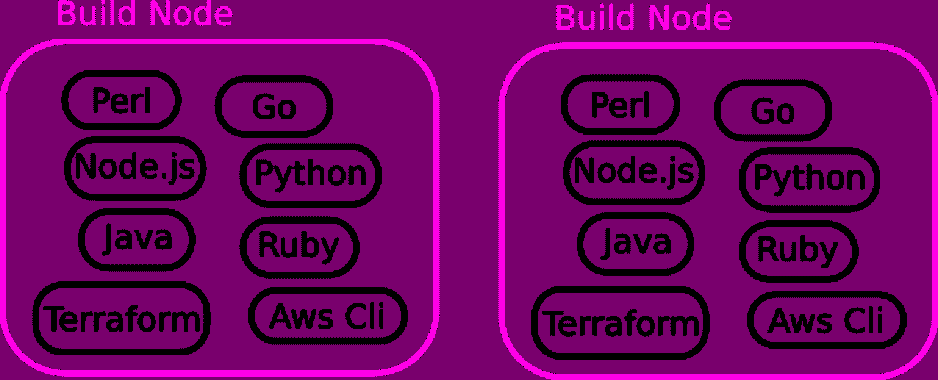
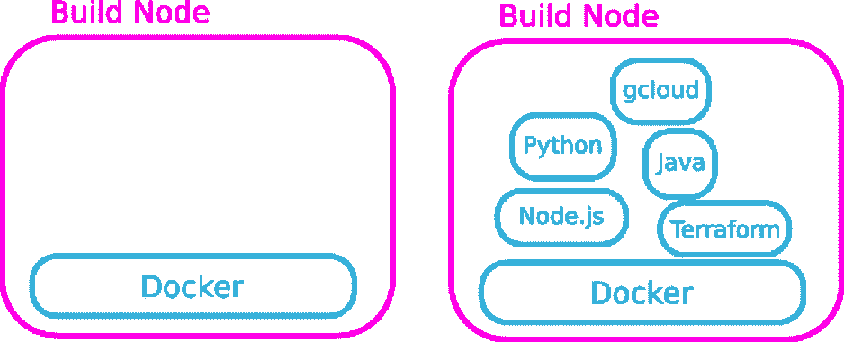
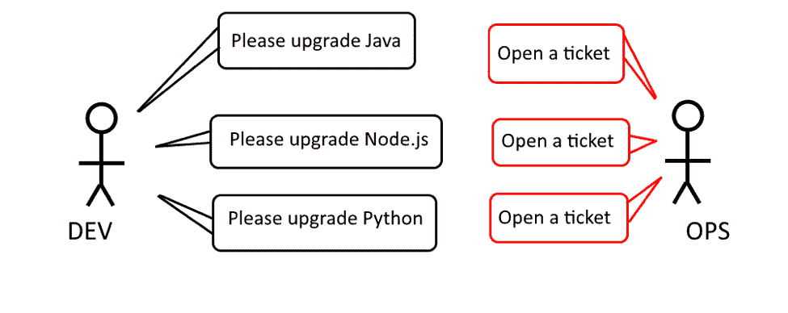
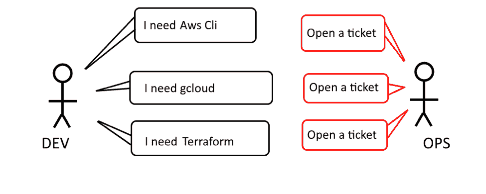
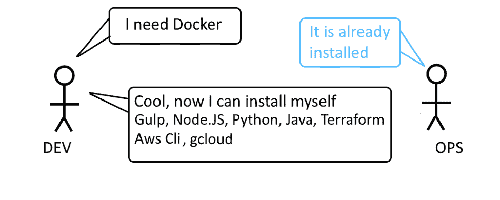
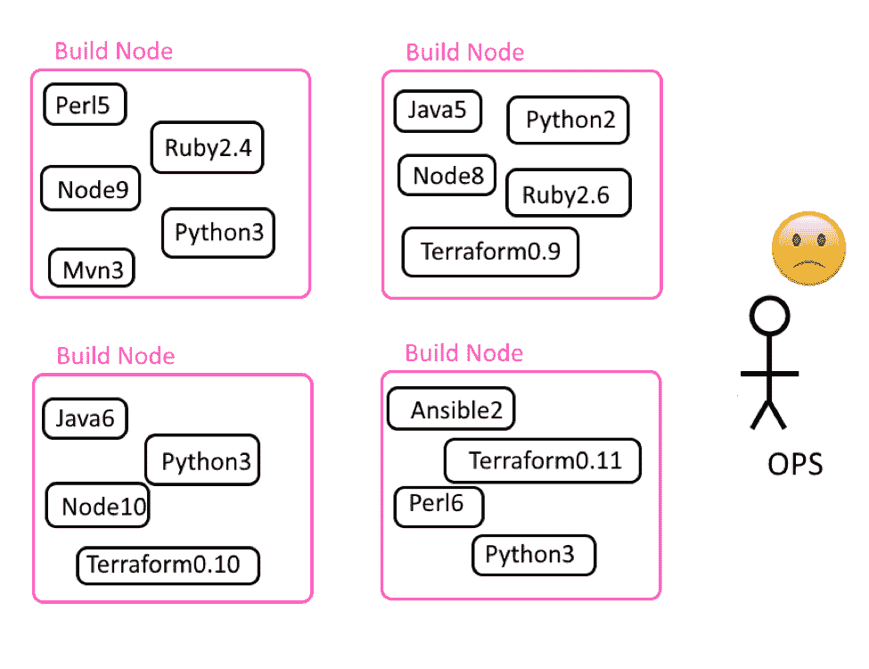
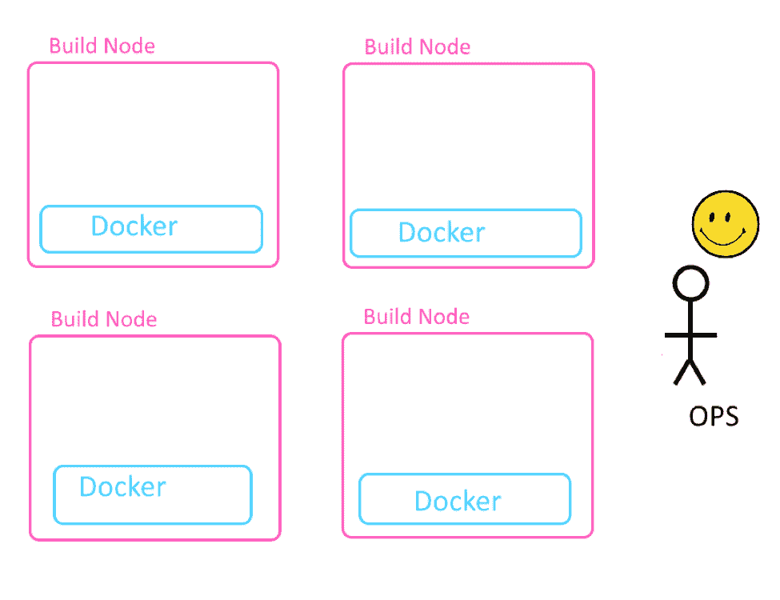
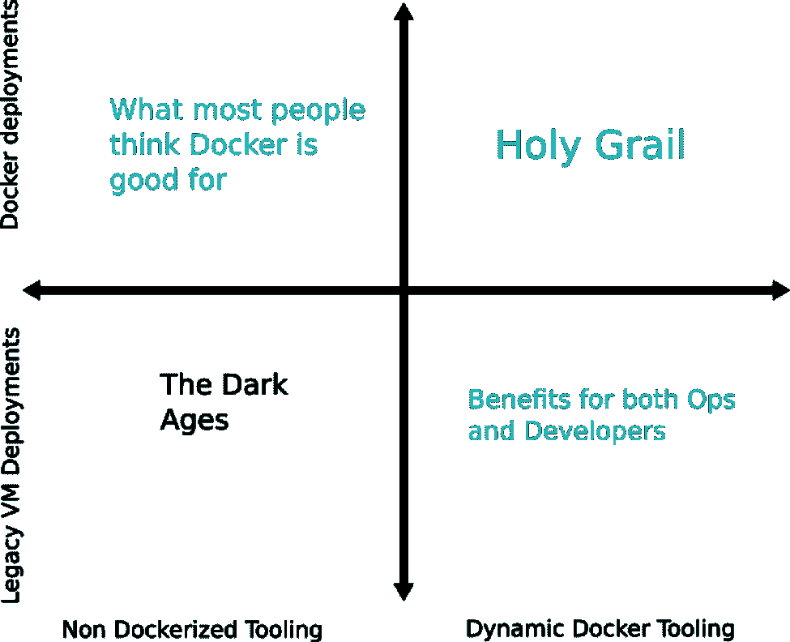

# 基于 Docker 的动态工具:一个经常被忽视的最佳实践

> 原文：<https://thenewstack.io/docker-based-dynamic-tooling-a-frequently-overlooked-best-practice/>

[Kostis Kapelonis](https://codefresh.io/)

[Kostis Kapelonis 是 Codefresh 的开发人员，code fresh 是一个为 Kubernetes 和 containers 构建的连续交付平台。Kostis 以前是一名软件工程师，在应用程序容器化、构建 CI/CD 管道和开发 Java 应用程序方面有多年的经验。他住在希腊，喜欢轮滑。](https://codefresh.io/)

容器正迅速成为大型企业和小型公司的通用部署格式。Docker 很自然地充当了开发人员和运营人员之间的共同角色，允许轻松部署和独立发布。

使用容器进行部署确实是从旧的(裸机和虚拟机(VM ))世界的一个受欢迎的转变，因为小的占用空间(在大小和启动时间方面)允许组织比以前更频繁地进行部署。缩短发布之间的时间是任何组织的一个不变的目标，因为这确保了新的特性一旦实现就能到达客户手中。

不幸的是，这种从虚拟机到 Docker 映像的快速过渡掩盖了容器的另一个很少被提及的巨大优势，这就是以动态工具的形式在持续集成(CI)过程中使用容器时对开发人员和运营人员的好处。这是容器的一个改变游戏规则的特性，可以说这比它们作为部署工件的用途更重要。

这种对如何在 [CI/CD](https://thenewstack.io/understanding-the-difference-between-ci-and-cd/) (持续集成/持续部署)过程中使用容器的误解现在非常普遍，以至于“Docker 采用”几乎是生产部署的同义词。这与事实相去甚远，在本文中，我们将解释为什么利用基于 Docker 的工具也是整个 Docker 采用过程中一个重要且独立的部分。

## 用 Docker 动态构建节点

在传统的 CI 环境中，所有执行构建的机器都有一个开发人员可能需要的所有工具的超集。每个节点都配有公司已采用的预安装版本的构建、测试和供应工具。

拥有同一个工具的多个版本是一个巨大的挑战，对于真正的大型组织来说，不同的团队使用多种技术，维护构建节点所需的工作可能会很快失去控制。

容器(以 Docker 的形式)的出现现在为我们提供了另一种更直观、更简化的方法——动态工具。使用动态 Docker 工具，所有构建节点开始时只安装了一个东西——Docker——其他什么都没有。

> 对于习惯于传统静态构建工具方法约束的开发人员来说，基于动态 Docker 的工具感觉像是一次复兴。

然后，在构建期间，使用 Docker 容器只启动手头构建工作所需的特定工具。构建完成后，构建节点会恢复到其原始状态(即完全没有任何工具)。

这种简单的方法非常强大，对于开发人员和操作人员都有几个优点，我们将在下一节中看到。

### 静态构建工具的黑暗时代——开发者的观点

既然我们已经看到了如何将 Docker 仅用于 CI 流程，而不是完整的 CD，我们需要解释一下基于 Docker 的工具的优势。看到好处的最简单的方法是解释传统静态构建方法的缺点。

在静态工具平台中，构建节点是长期运行的，并且只装载“批准的”构建工具。这给开发人员带来了许多生产力问题(和挫折):

*   升级新工具必须首先由运营部门请求，导致升级周期非常缓慢。
*   开发人员被迫根据构建节点上可用的内容来配置他们自己的工作站。
*   用新的框架和工具创建一个全新的项目需要大量的工作，因为所有的构建节点都必须升级以适应它。
*   开发人员必须跟踪构建节点的能力，并确保他们的构建工作实际上被发送到满足所有需求的节点。
*   在一个构建节点中使用同一个工具的多个版本总是一个巨大的挑战。在极端的情况下，开发人员被迫改变他们项目的库，仅仅因为构建节点被升级/降级到那个版本。

基于云的架构的采用进一步加剧了这一问题，因为现在单个组织可以同时部署到外部控制的多个平台。

使用多个云基础架构导致需要采用针对每个部署目标完全不同的配置和部署工具。工具开发的速度非常快，很多时候操作人员跟不上一个构建节点所需的所有变更。

最终的结果是开发人员总是不高兴，因为他们认为构建平台对他们不利。关于构建工具的可用性，开发人员和操作人员之间总是关系紧张。

### 动态 Docker 工具对开发人员的好处

有了动态 Docker 工具，开发人员和操作人员之间的交流变得非常容易。构建节点只有一个硬性要求，那就是 Docker 本身。

一旦 Docker 安装在构建节点中，任何开发人员都可以使用特定项目所需的特定工具启动 Docker 映像。运营商不再是采用新框架和新库的障碍。

这种方法的动态本质来自于 Docker 容器是短命的这一事实。它们只在各自的构建需要它们的时候存在。与在构建节点中预先安装工具的传统实践相比，这是一个巨大的差异。

开发人员现在很高兴(也更有效率),因为:

*   他们可以立即使用他们选择的任何版本的框架。
*   创建使用全新架构的新项目非常容易。
*   所有构建节点都是平等的，因此它们可以将作业发送到任何节点，因为它们事先知道工具版本不匹配的情况永远不会发生。
*   使用同一个工具的多个版本现在非常容易(甚至在同一个项目中)。
*   他们从未被迫升级他们的库版本。遗留项目仍然可以使用与绿地项目完全不同的工具版本。
*   构建节点是“自我清理”的，因此它们永远不必担心版本工具中的冲突。
*   与运营商的沟通变得非常简单。唯一要讨论的主题是构建节点中 Docker 守护进程的版本。

对于习惯于传统静态构建工具方法约束的开发人员来说，基于动态 Docker 的工具感觉像是一次复兴。

现在让我们来看看运营商如何从 CI 中的动态工具中获益。

## 静态构建工具的黑暗时代——操作者的观点

操作员(即系统管理员)通常在管理静态构建节点上花费最多的精力。他们的责任是保存一个巨大的工具“祝福”版本列表，以确保这些工具对开发人员可用。

这种方法的复杂性可能会很快导致日常冲突，尤其是在使用不同工具和技术的组织中。

为了解决多种构建工具和版本的复杂性，操作人员通常采用以下两种方法之一:

1.  所有的构建节点都是完全相同的，并且每个节点都包含开发人员使用的每个可能的项目所需的所有构建工具。
2.  不同的构建节点有不同的构建工具集合。节点被分配了特殊的“标签”来显示它们的能力。

两种方法各有利弊。如果构建场中的所有节点都完全相同，那么就需要一种特殊的机制来处理同一工具的多个版本。此外，每个构建节点都可能很快过载。另一方面，这使得开发人员的生活稍微轻松了一些，因为他们可以为自己的构建选择任何节点。

对不同的工具使用不同的节点解决了构建工具的版本冲突，因为每个节点在同一工具上可以有不同的版本。然而，在这种情况下，操作员需要密切跟踪哪个节点上安装了哪个工具，并确保在出现新版本时升级所有节点。

开发人员还需要知道后一种方法，因为他们必须确保他们的构建作业被发送到正确的节点。例如，python 开发人员需要指定一个作业需要一个带有“Python”标签的节点，而 JavaScript 开发人员需要一个带有“javascript/npm”标签的节点，等等。

总之，静态构建节点对于操作者来说是一个巨大的时间接收器。在有些公司，构建节点的维护实际上是一项全职工作。

## 动态对接工具为操作员带来的好处

有了动态 Docker 工具，操作员的生活变得非常轻松。

所有节点都很容易设置和维护，尤其是如果已经有一个用于构建的 Kubernetes 集群，这很快就成为一种常见的做法。如前所述，每个构建节点只需要安装 Docker，其他什么都不需要。所有节点也完全相同(根据定义)。

通过这种简单的方法，运营商…

*   维护已批准工具的列表，但不需要事先安装它们；
*   不关心开发人员使用的工具的确切版本；
*   不再负责工具升级(因为开发人员可以自己完成)；
*   不再面临同一个工具多个版本的问题；
*   可以在同类的构建机器上工作；和
*   不必管理节点的标签，也不必跟踪哪个节点拥有哪个工具。

与开发人员的沟通现在非常容易，因为唯一需要讨论的是节点的 Docker 版本。

图中没有显示的另一个优势来自 Docker 容器的速度和占地面积。使用传统的静态构建方法，操作人员必须随时准备好构建节点，即使没有开发人员实际构建任何东西。

使用基于 Docker 的工具，开发人员可以在几秒钟内按需启动工具。当没有开发人员使用这些节点时，可以很容易地将这些节点重新分配给另一个使用完全不同技术的开发团队。

总的来说，基于 Docker 的工具解放了操作员的手，减轻了他们的日常负担。

## 使用 Docker 的两种完全正交的方式

本文的中心观点是，将 Docker 用于动态构建工具是一种最佳实践，您可以现在就采用**，而无需实际将 Docker 本身用于生产部署。**

 **Docker 部署工件或构建工具方法是完全独立的，您可以根据您的组织轻松有效地混合和匹配它们。

从本质上来说，在一个公司内采用容器有 4 个可能的阶段:

1.  基于虚拟机的工具，在虚拟机上部署(老方法)。
2.  基于 VM 的工具，部署在容器上(大多数人都熟悉这种方法)。
3.  部署在虚拟机上的基于 Docker 的工具(从容器中获益的好方法)。
4.  基于 Docker 的工具，部署在容器上(完全采用 Docker——圣杯)。

大多数与 Docker 相关的媒体关注的是基于 Docker 的部署，而不是基于 Docker 的构建工具，这使得许多组织忽略了后者的好处。

从上图中可以清楚地看出，可以单独采用基于 Docker 的工具(尽管部署仍然可以针对虚拟机/裸机)。许多组织试图盲目地尝试在生产部署中使用 Docker，而不了解这不是唯一可行的方法，从而赶上容器的潮流。

事实上，基于 Docker 的工具可以给 CI/CD 过程带来更多的好处，因为它解决了开发人员面临的许多常见的生产力问题，正如我们在前面的章节中所看到的。

能够按需创建构建环境，而不是等待冗长的资源调配批准，这是开发人员和运营人员之间最常见的难题之一。

在 [Codefresh](https://codefresh.io/) ，我们已经为 CI/CD 管道实现了这种方法。每一步都是它自己的容器。想运行 Node？有一个码头工人的形象。想跑 Maven？还有一个码头工人的形象。想做金丝雀展示吗？这也有一个图像。你需要硒吗？需要 Terraform 吗？基本上，作为 Docker 映像提供的所有内容都可以用作构建步骤。

您仍然可以使用 Codefresh 部署到传统目标(即虚拟机和裸机)，但构建平台的核心是利用工具利用容器和 Docker 映像。

开发人员可以创建管道，其中每个构建步骤都在包含所需工具的 Docker 映像的上下文中运行。版本冲突、工具升级和带有不同标签的构建节点现在已经成为过去。

我们认为动态 Docker 构建工具是一种新的方法，它正在改变开发人员和操作人员的生活，我们希望看到它在公司和组织中得到进一步的接受。

<svg xmlns:xlink="http://www.w3.org/1999/xlink" viewBox="0 0 68 31" version="1.1"><title>Group</title> <desc>Created with Sketch.</desc></svg>**