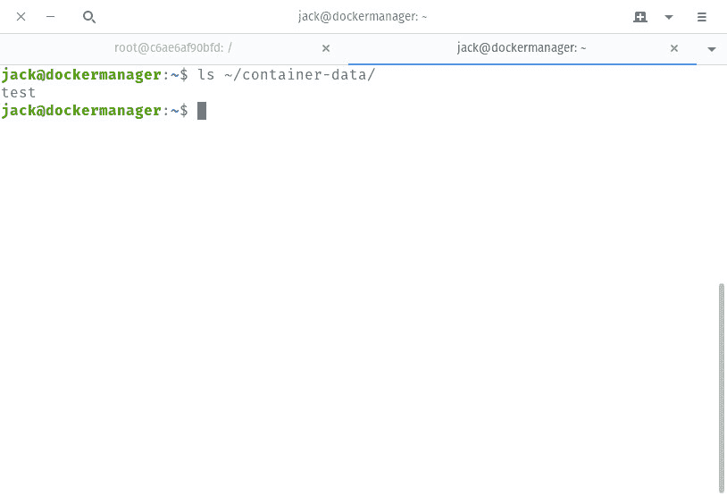

# Docker 基础:如何在 Docker 容器和主机之间共享数据

> 原文：<https://thenewstack.io/docker-basics-how-to-share-data-between-a-docker-container-and-host/>

有了 Docker containers，您的公司可以以其他方式无法达到的规模和速度提供应用程序和服务。因为部署容器化的应用程序非常简单，所以您可以很快上手。

你可能很快就会发现(在[使用 Docker](/docker-basics-how-to-use-dockerfiles/) 迈出最初几步之后)的一件事是，一旦部署，你的容器在如何保存和包含数据方面受到限制。该限制存在于容器文件系统中。Docker 容器利用了 Union 文件系统(UFS ),它与一系列只读层一起工作，其中包括顶部的最终读写层。当容器不需要保存数据时，这个系统可以完美地工作。但是当您需要部署一个需要保存数据能力的服务(比如一个使用数据库的应用程序)时，您会怎么做呢？

## 欢迎来到 Volumes

Docker 卷是位于主机文件系统上的目录(或文件集合),不是容器 UFS 的一部分。正是在这些卷中，容器能够保存数据。使用 *docker volume* 命令，您可以轻松地管理卷，以扩展您的容器，使其远远超出基本能力。

让我们看看如何部署一个新容器，该容器包括一个附加到主机上特定目录的卷，这样容器将与卷中的数据保持同步。我将在 Ubuntu Server 18.04 上演示，但只要平台支持 Docker，过程将是相同的(不管发行版如何)。我假设您已经安装并运行了 Docker，并且可以部署容器。

## 创建主机数据卷

第一步是创建一个新目录来存放该卷。为此，打开终端窗口并发出命令:

您必须确保新创建的目录位于 Docker 用户可以访问的位置(具有读写权限)。

一旦创建了该目录，就可以在其中挂载一个卷了。假设您要部署一个基于官方 Ubuntu 映像的容器，其中包含一个名为 */data* 的目录。要部署这样一个容器，将内部的 */data* 目录连接到主机目录 *~/container-data* 中的一个卷，您可以发出命令:

```
docker run  -dit  -P  --name ubuntu-test  -v  ~/container-data:/data ubuntu

```

上面的命令分解如下:

*   *docker run* 是主命令，表示我们将在一个新容器中运行一个命令。
*   -dit 是 *d* 用于分离模式， *it* 保证 bash 或者 sh 可以分配给一个伪终端。
*   -P 向主机发布容器端口。
*   –name 表示接下来是新容器的名称。
*   -v 说接下来就是卷了。
*   ubuntu 是用于容器的图像。

一旦命令完成，您将获得一个容器 ID ( **图 A** )。确保记住该 ID 的前四个字符，因为您将需要它来访问容器 bash 提示符。


我们部署的容器。

现在，您已经部署了一个基于官方 Ubuntu 映像的容器，其中包含一个*/数据*目录，该目录被挂载到主机卷的*~/容器数据*中。

## 测试音量

我们来测试一下这个体积。如果您忘记了容器的 ID，发出命令 *docker ps -a* 查看它的列表(图 B )。


图 B:我们新部署的容器清单。

使用命令:
访问新部署的容器

其中 ID 是已部署容器的前四个字符。现在，您应该会在容器中看到 bash 提示符(**图 C** )。


图 C:我们新容器的 bash 提示符。

发出命令 *ls /* ，您将看到 */data* 目录被添加到了 Ubuntu 容器中。让我们使用以下命令在该目录中创建一个测试文件:

*触摸/数据/测试*

创建这个测试文件后，在主机上打开另一个终端窗口，发出命令 *ls ~/container-data* 。您应该看到该目录中的测试文件(**图 D** )。



图 D:我们的测试文件是从容器中创建的，可以在主机上的卷中看到。

您刚刚通过主机上的一个卷部署了一个包含持久存储的容器。

## 数据库卷

假设您想要为数据库创建一个卷。要做到这一点，首先要部署一个 MySQL 数据库 Docker 容器，并指示它使用一个名为 mysql-data 的持久存储卷。使用命令
执行此操作

```
docker run  --name mysql-test  -v  mysql-data:/var/lib/mysql  -e  MYSQL_ROOT_PASSWORD=passwd  -d  mysql:latest

```

在上面的命令中， *-e* 开关通知 docker 后面是一个环境变量。

使用命令:
访问容器的 bash 提示符

```
docker exec  -it ID  /bin/bash

```

其中 ID 是新部署的容器的 ID 的前四个字符。

使用命令:
列出容器的 */var/lib/mysql* 目录的内容

记下这些内容，并使用命令:
退出容器

现在，使用命令
检查主机挂载卷的内容

```
sudo ls  /var/lib/docker/volumes/mysql-data/_data

```

您应该看到两个目录中的清单是相同的(**图 E** )。


**图 E:** 我们的 MySQL 数据与主机卷同步。

现在，您有了一个基于 MySQL 的容器，其中包含安装在主机上的卷中的持久存储。

这就是 Docker 容器和主机之间共享数据的全部内容。对于卷，这项任务不仅非常简单，而且非常灵活。

<svg xmlns:xlink="http://www.w3.org/1999/xlink" viewBox="0 0 68 31" version="1.1"><title>Group</title> <desc>Created with Sketch.</desc></svg>