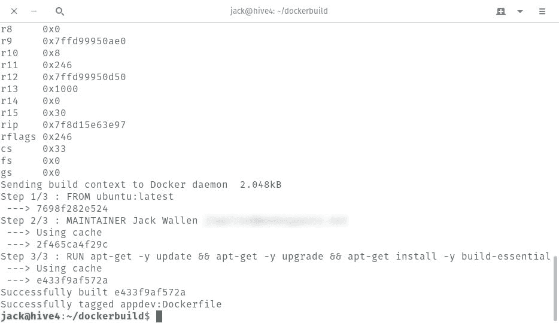
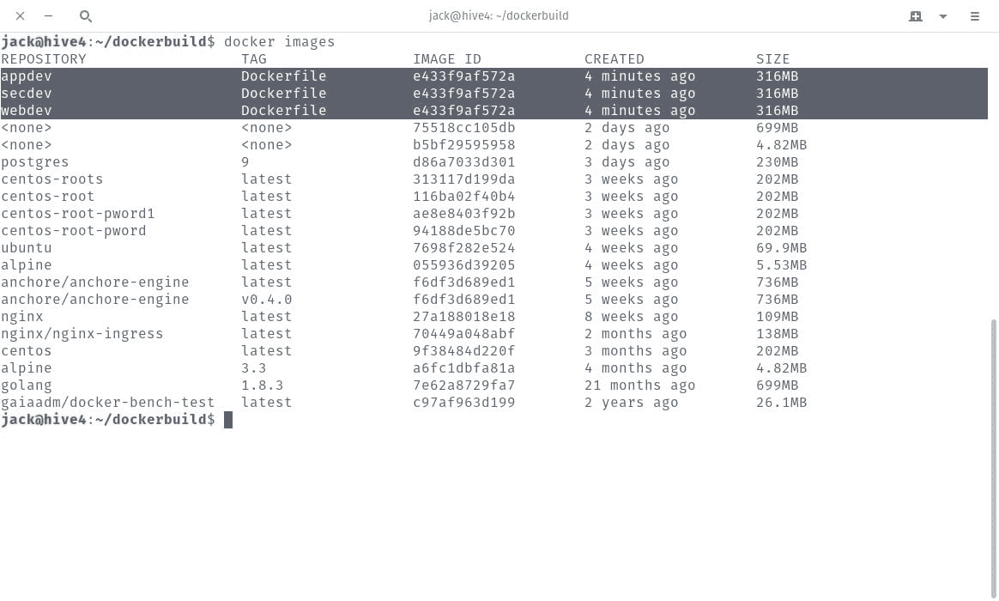
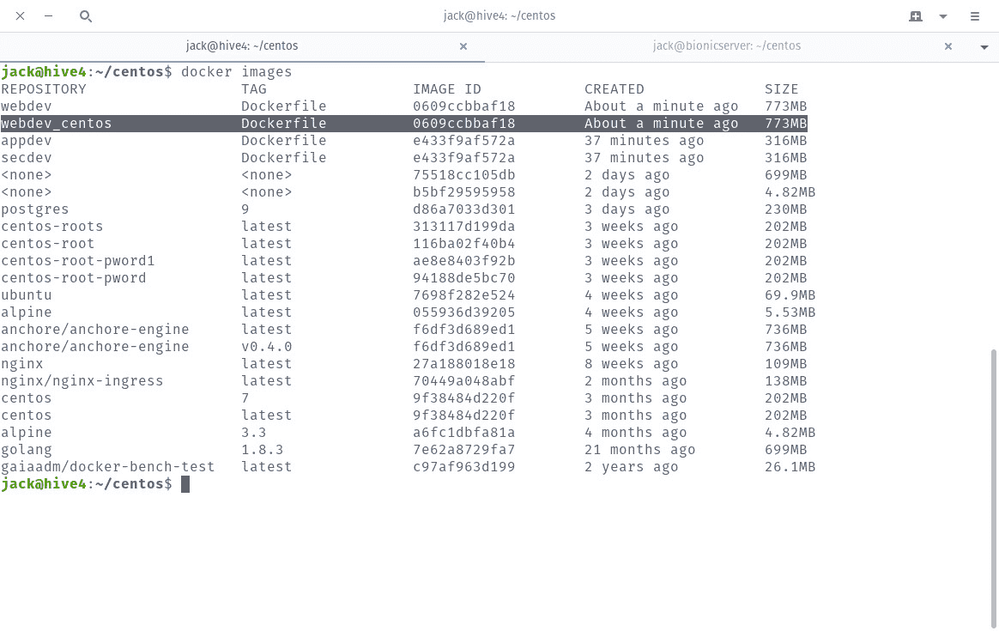

# Docker 基础:如何使用 docker 文件

> 原文：<https://thenewstack.io/docker-basics-how-to-use-dockerfiles/>

通过使用 Docker 映像，不仅可以一个接一个地部署容器，而且非常容易。一旦你从一个注册中心(比如 [Docker Hub](https://hub.docker.com/) )获取了映像，每个容器就可以用一个 *docker* 命令进行部署。但是，当您发现自己必须从同一个映像部署大量容器(每个容器用于不同的目的)时，会发生什么呢？突然之间，这些容器的管理变得有点麻烦。

比方说，你拉下最新的 Ubuntu 镜像进行开发。在使用该容器进行开发之前，您需要对映像进行一些修改(比如升级软件和为手头的工作添加必要的开发包)。

为此，您可以根据需要手动编辑每个图像(为主题的每个必要变体创建一个新图像)，或者您可以为每个变体构建一个 docker 文件。一旦构建了 docker 文件，您就可以快速地一遍又一遍地构建相同的映像，而无需花费时间手动完成。精心制作的 Dockerfiles 可以为你节省大量的时间和精力。

我想带你看一下制作 Dockerfile 文件的过程。我将使用最新的 Ubuntu 映像进行演示，更新和升级该映像，然后安装 build-essential 包。这将是一个相当基本的 docker 文件，但你可以很容易地建立在其上。

## Dockerfile 文件基础

在我们构造 docker 文件之前，您需要了解文件的组成部分。这将是一个名为 *Dockerfile* 的文本文件，其中包含指定如何构建特定图像的特定关键字。您可以在文件中使用的特定关键字有:

*   **ADD** 将文件从主机上的一个源复制到容器自己的文件系统中。
*   **CMD** 可用于执行容器内的特定命令。
*   **ENTRYPOINT** 设置一个默认应用程序，在每次用图像创建容器时使用。
*   **ENV** 设置环境变量。
*   **EXPOSE** 关联一个特定的端口，使容器和外界能够联网。
*   中的**定义了用于启动构建过程的基础映像。**
*   **维护者**定义图像创建者的全名和电子邮件地址。
*   运行是 Dockerfiles 的中央执行指令。
*   **用户**设置运行容器的 UID(或用户名)。
*   **卷**用于允许从容器访问主机上的目录。
*   **WORKDIR** 设置由 CMD 定义的命令的执行路径。
*   **标签**允许您为 docker 图像添加标签。

docker 文件的运行并不需要所有的关键字。举个例子，我们的例子将只使用来自、**维护者**和**运行者**的**。**

## 构建 Dockerfile 文件

在创建 docker 文件之前，我们需要创建一个新的工作目录。我们将使用命令
创建 **dockerbuild** 目录

使用命令:
切换到新创建目录

现在我们将制作我们的 docker 文件。使用命令
创建新文件

在该文件中，粘贴以下内容:

```
FROM ubuntu:latest
MAINTAINER NAME EMAIL

RUN apt-get  -y  update
RUN apt-get  -y  upgrade
RUN apt-get install  -y  build-essential

Where NAME is your full name and EMAIL is your email address.

```

保存并关闭文件。

### **树立你的形象**

Dockerfile 文件完成后，您现在可以从该文件构建映像了。发出命令(从~/dockerbuild 目录中):

```
docker build  -t  "NAME:Dockerfile"  .

```

其中 NAME 是要创建的新图像的名称。

例如:假设您想要为 web 开发、应用程序开发和安全开发创建图像。您可以发出以下命令:

```
docker build  -t  "appdev:Dockerfile"  .
docker build  -t  "webdev:Dockerfile"  .
docker build  -t  "secdev:Dockerfile"  .

```

这将开始下载 ubuntu:最新映像并根据 Dockerfile 构建映像的过程(**图 A** ):



图 A:图像已经建立。

一旦构建完成，发出命令:

您应该看到所有新构建的图像，现在可以使用了(**图 B** ):



图 B:准备部署的新创建的映像。

## CentOS 的 Dockerfile

假设您想要使用 CentOS 创建一个映像，该映像更新提取的 CentOS 映像并安装一个 web 服务器。为此，我们首先用命令创建一个新目录:

使用命令:
切换到该目录

使用命令创建新的 docker file:

将以下内容粘贴到该文件中:

```
FROM centos:7
MAINTAINER NAME EMAIL

RUN yum makecache
RUN yum upgrade  -y
RUN yum install  -y  httpd

```

其中 NAME 是您的姓名，EMAIL 是您的电子邮件地址。

保存并关闭文件。使用命令构建映像:

```
docker build  -t  “webdev_centos:Dockerfile”  .

```

根据需要升级的程度，这个特殊的构建会比 Ubuntu 映像花费更长的时间。构建完成后，发出命令 *docker images* ，查看新构建的(基于 CentOS 的)映像是否准备就绪(**图 C** ):



图 CentOS 映像可供部署。

## 轻松建立形象

这就是用 Dockerfiles 构建 Docker 映像的全部内容。这是创建新映像的一种更有效、更标准的方法，比提交对提取映像的更改要有效得多。一旦你熟练掌握了 Dockerfiles，你可以创建的图片类型是无限的。

<svg xmlns:xlink="http://www.w3.org/1999/xlink" viewBox="0 0 68 31" version="1.1"><title>Group</title> <desc>Created with Sketch.</desc></svg>