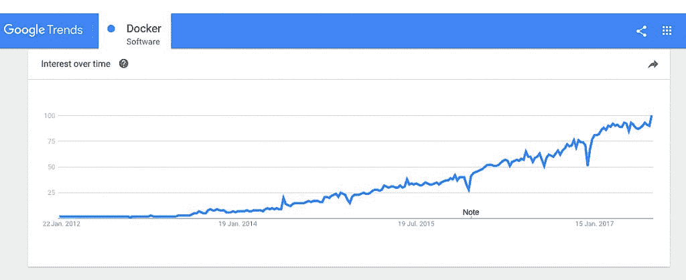
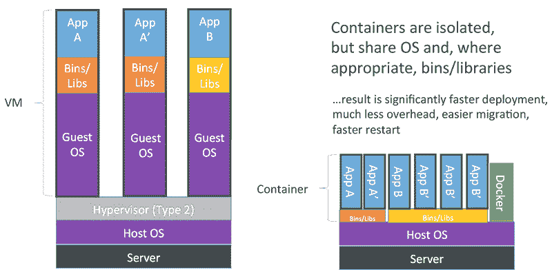
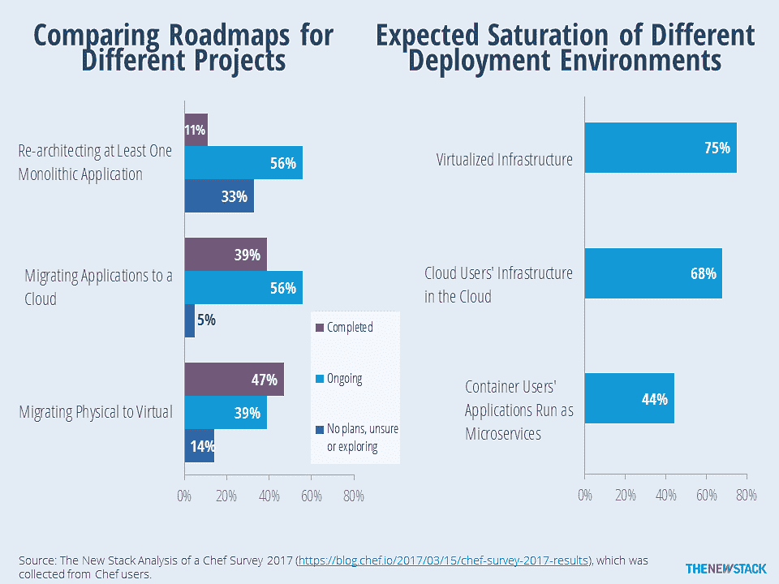

# Docker 基础，第 0 部分:我为什么要关心容器(和微服务)？

> 原文：<https://thenewstack.io/docker-basics-part-zero-care-containers-microservices-anyway/>

容器(和[微服务](https://thenewstack.io/ten-commandments-microservices/))是应用交付的未来，至少在下一次伟大的技术飞跃到来之前是如此，而 [Docker](https://www.docker.com/) 是类别杀手平台。如今，公司正以惊人的速度采用 Docker。而且，越来越多的开发人员——以及系统管理员和云管理员——需要至少具备 Docker 技术的功能基础。或者，更好的是，忙着把它添加到他们的工具带上。

Docker 已经和我们在一起一段时间了。你可能认为你个人不需要担心容器的事情，因为这是一个 [Linux](https://www.linux.org/) 的事情，或者因为这是一个 [DevOps](/category/devops/) 的事情或者任何其他不属于我的级别的问题。在很长一段时间里，这几乎是真的。然而，在过去六个月左右的时间里，集装箱有了一个巨大的飞跃。2016 年 9 月发布的最新 [Windows Server](https://www.microsoft.com/en-us/cloud-platform/windows-server) 引入了内置于操作系统中的 [Windows 容器](https://www.microsoft.com/en-us/cloud-platform/containers)。然后在 2 月份，甲骨文宣布了其新的[容器云服务](https://cloud.oracle.com/container)，针对 B.Y.O. Docker 容器进行了优化，以便在甲骨文公共云中无缝运行。

在 Docker 基础系列中，新的堆栈将帮助您开始使用 Docker，我们的新系列文章将带您一步一步地完成 Docker 学习曲线。第一步:了解容器的来源，它们的作用，以及您为什么关注它。

关注原因:Docker 的受欢迎程度正呈指数级增长。

## (科技)时间简史

曾几何时，我们有一个独立的物理服务器来完成几乎所有给定的功能:文件服务器、邮件服务器、打印服务器等等。大多数时候，这些服务器都处于闲置状态，直到被要求做一件特殊的事情。然后虚拟化出现了，使得使用一台服务器实现多种功能成为可能，这很好。

然而，虚拟机包含应用程序和操作系统，这意味着每个虚拟机不仅运行操作系统的副本，还运行操作系统运行所需的所有硬件的虚拟副本。简而言之，虚拟机比老式的单一功能服务器模型更有效，但仍然会占用大量系统资源。进入下一代:容器。

从设计上来说，容器可以在一台物理服务器中装入比虚拟机更多的应用程序。容器是软件定义的环境，从主机系统中抽象出来，易于移植。用简单的语言来说，这意味着每个容器都“包含”一个应用程序，但依赖于一个通用且兼容的底层操作系统层，不需要像虚拟机那样为每个容器复制操作系统层。这意味着需要更少的开销和更好/更快的应用程序性能。

我遇到的理解虚拟机和容器之间的区别的最好的隐喻——有些人错误地称之为“迷你虚拟机”——来自迈克·科尔曼为 Docker 写的博客[。](https://blog.docker.com/2016/03/containers-are-not-vms/)他说，基本上，虚拟机就像一所房子:一座独立的大厦，拥有自己的电、水和安全系统，以阻止不受欢迎的访客。集装箱就像公寓楼。他们仍然拥有所有必要的公用设施和系统，但资源由所有单位共享。此外，公寓有不同的大小和配置，所以你可以只租你需要的空间，而不是整个复杂的。所以每个公寓就是一个容器，共享的资源就是容器主机。

## 我们必须保护这座房子。我是说，集装箱

现在我们有了住房的比喻，您应该将容器视为应用交付技术的公寓。容器化的核心概念是虚拟化操作系统，以便在单个内核主机上并发运行应用程序。在这种情况下，“应用程序”也可以指 HTTP 服务器、DNS、DHCP 等服务。

在容器世界中，这些被称为[微服务](/category/microservices/):紧凑、轻量级，但有弹性，为容器创建并在容器内运行的服务。

容器实际上已经存在了一段时间。LXC(Linux 容器)在近十年前被引入，但是由于显而易见的原因，它们的使用主要局限于 Linux 开发者。容器没有马上流行起来，因为尽管它是一项强大的技术，但也很难使用。在早期，实现容器栈需要高水平的系统工程专业知识，只有像脸书和谷歌这样的大公司才有这种知识(这两家公司都运行基于容器的系统)。

这就是 Docker 的用武之地——这个开源容器平台让容器技术对没有内核技术博士学位的人有用。这无疑启动了[当前的微服务革命](https://thenewstack.io/containers-microservices-two-peas-devops-pod/)。

Docker 容器将应用程序的操作系统虚拟化，将其拆分和划分。这允许代码被构造成离散的、独立的块，这些块可以在 Linux(以及现在的 Windows——为了记录起见，Windows 容器是 Docker 容器)运行的任何地方运行。容器是便携性的极致。

因为 Docker 应用程序在一个容器中运行，而该容器可以在任何安装了 Docker 的系统上运行，所以开发人员只需为 Docker 构建一个应用程序一次。不需要预先最好地猜测它将运行的所有各种平台、设备和操作系统硬件平台或操作系统，并尝试为每个平台、设备和操作系统配置应急代码。Docker 在哪里运行，你的应用就在哪里运行——而且，Docker 似乎越来越无处不在。

## 你为什么在乎

作为一名开发人员，你参与了软件交付过程中的一个或多个环节:设计应用程序、编写实际代码、测试，然后(万岁！)发射。用 Docker 开发对 app 设计影响不大，简化了编码(见上)。

在测试时，您仍然使用相同的测试工具，尽管使用 Docker 容器更容易维护一致的测试环境。当使用 Docker 进行开发时，你在一个容器中测试你的应用程序，然后把它放在一个容器中。因此，测试环境与生产环境是相同的——这使得您的最终用户很可能不会发现 QA 团队遗漏的问题。

真正物有所值的是在发射时。在为生产打包应用程序时，使用容器可以使它在环境和平台之间轻松移植，应用程序作为一组模块化的微服务运行。复杂的应用程序被分割成离散的单元，例如，应用程序的前端部分驻留在一个容器中，数据库可能在另一个容器中运行。这降低了应用程序发布后管理的复杂性，因为一个部分的错误并不意味着整个应用程序的大修。更新也是如此——只需要处理那些很好地隐藏在容器中的适用代码。这意味着应用程序中其他完全不相关的部分不会意外崩溃。

集装箱在这里。现在让我们使用它们。

Docker 并不是唯一的集装箱系统。然而，它是使用最广泛的。它是开源的、平台无关的，并且具有简单的工具。在微软容器中可以看到 Docker 的强大功能，它是为了与 Docker 管理工具精确配合而构建的。

下周五:101 号码头。学习 Docker 术语、概念和必要的工具，帮助可爱的蓝鲸更快地交付您的集装箱化项目。

<svg xmlns:xlink="http://www.w3.org/1999/xlink" viewBox="0 0 68 31" version="1.1"><title>Group</title> <desc>Created with Sketch.</desc></svg>