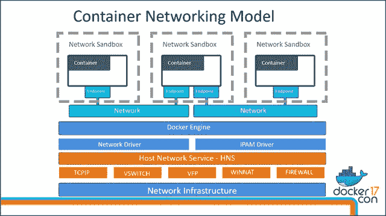

# Docker con 2017:Docker 如何改变 Windows，让 Windows 也能改变 Docker

> 原文：<https://thenewstack.io/docker-changed-windows-windows-change-docker/>

十年前，微软公开声明的对 Linux 的政策是通过各种手段迫使其供应商获得付费许可，不管他们是否直接或间接窃取了 Windows 技术。上周在奥斯汀举行的 DockerCon 2017 上，微软最忙碌的两名工程师展示了他们如何重新布线 [Windows Server 2016](https://www.microsoft.com/en-us/cloud-platform/windows-server) (将在几周内进行重大更新)，使其能够在 Windows 内的 Linux 子系统上管理和运行基于 Linux 的容器。

微软首席项目经理[泰勒·布朗描述道:“我们希望有一个类似‘这是所有东西的入口’的层。](https://twitter.com/Taylorb_msft)

从技术上讲，布朗解释了为什么微软有意重新设计其 Hyper-V 虚拟化系统，以包括一种名为主机计算服务(HCS)的东西。他的团队观察到，在 Linux 系统中，容器系统的多种排列是如何同时 ping 同一个控制组(cgroup)接口的。

“我们担心的是，有一天你会看到 Docker 和 rkt 以及其他东西放在一起，”他继续说道，“而谈论这些东西根本不会有共同的方式。”

## 所有事物的入口

两年前，微软在自己的公司会议上首次推出 Docker 支持后不久，[它让我们第一次看到了 Windows 和 Linux 互操作性的方案。2015 年 8 月，泰勒·布朗解释了为什么微软选择生产两种容器的实现:一种只是标记为“Windows 容器”，另一种是“](https://thenewstack.io/the-windows-and-linux-container-era-is-here/) [Hyper-V 容器](https://thenewstack.io/microsoft-secures-the-windows-docker-container/)”他说，出于安全目的，你可能需要在完全隔离的情况下运行容器，而 Hyper-V 提供了这一点。

当然，无论如何，隔离是在 Linux 中创建 cgroups 的最初想法。所以有一个挥之不去的问题，为什么 Windows 开发人员或管理员不希望在所有情况下都实现 Hyper-V。

星期二，对这个问题有了一个冗长、详尽、而且有些迂回的回答。

“当你运行一个 Windows 服务器容器时，那就是一个共享的内核，”Brown 解释道，他小心翼翼地在短语中加入了“服务器”一词，原因很快就会变得显而易见。“如果我运行第二个，同样的内核。它们还与主机共享同一个内核。”

事实证明，启用这种内核共享与微软客户端操作系统 Windows 10 的架构背道而驰。

“尽管 Windows 10 和[Windows] Server 的内核相同，”布朗在回答一位与会者的问题时说，“但它们的操作方式不同。你得到不同的调度参数，你得到不同的内存管理技术。因此，如果你试图达到一种状态，在这种状态下，你可以明确地说，‘这将会以同样的方式运行’，这些将会干扰并改变事物的运行方式。”

换句话说:如果 Docker 启发的共享内核的方法既适用于 Windows 10 又适用于 Windows Server，那么您试图在两种环境中平衡容器的性能特征的几乎所有努力都会导致不平衡。这是微软以前遇到过的问题，特别是其长期存在的网络服务器 IIS。从版本 6.0(2003 年发布)开始，它使用内核模式设备驱动程序 HTTP。SYS——在 Windows 术语中，是一个仅用于 Windows 基础层的库。这是微软将其网络服务器的核心硬连线到其操作系统中。

尽管微软统一了客户机和服务器操作系统的内核，但它们的支持结构却大相径庭。他们的时间和进程调度概念现在是基于独立的结构。因此，IIS 在这两种操作系统中的表现截然不同。现在，确保所有支持的实现的行为一致是任何容器化平台的要求。布朗说，尽管几个月前发布的文档解释了如何在 Windows 10 上运行这两种容器类型，但展望未来，客户端操作系统将只运行 Hyper-V 容器。

“这种形象在不同的环境下会有不同的表现，”布朗继续说道，“这与我们对 Docker 的整体精神和目标是背道而驰的。这就是为什么我们以我们的方式实施它，至少现在是这样。”

## 整个精神和目标

如果 Docker 从一开始就想构建两个可以在两个操作系统上相同地运行工作负载的平台，这个项目可能永远也不会完成。从建筑学的角度来看，这与在岛上建造一座摩天大楼和在海上平台上建造一座功能相同的摩天大楼没有太大区别。

简单地说，在引擎盖下，这两个码头工人的工作不一样。更重要的是，微软已经对 Windows Server 进行了重大修改，使任何类型的容器化都能够发生。

微软变革的关键与网络有关。尽管虚拟交换机(或 vSwitch)迄今为止在公认的倾向于 Linux 的新堆栈中扮演的角色很少，在 Docker for Linux 中也没有扮演任何角色，但它对 Windows 如何感知虚拟网络至关重要。所有 Docker 容器的连接都发生在 IP 网络上；在 Linux 中，这些连接的模型简单地说就是 [Linux 路由](http://linux-ip.net/html/routing-intro.html)。同样简单，Windows 中没有 Linux 路由。因此，微软和 Docker 的工程师不得不为 vSwitch 配备 Windows 版本的容器平台。

回到 Windows Vista 和“Longhorn”项目的时代，微软的 Windows 工程师创造了一个叫做 *IP 路由区间*的概念。其初衷是保证虚拟专用网(VPN)内路由的隔离。Windows 上的 Docker 网络不使用 VPN 但是，它确实利用了隔离舱的概念。Hyper-V 首先利用它来支持多个虚拟服务器在一台物理服务器上运行。具体来说，划分确保每个虚拟服务器与所有其他虚拟服务器隔离开来。

如果您还记得 Linux 容器是如何发展的，那么这个概念是从 cgroup 开始的，它导致了隔离的名称空间。给每个空间分配指定的 IP 地址进行网络隔离，然后就产生了 Linux 开发人员所理解的容器。Windows 的发展方向相反，至少微软首席工程主管 [Dinesh Govindasamy](https://www.linkedin.com/in/dinesh-kumar-govindasamy-0a0a108/) 上周二在 DockerCon 与布朗的会谈中解释了这一点。首先，Hyper-V 为 Windows 工程师提供了任何容器都需要的网络隔离组件。从那里，这些工程师必须建立一种方法来共享内核，通过 IP 网络共享资源，并整合[子系统，从而使 Linux 容器能够在 Windows](https://thenewstack.io/finally-linux-containers-really-will-run-windows-linuxkit/) 中运行。

Govindasamy 宣布，尽管软件定义的网络(SDN)已经存在了很长一段时间，但 Windows Server 现在才开始正式支持覆盖网络模式——实现 Docker Swarm orchestration 引擎的一个关键功能——最新的更新补丁将在几天内发布。

“Docker 网络架构是建立在这个容器网络模型之上的，”他继续说道，展示了一个看起来像是为 Piet Mondrian 做的一堆煎饼的图表。

为了将这种架构应用于类似的 Windows 组件，需要有一种方法让应用程序安全地构建网络——这是 Windows 所不具备的。

因此，Govindasamy 和他的同事们设计了一个叫做主机网络服务(HNS，HCS 的网络对等物)的组件。Docker for Windows 依靠 HNS 来创建虚拟交换机和虚拟防火墙(Windows 称之为 [WinNAT](https://blogs.technet.microsoft.com/virtualization/2016/05/25/windows-nat-winnat-capabilities-and-limitations/) )。他向与会者解释说，HNS 还建立网络端点，将它们绑定到 vSwitch 端口，并对端点应用策略。

“我们在 Linux 中的默认网络模式是 *[桥接模式](https://wiki.archlinux.org/index.php/Network_bridge)* 。我们在 Windows 中的默认网络模式是 *[NAT 模式](https://docs.microsoft.com/en-us/virtualization/hyper-v-on-windows/user-guide/setup-nat-network)* ，”他继续说道，粗略地说明了这两个操作系统具有完全不同的网络优先级的事实。从某种意义上说，他们的性格截然不同；Linux 想连接，Windows 想抽象。

“对于 NAT 模式，我们创建一个内部 vSwitch，”Govindasamy 解释道。“[它是]一个私有虚拟交换机，在主机分区中添加了网关 NIC[*虚拟网络接口卡*]。然后，我们在网关网卡和外部网卡之间创建一个 NAT。因此，由于有了 vSwitch，您添加到此 NAT 网络的任何容器都应该能够相互通信，并且任何流出此 NAT 网络的流量都将使用 WinNAT 进行 NAT 处理。”

## 常见组件

为什么所有这些都很重要？有几个原因，我保证很有趣。

首先，虽然容器编排的目标是提供跨平台的一致方法，但是对 Kubernetes 进行的[调整以支持 Windows 容器网络](http://blog.kubernetes.io/2016/07/update-on-kubernetes-for-windows-server-containers.html)肯定会导致不同的性能特征。不一定更差，也许更好，但肯定是不同的。

这就引出了另一个重要的原因:虽然 Docker 的原始 Linux 路由架构不能被翻译成 Windows，但理论上，没有什么能阻止微软面向 vSwitch 的方法在某个时候被翻译成 Linux 实现，即使只是实验性的。 [Open vSwitch 不再是 VMware 项目](https://thenewstack.io/vmware-hands-oversight-open-vswitch-linux-foundation/)；它现在由 Linux 基金会管理，微软是该基金会的成员之一。

此外，在周二 DockerCon 的主题演讲中，[介绍了莫比项目](https://thenewstack.io/finally-linux-containers-really-will-run-windows-linuxkit/)，Docker 首席技术官 [Solomon Hykes](https://twitter.com/solomonstre) 谈到了标准化 Docker 底盘的必要性——就像汽车制造商所做的那样——以便更容易实现各种平台的专业化。

“很明显，他们重复使用相同的零件——相同的车轮、发动机等。Hykes 说，“但他们也在这些组件的通用组件上进行合作。这使得他们不需要重复劳动…所以我们窃取了这个想法，并将其应用到我们的工程问题中。结果是一些非常有效的东西。我们在 Docker 中创建了一个地方，我们所有的团队都可以在这里就通用装配进行协作。”

联网是 Docker 运营方式的基础，因此很难想象 Docker 的工程师会以某种方式避免考虑采用微软的 vSwitch/vNIC/NAT 模型的可能性，或者在未来的某一天将该模型的某种标准化形式应用于其所有版本，包括 Linux。因此，微软为在 Windows Server 上启用 Docker 而解决的问题很可能为 Docker 在其他地方的未来指明了方向。

毕竟，生态系统厌恶不平衡。

特征图片:一个 [Roberval 天平](https://en.wikipedia.org/wiki/File:Balance_scale_IMGP9728.jpg)，由 Nikodem Nijaki 拍摄，在 Creative Commons 3.0 下获得许可。

<svg xmlns:xlink="http://www.w3.org/1999/xlink" viewBox="0 0 68 31" version="1.1"><title>Group</title> <desc>Created with Sketch.</desc></svg>