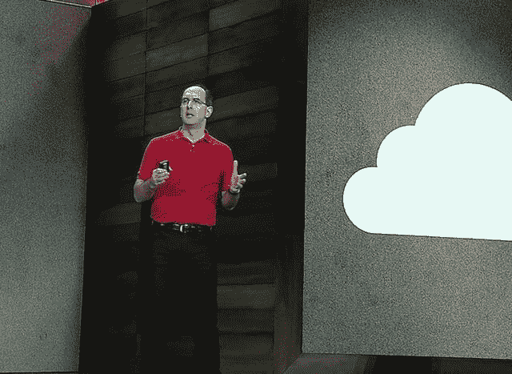
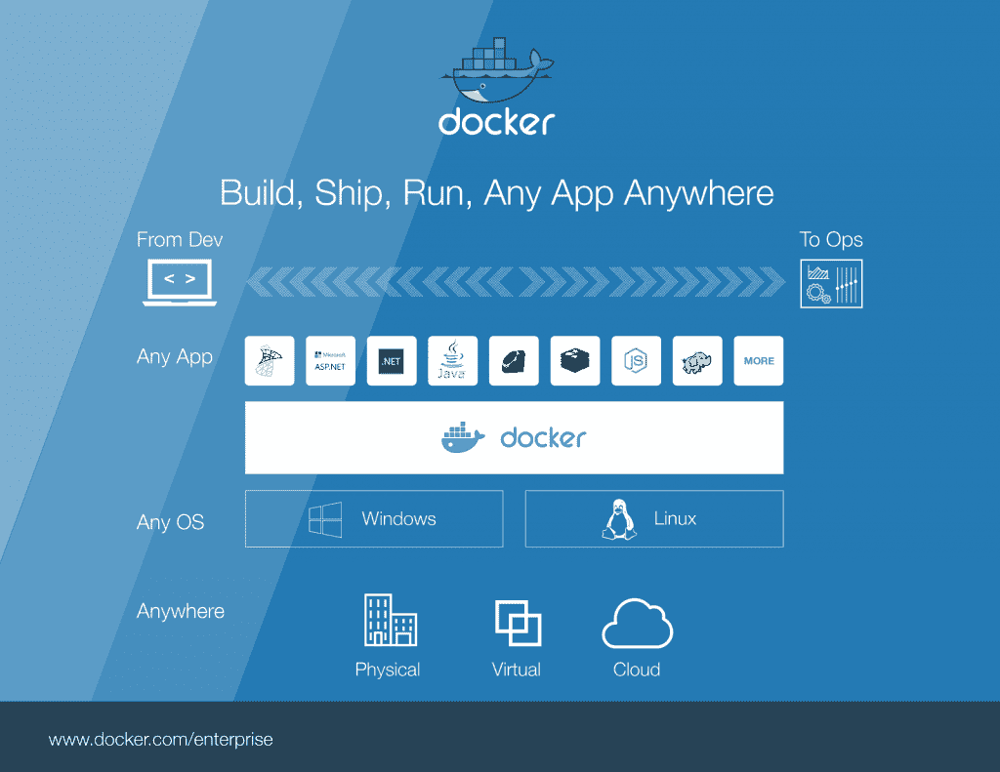
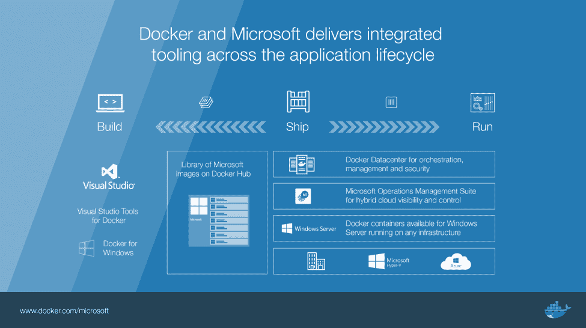
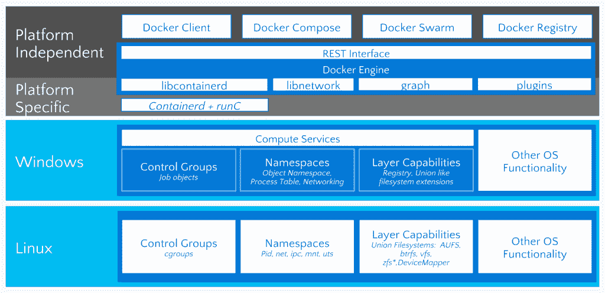

# 包含商业 Docker 引擎的 Windows Server 2016

> 原文：<https://thenewstack.io/docker-comes-windows-server-2016/>

周一，微软执行副总裁斯科特·格思里(Scott Guthrie)在该公司于亚特兰大举行的 [Ignite](https://ignite.microsoft.com/#fbid=80t92Pfq-At) 大会上发表了一份备受期待的声明，称 [Windows Server 2016](https://www.microsoft.com/en-us/cloud-platform/windows-server) 的所有副本——周一将进行全面评估，并于 10 月底前全面发布——将包括一个商业支持的 Docker 引擎作为免费选项。

Guthrie 说:“这使得开发人员和 it 管理员能够非常轻松地利用 Windows Server 2016 进行基于容器的部署。他接着发表了一份声明，明确了服务器操作系统在微软以云为中心的宇宙中的新位置:“我们在许多方面都认为 Windows Server 2016 是我们 Azure 云的边缘。我们建议您考虑将 Azure 作为所有本地服务器的边缘。”

Azure 正在成为微软的基础设施层。Windows Server 成为 Azure 的工具，用于执行 Windows 工作负载。还会有 Linux 工作负载，去年 11 月与 Red Hat 的合作协议将 Red Hat Enterprise Linux (RHEL)放在 Azure 首选 Linux 的前列。在周一宣布的一项协议中，与去年 11 月与 Red Hat 类似， [Docker，Inc.](https://www.mirantis.com/software/docker/kubernetes/) 将使微软成为其客户联系点，以支持 Windows Server 中的 Docker 引擎。

这是向前迈出的非凡一步，其重要性不可低估。从历史上看，企业对开源软件的主要反对意见是，它缺乏与商业软件相同的支持水平和能力。Red Hat 与微软的合作伙伴关系带来了非凡的回报，上个月再次扩展，使政府客户能够合并他们的 Red Hat 和微软订阅。或许类似的合作关系会给 Docker 公司带来类似的好处。

主要客户倾向于对那些利益直接延伸到他们身上的合作关系非常满意——最明显的是，在支持方面。到目前为止，Windows 数据中心几乎没有理由或动机开始尝试 Windows 容器。现在他们不仅有了一个好借口，而且有了一个安全网。

## 这片海洋中的两头鲸鱼之一

在周一的全体会议上，Docker 首席执行官[本·戈卢布](https://www.linkedin.com/in/bengolub)简短地上台证实，他的公司也一直在与微软直接合作，完善 Docker 数据中心，以用于 Windows。

“Docker 提供了一个管理工具，现在成千上万的大小组织都在使用它，”Golub 说。“这使得将容器的概念应用于软件供应链成为可能，这样您就能够管理整个过程，从构建代码到测试、扫描、投入生产、升级、从一台主机转移到另一台主机等等。我们也在这方面进行了合作，你可以在 Azure 中尝试，也可以在本地尝试，没关系。”

两家公司周一的联合声明证明了他们在这种背景下共同努力促进 Docker 数据中心的承诺，Docker，Inc .首席运营官 Scott Johnston 在公司博客帖子中证实了这一点。该推广避免使用“首选”或“默认”这样的短语，显示出微软包含了其现有的与 Mesosphere 的推广——这使得 DC/操作系统在 Azure Marketplace 中处于有利位置。事实上，在 Ignite Monday 的一些演示中，DC 操作系统仍然出现在那个位置，产品经理仍然很乐意提到它。

然而，今天的协议给了 Docker 一种它在 Linux 开源领域永远无法获得的优势:访问 Windows 数据中心，为运营从 WS2016 升级到 Docker 引擎到 Docker 数据中心提供了一条路径。除了 DC/操作系统，在新兴的 Windows 容器编排领域还没有真正的竞争，到目前为止，微软还没有宣称自己拥有这个领域。

微软公司副总裁 [Jason Zander](https://www.linkedin.com/in/jason-zander-62780637) (左上图)在台上介绍了 Golub，让与会者重新熟悉了集装箱化的目的以及码头工人在该市场中的角色。去年的 Ignite 已经过去一年半了，当时微软的 Azure 首席技术官 [Mark Russinovich 介绍了](https://thenewstack.io/docker-just-changed-windows-server-as-we-know-it/)Docker 容器的概念，受到了敬畏和惊讶。今天的与会者确实用掌声欢迎今天的新闻，尽管这一次他们听起来更渴望推进发射。

## 将虚拟机屏蔽扩展到容器

这一次，Zander 集中讨论了 Windows Server 将支持的两种容器模式之间的关键架构差异——一种完全基于 Docker，另一种是为微软的 Hyper-V hypervisor 设计的[。实际上有几个细微的差别，但是真正努力去总结它们经常会导致无意识的沉睡。詹德找到了有价值的那个。](https://thenewstack.io/microsoft-secures-the-windows-docker-container/)

Zander 说:“虽然常规容器可以有一个共享内核，但如果你在有多个客户的地方进行多主机租赁，他们真的不应该这样做。“这有潜在的安全风险。因此，Hyper-V 容器允许我采用相同的容器技术，但我可以在隔离虚拟机的情况下部署它们。实际上，我们将这种技术用于 Azure 机器学习和 Azure Automation，我们再次为多个租户执行大量作业，但我们需要这种安全性和隔离性。”

自从 Docker 首次在 Linux 中从 **cgroups** 模型中提出容器化以来，安全工程师和软件开发人员都[指出了开放容器遭受间接攻击的潜在危险](http://www.cmswire.com/information-management/docker-engineer-our-containers-are-secure/)，因为它们共享了一个可能暴露的 Linux 内核。从 Windows 的角度来看，这种理论上的潜力似乎更容易被利用——在 Windows 环境中，杠杆作用已经被证明是最危险的工具。

微软一直致力于在此类攻击开始之前规避它们，方法是在硬件级别启用信任模块来产生和管理加密和解密 Hyper-V 虚拟机所需的密钥。这种[屏蔽的虚拟机技术](https://blogs.technet.microsoft.com/datacentersecurity/2016/03/16/windows-server-2016-and-host-guardian-service-for-shielded-vms/)，微软称之为，正在扩展到 Hyper-V 容器，架构上的权衡是必须包含系统内核的基本映像(在这种情况下，是 Nano 服务器)。每个 Hyper-V 容器包括一个 Windows 容器，与一个非共享内核捆绑在一起。

令人惊讶的是，今天上午的主题演讲和全体会议没有提供 Docker 容器技术的演示，尽管本周晚些时候的分组会议承诺进行动手分析。Azure Stack 是微软基于 Azure 基础设施的 OpenStack 的 Windows 替代产品，也曾被预计于周一正式发布，尽管企业云集团的技术人员杰弗里·斯诺弗[向与会者解释说，Azure Stack 的技术预览版 2 将于周一发布。Azure Stack 仍有望在年底前全面上市。](https://twitter.com/jsnover)

[Docker](https://www.mirantis.com/software/docker/kubernetes/) 和 [Red Hat](https://www.openshift.com/) 是新堆栈的赞助商。

<svg xmlns:xlink="http://www.w3.org/1999/xlink" viewBox="0 0 68 31" version="1.1"><title>Group</title> <desc>Created with Sketch.</desc></svg>