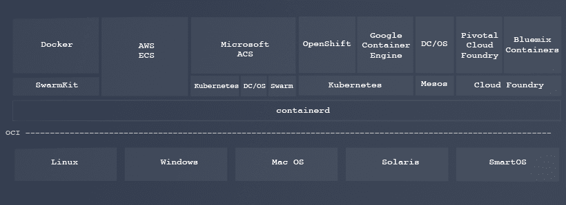

# Docker 将其容器运行时 containerd 捐赠给云本地计算基金会

> 原文：<https://thenewstack.io/docker-donate-container-runtime-containerd-cloud-native-computing-foundation/>

Docker 计划将其 [containerd](https://containerd.io/) 容器运行时捐赠给[云原生计算基金会](https://www.cncf.io/)，这是一个非营利组织[致力于组织](https://thenewstack.io/cncf-adds-googles-grpc-remote-call-project-big-tent/)一套基于开源容器的云原生技术。

12 月，Docker [开源发布了 containerd 的代码，为 Docker 容器提供了一个运行时环境。通过开源 Docker 堆栈的这一组件，该公司希望向用户、合作伙伴和容器生态系统中的其他参与者保证，核心容器组件将保持稳定，并且社区将对其发展有发言权。](https://thenewstack.io/docker-spins-containerd-independent-open-source-project/)

containerd 被设计为一个独立的组件，可以嵌入到第三方系统中，以提供核心的容器功能。现在，公司[已经采取了下一步](https://blog.docker.com/2017/03/docker-donates-containerd-to-cncf/)来确保 containerd 的独立性，将它捐赠给第三方组织。具体来说，Docker 将向 CNCF 技术监督委员会(TOC)提议让 containerd 成为 CNCF 项目。

Docker 技术人员 Patrick Chanezon 说:“拥有一个稳定的容器运行时，整个行业都在合作，这对整个行业都有好处，包括 Docker。此举也确保了 Docker 将在不断增长的 Kubernetes 生态系统中保持可行的组件，尽管它不会对其他容器运行时产生任何影响，如 Red Hat 的 [Project Atomic](http://www.projectatomic.io/) 、 [CRI-O project](https://github.com/kubernetes-incubator/cri-o) 或 CoreOS 的 [rkt](https://coreos.com/rkt/) 的运行时。

该公司还一直在争取将 containerd 纳入更广泛的开源云原生容器技术社区:上个月，Docker [在旧金山举办了 containerd](https://blog.docker.com/2017/02/containerd-summit-recap-slides-videos-meeting-notes/) 峰会，吸引了阿里巴巴、AWS、谷歌、IBM、微软、Rancher、Red Hat 和 VMware 等公司的代表。它希望 CNCF 能在本月晚些时候于柏林举行的 [CloudNativeCon/KubeCon](http://events.linuxfoundation.org/events/cloudnativecon-and-kubecon-europe) 会议上宣布接受该项目。

从 [Kubernetes](/category/kubernetes/) 容器编排引擎开始，CNCF 正在建立一个可互操作的开源技术名册，组织可以用它来构建自己的云原生操作。Docker 认为，containerd 运行时将非常适合这个堆栈，并成为 Kubernetes 的好伙伴(Kubernetes 1.5 运行于 Docker 1.10.3 到 1.12.3)。此外，containerd 使用 CNCF 的 gRPC 公开了一个 API，并以另一个 CNCF 项目 Prometheus 格式公开了度量标准。

根据 Chanezon 的说法，Docker 已经捐赠了其核心容器运行时引擎 runC，作为开放容器倡议的参考实现，尽管认为 CNCF 更适合，因为它更专注于支持代码，而不是规范。“CNCF 更注重项目和实施，”查内松说。

TNS 分析师 Lawrence Hecht 为本文做出了贡献。

云本地计算基金会、CoreOS 和 Red Hat 分别是新堆栈的赞助商

通过 Pixabay 的特征图像。

<svg xmlns:xlink="http://www.w3.org/1999/xlink" viewBox="0 0 68 31" version="1.1"><title>Group</title> <desc>Created with Sketch.</desc></svg>