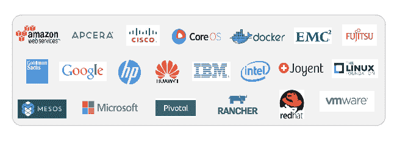

# Docker 贡献了容器格式和运行时代码，与 CoreOS 一起组成了标准组

> 原文：<https://thenewstack.io/docker-donates-container-format-and-runtime-code-joins-coreos-to-form-standards-group/>

Docker 将其容器格式和运行时间捐赠给一个名为[开放容器项目](http://www.opencontainers.org) (OCP)的新组织，该组织将在 Linux 基金会的保护伞下运作。Docker 将与 [CoreOS](http://coreos.com) 联手，并与众多技术公司合作，为 OCP 开发一份草案规范。总共约有 20 家公司参与该项目。

这是 Docker 和容器生态系统中的一个重大发展，但并不出人意料。CoreOS 已经用 Rocket 规划了自己的路线，这是一种它在去年 12 月 DockerCon Europe 之前开发并推出的容器。这一举动并没有让 Docker 社区中的一些人满意，但它确实迫使人们讨论新的容器生态系统中应该出现什么标准。今年春天，CoreOS 收到了来自 Google 和许多其他人对新的 open appc 规范的大力支持，这是其容器技术的开放版本。

## libcontainer

开放 Docker 的容器格式和运行时 libcontainer，可以看出 Docker 对市场的影响有多大。在其公告中，Docker 表示，OCP 的使命是“使用户和公司能够继续创新和开发基于容器的解决方案，并相信他们现有的开发成果将受到保护，不会出现行业分裂。”它还引用了创立应用容器倡议的 CoreOS 作为 OCP 的主要贡献者。

正如 GitHub 上所说，Docker 的 libcontainer 是一个原生的 Go 实现，用于创建具有名称空间、cgroups、功能和文件系统访问控制的容器。它允许开发人员管理容器的生命周期，在容器创建后执行额外的操作。它是 Docker 的工具链和底层容器机制之间的可插拔接口，用于支持各种容器类型(除了 Docker 自己的实现)，包括 LXC、OpenVZ 和 chroot。

Docker 已经获得了 libcontainer 项目的全部内容，“包括[nsinit]和使其独立于 Docker 运行所需的所有修改，并将其捐赠给这项工作，”Docker 首席执行官 Ben Golub 今天在一篇博客文章中说。由于 OCP，libcontainer 将不再作为一个单独的项目运行。libcontainer 目前的维护者——迈克尔·克罗斯比、罗希特 Jnagal、维克多·马尔莫尔、姆鲁纳·帕特尔、亚历山大·巴甫洛夫·莫罗佐夫、丹尼尔·明和蒂昂·格拉维将与 appc 维护者 CoreOS CTO 布兰登·菲利普和文森特·巴茨一起推动项目向前发展。

对码头工人来说，这消息似乎来得正是时候。他们已经从 Solomon Hykes 在 2013 年发起的项目发展成为拥有 40，000 个基于 Docker 的工具和超过 150，000 个基于 Docker 的应用程序的项目。已经下载了超过 5 亿次。以任何标准衡量，这都是相当可观的。在多个架构和操作系统上使用，包括 32 bit、Power、Z、Windows 和 SmartOS。

但是随着流行而来的是不可避免的社区紧张。CoreOS 首席执行官 Alex Polvi 和 CTO Phillips 向 Rocket 表达了他们的观点。Polvi 在今年早些时候接受新堆栈的采访时，公开谈论了他们与 Docker 的差异，但也希望开发一个开放的标准:

Docker 容器格式和 Rocket 容器格式不能融合没有技术上的原因。我们百分之百支持他们融合。我们希望这个标准是精心设计的。如果它坏了，我们不会坐以待毙。我们将发布我们认为设计良好的内容，这些内容已经被我们之外的许多人审查过，他们也认为是设计良好的。我们很高兴与 Docker 合作，努力提供互操作性。但我们不会因为它在那里就把它让给 Docker。我们希望它是好的——是一个定义良好的、可靠的、技术上构建良好的实现。

OCP 将如何“好”，这是个问题。Docker 首席执行官 Ben Golub 表示，这在很大程度上取决于保持项目的紧密专注。目标是定义容器格式和运行时，而不是技术栈，Golub 今天在博客中说。OCP 不会是一个倡导团体。它将有一个治理模型，包括一个努力保持供应商中立的技术顾问委员会，这样他们“可以避免已经损害了类似计划的党派内讧。”

【T2

波尔维为 OCP 赢得了一些荣誉。他当然值得。在一次电子邮件采访中，他提到了让各方走到一起的努力，以及他们是如何做到这一点的。不过，有一种真实的感觉，Docker 和 CoreOS 现在都有机会开发一个通用规范，这比其他任何东西都更有希望让客户对容器技术更有信心。两家公司都将寻求开发自己的容器技术，其他无数公司也是如此，比如 VMware 和 Canonical，后者开发了 Linux 容器管理程序 LXD。CoreOS 一直将安全性作为其战略的基石。以下是他在我们的电子邮件采访中说的话:

安全仍然是我们的一大担忧。我们在 12 月发布的产品主要关注安全性、可组合性和开放标准。App Container 和 OCP 解决了 it 的开放标准问题。我们在 OCP 的参与将始终着眼于安全。此外，我们将继续投资 rkt，以确保有一个非常安全的 OCP 运行时。

Docker 和它的生态系统代表了一场令人难以置信的文明的开源运动，至少在公众看来是这样。也许社区里有太多的风险资本投资，导致了一个舒适的市场，而不是足够的紧张。但与此同时，这是一个蓬勃发展的生态系统，现在已经有了一些标准。

CoreOS、Docker 和 Red Hat 是新堆栈的赞助商。

特征图片:[捐赠于此:加州萨克拉门托(2015)](https://www.flickr.com/photos/saintdesespoir/17124060292/in/photolist-s6chwQ-6DArsC-5RUBNw-ox7yhW-784DeB-9rdkib-6DArgJ-6Dwd8T-65hhH4-7wvm3Z-7wz97W-A7ndz-4f9d72-rcKHkA-gzvUxd-gzwwUa-gzvJco-uL1m6u-CwVW8-2dFM87-9sk6t4-5rNC5N-N67c4-6Z7ptS-67aNkf-4my7fZ-9YrTXM-8jhHnc-gzwvtY-gzvXC1-gBeycz-gBf31D-gBe7J9-oDJemL-8NmjK7-n8hQRE-4A92qQ-4nYc15-ArpKS-uvK4GU-ayzSh3-aEKaVU-uvJUJA-6bDVRb-5tm2Ci-9raq4g-7wtBoz-4ih9zC-7vMLT1-qZKDcd) ，[由何将失去](https://www.flickr.com/photos/saintdesespoir/)，授权于 [CC BY-ND 2.0](https://creativecommons.org/licenses/by-nd/2.0/) 。

<svg xmlns:xlink="http://www.w3.org/1999/xlink" viewBox="0 0 68 31" version="1.1"><title>Group</title> <desc>Created with Sketch.</desc></svg>