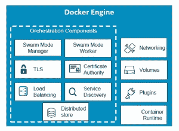
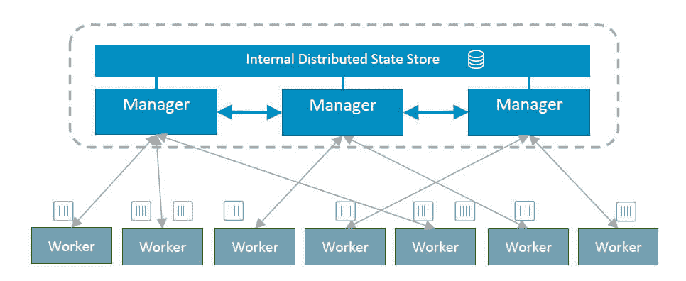
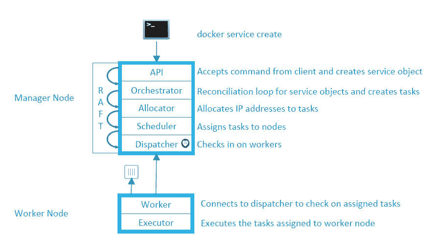
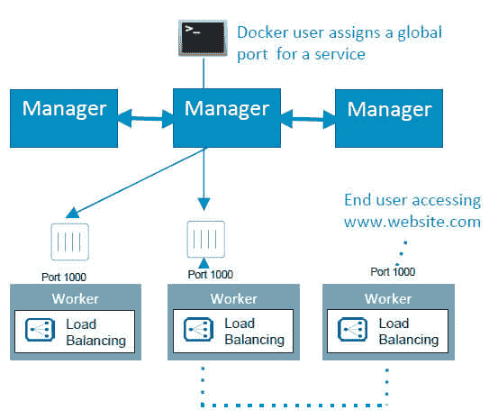
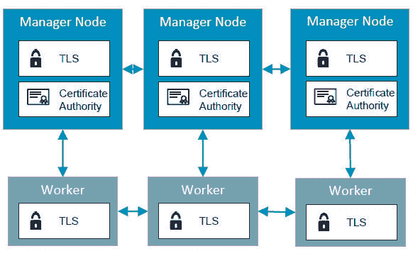

# Docker 引擎 1.12 带有内置的编排功能

> 原文：<https://thenewstack.io/docker-engine-1-12-will-come-built-orchestration-capabilities/>

Docker Inc .希望将编排作为其核心容器引擎的内置功能，而不是依赖外部软件。

将于 7 月发布的 Docker Engine 1.12 版本将内置编排功能，允许用户管理复杂的容器化应用程序，而无需额外的软件，使用开发人员熟悉的使用 Docker 容器的相同命令行结构和语法。

以前，这些所谓的编排功能是通过第三方工具提供的，比如 Kubernetes 或 Docker Swarm。'

Docker 营销副总裁大卫·梅西纳(David Messina)说:“随着 Docker 应用程序得到更广泛的部署，我们必须开发与系统管理员习惯的技术紧密结合的技术。

作为一个可选功能，Docker 引擎软件可以作为跨多个服务器的类似引擎的自组织集群中的一个节点，这些引擎可以作为单个可扩展系统一起工作，以运行大量互连的 Docker 容器。

应用程序部署的编排模型提供了许多好处，尤其是那些构建在微服务架构中的好处。应用程序和容器运行时环境都可以轻松地扩展以满足需求。它还确保了一种跨不同硬件环境运行应用程序的方式，使用 Docker 作为统一的基础。

## 走到一起

梅西纳说，Docker Engine 实际上“变成了一个运行在虚拟机或物理机上的节点”。每个引擎中都存在业务流程原语，包括自我组织和自动发现其他节点的能力操作员选择哪些发动机是经理，哪些是工人。

Docker 节点的集群，或者用 Docker 的说法是“群”，是自我修复的，因为在故障节点上运行的应用程序在别处被重新启动。在每个引擎中，工作负载信息被捕获到一个高度一致的分布式数据存储中。

“每个引擎都敏锐地意识到应用程序和服务的状态需求，并意识到每个工作引擎上运行的每个容器，”Messina 说。

“没有对第三方键值存储的外部依赖，”他说，指的是 Docker Swarm 如何依赖外部 etcd 分布式键值存储。嵌入每个 Docker 引擎的分布式键值存储基于 [Raft 共识算法](https://raft.github.io/)。

“因为当调度请求进来时，它们都在共享关于状态的主动知识，所以它被存储在内存中，所以调度也可以在内存中发生，所以没有阻塞，”Messina 说。管理器和节点之间存在持续的协调，以确保如果一个节点发生故障，事情将被重新安排给另一个工作器

为了自动化工作流，开发人员可以部署声明式服务部署 API，该 API 定义了服务、存储、网络和计算资源。API 提供了在容器层之上声明抽象的能力，包括服务、映像、规模和端口。开发人员可以使用 [Docker Compose](https://docs.docker.com/compose/) 来声明需求并将其转化为服务请求。

高级部署执行也可以通过 API 来执行，包括金丝雀和蓝/绿滚动更新。还可以执行特定于应用程序的运行状况检查。管理员选择新节点如何加入群，自动、手动或通过密码秘密握手。

在这个 Docker 命令中，一个容器的五个实例被旋转成一个新的服务，称为 Frontend，通过“My Overlay”网络连接，并通过 TCP 端口 80 进行外部通信。

该软件使用多主机覆盖软件为群集提供单一网络空间，并提供自动负载平衡。自动服务发现是通过 DNS 服务执行的。用户可以使用 Docker 的插件架构和第三方软件构建跨多个云的覆盖网络。

节点之间的所有通信都经过加密，并通过 TLS 执行，PKI 服务提供自动证书轮换。称为加密节点身份的通用框架证明了对识别和管理敏感工作负载和网络的支持。

“一个引擎必须被密码识别为群的一部分，它们通过 TLS 自动通信，”Messina 说。

Messina 说，尽管 Docker Swarm 的许多功能已经嵌入 Docker 核心引擎本身，但该公司仍将在无限期的未来维护和更新 Swarm。

Docker Engine 1.12 的发布候选版已经发布，该公司建议在新推出的 Docker for AWS 和 Docker for Azure 云服务上尝试新功能，这两种服务都提供了与其后端存储服务的集成。

Docker 引擎的商业支持版本可以从 Docker、HPE 或 IBM 获得，并且可以在 Red Hat Enterprise Linux、Ubuntu 或 HPE Linux 上运行。该公司将在本周于西雅图举行的用户大会 DockerCon 上对这项新技术进行更深入的探讨。

<svg xmlns:xlink="http://www.w3.org/1999/xlink" viewBox="0 0 68 31" version="1.1"><title>Group</title> <desc>Created with Sketch.</desc></svg>