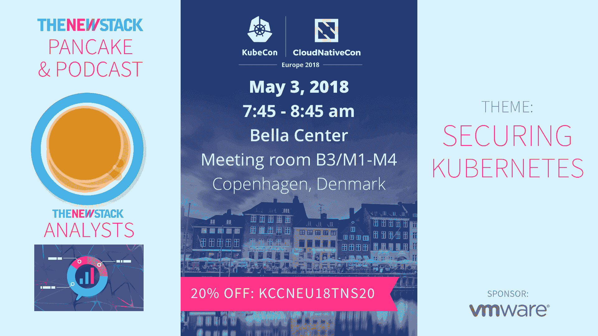

# Docker 企业版 2.0 拥抱 Kubernetes

> 原文：<https://thenewstack.io/docker-enterprise-edition-2-0-embraces-kubernetes/>

[回到 10 月份，](https://thenewstack.io/docker-fully-embraces-kubernetes/) Docker 除了自己的编排器 Swarm 之外，还转向支持 [Kubernetes](https://kubernetes.io/) 容器编排软件。本周，随着 2.0 版本的发布，该公司已将 Kubernetes 完全集成到其 Docker 企业版中。该平台将继续支持 Swarm，但现在将允许用户在两个调度程序之间进行选择，并首次利用 Kubernetes 中现有的 Docker EE 功能。

“2013 年，当我们首次开源该项目时，Docker 所做的是让 Linux 的一个强大但模糊且技术上困难的角落——容器——易于系统管理员和开发运维团队使用。我们把同样的观点带到了 Kubernetes。Docker 首席运营官 [Scott Johnston](https://www.linkedin.com/in/scottcjohnston/) 说:“我们正在从谷歌中获取一项非常强大的技术，在 Docker EE 堆栈中，我们正在将其产品化，并使其能够被企业团队采用，而无需他们进行培训。

Johnston 在与新的 Stack 谈论这个版本时反复提到的一个主题是，团队不需要重新培训就可以利用 Docker 的 Kubernetes 发行版。

在这个版本中，该公司已经让 Docker 编写了可部署到 Kubernetes 集群的文件。这意味着数百万个合成文件可以不加修改地部署到 Kubernetes 集群中。

Docker EE 2.0 平台包括许多新的和更新的 API，可以与现有的企业环境挂钩。Johnston 表示，这一版本旨在保持广泛的定制开放，并已经允许团队将 Jenkins 和 GitHub Enterprise 插入到 Kubernetes 或 Swarm 的部署管道中。

这也扩展到安全层，Docker EE 2.0 包括节点级的基于角色的访问控制。约翰斯顿说:“这允许你在操作上做安全的事情。应用程序团队 A 可以将他们的容器发送到集群中，应用程序团队 B 也可以，但是团队 A 的容器不能看到、干扰或中断容器 B 端的任何东西。如果一个是易受攻击的——比方说那个东西从它的容器里出来了——它不会干扰任何其他东西。在群集内部，所有这些都是逻辑分区的。”

这意味着组织可以为 Kubernetes 集群建立一个安全的软件供应链。Johnston 说:“当开发人员对他们推送的容器进行更改时，这将触发对堆栈中所有层的自动二进制扫描，能够查找漏洞、版本号和软件许可证。

如今，有超过 20 家厂商以不同的形式提供他们自己的 Kubernetes 产品，Docker 只是其中之一。然而，为此，Johnston 和 Docker 团队坚持认为，他们的发行提供了超越竞争对手的竞争优势。

约翰斯顿将 Docker 定位为与 Pivotal 和 Red Hat 竞争，这两家公司的侧重点明显不同:Pivotal 提供咨询服务，Red Hat 销售软件和 Linux 许可证。另一方面，Docker 是一个纯粹的容器管理产品。因此，该平台不依赖于 Red Hat 或 VMware 的任何特定发行版或软件。

“当我们审视竞争格局，看是否有其他公司采用 Kubernetes 并将其纳入他们的平台时，我们发现企业希望他们运行的基础设施具有真正的灵活性。我们的竞争对手采用开源的 Kubernetes，并倾向于将其锁定在特定的 Linux 发行版上。Docker 企业营销副总裁大卫·梅西纳说:“我们在这方面的差异化很大一部分是在你最基本的层面上，你的选择取决于我将在哪里运行它。

这种差异也延伸到 Kubernetes 本身的 Docker 分布。Johnston 说，Docker 的平台版本不是从原始版本派生出来的，仍然能够根据需要在较低的级别进行修改。

“我们集成 Kubernetes 的方式，如果你想去原生 Kubernetes YAML，或配置文件，他们可以做到这一点。你可以打开引擎盖，走到 Kubernetes 上的金属层，但他们不必这样做。他们从 Kubernetes 那里获得了很多能量，”Johnston 说。

Docker 企业版团队依靠其平台的可定制性来继续扩大对企业用户的吸引力。Johnston 指出 Debian 和 Ubuntu 非常受企业 Kubernetes 用户的欢迎，将这些用户锁定在 Red Hat 中会限制底层环境的灵活性。

梅西纳表示，对 Kubernetes 的兴趣主要来自 Docker 的 450 名现有企业群用户。“我们有一个很棒的基层社区，但我们也看到很多运营人员。自下而上的浪潮是相当可观的。推动人们对 Kubernetes 产生兴趣的是我们现有的 450 家企业客户，以及可能刚刚开始参与容器游戏并意识到他们需要一个企业容器平台的全新客户，”Messina 说。

特写图片由[冯](https://unsplash.com/photos/urFw0pB8cgw?utm_source=unsplash&utm_medium=referral&utm_content=creditCopyText)在 [Unsplash](https://unsplash.com/?utm_source=unsplash&utm_medium=referral&utm_content=creditCopyText) 上。

[管理 Kubernetes 的云计算原生计算基金会](https://www.cncf.io/)和[红帽](https://www.openshift.com/)是新堆栈的赞助商。

<svg xmlns:xlink="http://www.w3.org/1999/xlink" viewBox="0 0 68 31" version="1.1"><title>Group</title> <desc>Created with Sketch.</desc></svg>