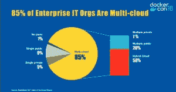

# Docker 企业版提供多云应用管理

> 原文：<https://thenewstack.io/docker-enterprise-edition-offers-multicloud-app-management/>

Docker 已经扩展了其商业容器平台软件 Docker 企业版(EE ),以管理跨多个云服务的容器化应用程序。

Docker 产品营销总监 Jenny Fong 表示，这一版本的理念是更好地帮助企业客户在整个开发和部署生命周期中管理他们的应用程序。Fong 说:“虽然容器有助于使应用程序更具可移植性，但容器的管理是不一样的。”

Docker EE 为容器提供了管理层，解决了安全和治理方面的需求，该公司现在正在将这种管理扩展到云中。

该公司已经注意到，当今 85%的企业 IT 组织都在追求云计算战略。因此，对于访问角色和策略，许多操作工作都是重复的。和其他管理问题。AWS 的管理控制与微软 Azure 不同。这里的危险是内容变得孤立，因为它们是为单个云服务定制的，这使得跨云操作(如高峰需求期间的云爆发)变得更加难以执行。

【T2

Docker EE 2 的新联邦应用程序管理特性提供了一个单一的界面，用于管理跨不同云提供商的 Docker 容器，如 Amazon Web Services 和 Google Cloud Platform，以及内部云。此外，该公司还宣布，Docker EE 现在支持从 Kubernetes 管理 Windows 服务器容器的能力。

“我们希望将我们更高层次的管理能力引入云托管的 Kubernetes，”Fong 说。

随着这一版本的发布，Docker 为商业领域的许多微软商店做出了重大贡献。超过 50%的 Docker 客户使用 Windows 容器来更新传统应用程序。该公司声称 docker EE 是唯一支持生产级 Linux 和 Windows 容器的企业级容器平台。

联合管理基于 Docker EE 包的一部分 [Docker 可信注册中心](https://docs.docker.com/ee/dtr/)。注册表提供了在任何位置镜像安全扫描的容器映像副本的能力，并提供了缓存功能，因此它们可以快速部署，甚至跨多个可用性区域。

Docker 产品副总裁 Benjot Chanana 说，通过这种方式，“你可以保持对整个供应链的控制”。“利用我们的提升策略和镜像功能，您可以确保当映像被扫描时(并且您已经检测到它没有严重漏洞)，您可以提升它，并且该提升策略可以完全自动化，因此一旦它提升到生产就绪状态，您就可以将副本镜像到所有注册中心和云提供商位置。”

Docker EE 还可以在云提供商或内部完全控制由 Kubernetes 或 Swarm 管理的集群供应。

该公司在本周于三藩市举行的公司 [Dockercon 2018](https://2018.dockercon.com/) 上宣布了 Docker EE 2.0 的增强功能。除了 Docker EE 新闻，该公司还为 Docker 桌面添加了[基于模板的工作流](https://beta.docker.com)。

谷歌和微软是新堆栈的赞助商。

专题图片:Docker 首席执行官史蒂夫·辛格(Steve Singh)，开启 Dockercon 2018。

<svg xmlns:xlink="http://www.w3.org/1999/xlink" viewBox="0 0 68 31" version="1.1"><title>Group</title> <desc>Created with Sketch.</desc></svg>