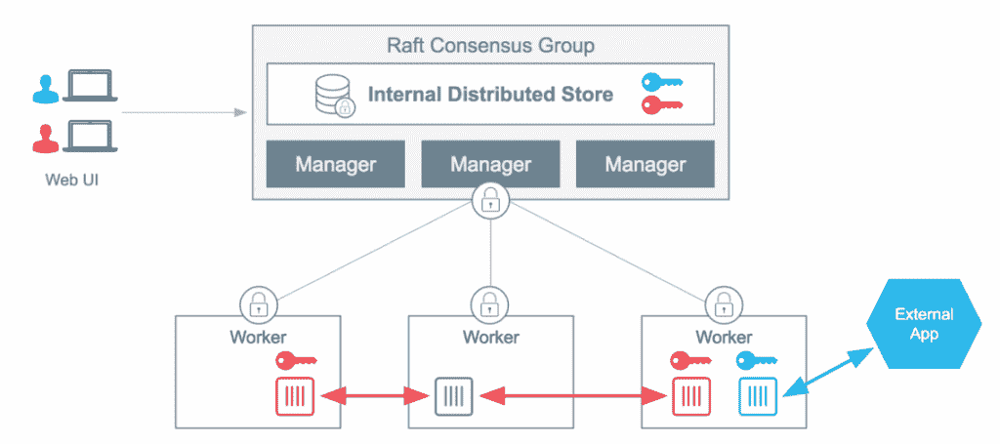

# Docker 将机密管理整合到 Swarm 中，以增强其数据中心平台

> 原文：<https://thenewstack.io/docker-grafts-secrets-management-swarm-says-strengthens-datacenter-platform/>

在围绕其 Swarm orchestrator 整合功能的下一步中， [Docker Inc.](http://www.docker.io) 在 Docker 数据中心平台的 Docker Swarm orchestrator 中添加了一个名为*秘密管理*的新安全功能，旨在确保高度分布式应用的完整性。

Docker 的安全主管 Nathan McCauley 在接受新堆栈的采访时断言:“如果你把一个可能做一些非常有创意或非常有用的事情的应用程序放在 Docker 容器中，它会变得更加安全，并且能够更好地保护自己。”。"通过在平台中，你正在武装应用程序."

*机密*，在这个上下文中，指的是对正在运行的应用程序保密的数据，比如它的用户凭证、它的数据库的访问密钥，或者描述它当前运行的平台的配置细节和环境变量。Swarm 即将推出的新功能，作为 1.13 上被称为 Docker Datacenter 的[的一部分，承诺能够将这些秘密直接注入到容器化的应用程序中，而不会被任何其他正在传输或静止的进程看到。](https://blog.docker.com/2017/02/docker-datacenter-1-13/)

这种类型的保密通信对于多租户平台上高度分布式应用程序的完整性至关重要。如果没有某种保密机制，理论上恶意服务伪装成合法服务是可能的。事实上，一些微服务架构可能会无意中使应用程序暴露于这种类型的篡改——允许运行中的应用程序的组件在未经验证的情况下随意“更新”。

## 自我整合

当然，秘密管理对于新堆栈的普通读者来说并不陌生，他们可能已经熟悉了 [Vault](https://thenewstack.io/using-vault-to-manage-your-apps-secrets/) 、 [HashiCorp](https://www.hashicorp.com/) 用于在分布式系统中实现机密数据交换的服务。我们已经看到迹象表明， [Vault](https://www.hashicorp.com/vault.html) 作为一个秘密管理器已经变得很受欢迎，不仅可以与 HashiCorp 自己的 [Nomad](https://www.hashicorp.com/nomad.html) 调度程序一起使用，还可以与 [Kubernetes](/category/kubernetes/) 一起使用——例如，[这个在 GitHub](https://github.com/Boostport/kubernetes-vault) 上获得 Apache 许可的 Kubernetes + Vault 集成项目。

Docker 的观点是，任何这种第三方工具与本身缺乏能力的平台的集成，从设计上来说，都带有漏洞的可能性和被利用的可能性。

McCauley 说:“为了让一个平台范围的解决方案发挥作用——一个全面发挥作用的东西，你需要有一个在平台和容器中都能实现的解决方案。根据定义，在容器中运行的应用程序需要一个接口来获取秘密。它们出现在容器和平台中。”

在周四的一篇公司博客文章中，Docker 安全工程师李颖解释了 Swarm 用户如何使用新命令 docker secret create 在平台和容器之间启动秘密共享机制。一个[认证机构](http://searchsecurity.techtarget.com/definition/certificate-authority) (CA)将已经被 Swarm 建立起来，供平台内部专用。正如 McCauley 为我们验证的那样，这个 CA 将负责 Swarm 中所有节点的身份，包括带有 Docker 守护进程的管理节点和带有 Docker 守护进程的工作节点。“所有的传输都是通过 TLS 加密进行的,”应写道,“所有的静态数据都是用 256 位密码加密的。

提到 Docker 称之为秘密管理的“容器本地”解决方案，McCauley 继续说，“我们试图传达的是秘密管理存在问题。容器的本质从根本上改变了这个问题集，因此我们称之为“容器原生”，以解决基于容器的平台的一些独特特征。”

他告诉我们，在容器化出现之前，应用程序可以自由地采用静态配置——在高度分布式系统出现之前，这也不必如此保密。容器化的兴起带来了第一波秘密管理解决方案，其中一些只是方法而不是产品，他没有提到其中任何一个的名字。他承认，这些技术的开源种类向世界介绍了秘密管理的需要。

然而，麦考利说，“我会把它们总结为人们一起黑客解决方案。”他举了一个常见的例子，在将秘密推送到存储库之前，将秘密嵌入到源代码中——这是一个临时的、虽然方便的修复方法。当然，开源代码文件中的“秘密”根本就不是秘密。

“想象一下，如果你住在一套公寓里，”麦考利建议道，“仅仅因为你是那套公寓的居民，你就能知道那套公寓里每个人的电子邮件密码。这就是如今流行的容器编排器中的秘密管理，我们对此很不高兴。”

## 大蓝鲸的攻击

第二波秘密管理，正如他所描述的，增加了一两个程度的定制，质量在“不太安全”和“相当安全”之间变化。

“但它们基本上都被固定在集装箱平台的侧面，”他说。

Docker 的新闻简报中的措辞包括以下内容:“其他解决方案是作为事后想法附加到应用平台上的。其他容器编排器不安全，无法支持同一集群上的多个应用。”

Kubernetes 有证据证实麦考利的说法。Kubernetes 的应用程序秘密官方文档清楚地描述了该平台将秘密暴露给整个 pod。它确实解释了在理论上如何将秘密限制在 pod 内的单个容器中，尽管它涉及到为分区显式地设计整个应用程序:一个分区“处理用户交互和业务逻辑，但它看不到私钥”，另一个分区充当显式签名者。

在去年四月红帽会议的一次演讲中，，[杰里·贾拉瓦](https://twitter.com/w_i)，一位为赫林斯基移动开发公司 [Qvik](https://qvik.com/) 效力的高级系统架构师，建议开发者不要在源代码或 Docker 容器图像中嵌入秘密。贾拉瓦介绍说，秘密是 Kubernetes 生态系统中的“一等公民”，尽管这是该方法的“缺点”之一，他警告说，Kubernetes 的 **etcd** 键/值存储中的秘密是以明文形式存储的。因此，他建议，管理员可能想出一些方法来确保只有授权的个人才能访问 [**etcd**](https://github.com/coreos/etcd) 文件。

不到一年前，Kubernetes 的一名贡献工程师公开声称 Kubernetes 的秘密系统足够有效，只要不介意再想出一个安全系统来维持它。问题就在那里，而且可能仍然存在。

## 重新考虑异质性

但是，每个平台的核心都有责任提供它可能需要的每一类功能吗？或者，如果它真的是一个生态系统的中心，那么寻求第二和第三方的帮助来完善它的特性列表不是更好吗？这是一场 Docker 曾经支持第三方贡献者的辩论，尤其是当它开始推进自己的插件架构时。

现在，至少就安全性而言，Docker Inc .正在证明，当平台为自己提供功能时，功能是最可靠的。

这对 HashiCorp 来说可能是一个独特的挑战，其 Vault secrets 服务同时支持 Kubernetes 和 Docker。

“如果你生活在一个纯粹的、Docker 的世界，那么也许你可以提出这样的论点，”HashiCorp 首席技术官 Armon Dadgar 谈到新的堆栈时说道。“对于大多数现代企业来说，他们的一小部分工作负载实际上是在运行 Docker。所以现实是，对大多数人来说，这并不是一个本地的，银弹解决方案。尤其是，它忽略了一个事实，即多数据中心是大多数大型组织的现实。”

Dadgar 告诉我们，他的公司在财富 2000 强的势力范围内拥有许多客户，基本上所有这些客户都拥有许多不同类别的传统应用程序(例如，Windows Server、WebSphere、CMS、ERP、大型机、vSphere)。所有这些类别的应用程序之间的互操作性需要一个驻留在这些平台之外的“秘密服务”(我们的说法，不是 Dadgar 的说法)。

换句话说:将 Vault 集成到这些平台中的任何一个都与部署 Vault 的初衷背道而驰。在达德加尔看来，独立是它的主要优点。因此，Vault 将为 Docker 和 Kubernetes 提供同等质量的服务这一事实，使得任何一个平台在机密管理方面可能存在的架构缺陷都变得无关紧要。

“如果我们高度关注并高度限制我们的问题到 100%的 Docker 和一个数据中心，”Dadgar 说，“那么当然，也许那些说法会成立。现实情况是，总会有“胶水”——总会有这些需要集成的多个系统。”

对于周四的公告，Docker 的 McCauley 断言，将秘密管理集成到 Swarm 中给了开发者一个单一的控制台，从这个控制台可以进行访问控制和策略管理。我们问 McCauley，这种集成是否意味着开发人员(使用 Docker 的人)可能最适合在这种情况下管理安全策略，而不是 infosec 人员(使用安全平台的人)。

“Docker 的基本论点是，答案是两者都有，”安全主管回应道。“开发人员负责定义他们的应用程序中需要存在哪些秘密，因为他们是最了解这些秘密的人。如果你提供一个对他们有用的接口，他们会很好地定义它。但是，同样重要的一部分是 IT 运营团队，他们可以制定策略，让开发人员决定他们需要什么，审查这些策略，并将其部署到集群中。它们都是问题的组成部分；如果我们有一个解决方案，尊重这两个部分的代理，你最终会得到一个更安全的整体。"

由于 Docker Inc .采取了平台公司的立场，它采取了过去平台公司成功的立场:Oracle、SAP、IBM 和微软。这是一个竞争激烈的领域，即使是在开源领域。现在，以大蓝鲸为标志的公司看起来更大更蓝了。

专题图片:[“数字虎鲸”，由道格拉斯·柯普兰](http://www.stockpholio.net/view/image/id/4758721071)在温哥华会议中心外创作的雕塑，由 3dpete 拍摄，获得知识共享许可。

<svg xmlns:xlink="http://www.w3.org/1999/xlink" viewBox="0 0 68 31" version="1.1"><title>Group</title> <desc>Created with Sketch.</desc></svg>