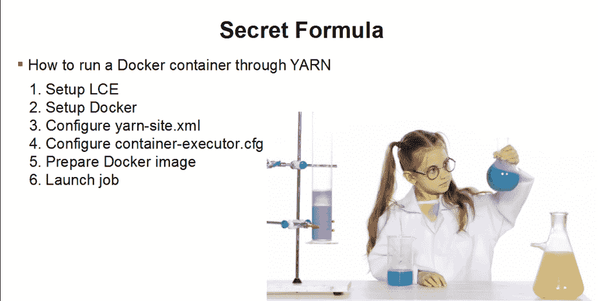

# 在 Hadoop 上运行 Docker 容器的六个问题

> 原文：<https://thenewstack.io/docker-hadoop-theres-good-bad-ugly/>

尽管在 Hadoop 上容器化工作负载的潜在价值， [Cloudera](https://www.cloudera.com/) 的 [Daniel Templeton](https://www.linkedin.com/in/danieltempleton/) 建议在部署 Docker 容器之前等待 Hadoop 3.0，理由是安全问题和其他警告。

“我想到给这个起个标题，‘很酷，但是不能用。’这里有很大的潜力，但在 3.0 之前——(它)不会解决你的问题，”他上周在迈阿密对参加 ApacheCon 北美会议的人说。

Templeton 是 Cloudera，[的 YARN 开发团队的软件工程师，他深入研究了 Hadoop](https://cdn.oreillystatic.com/en/assets/1/event/193/Docker%20on%20YARN%20Presentation.odp)[LinuxContainerExecutor](https://www.cloudera.com/documentation/archive/cdh/4-x/4-3-0/CDH4-Security-Guide/cdh4sg_topic_18_3.html)提供的 Docker 支持(下载),并讨论了何时可能有更好的替代方案。他规定他说的是 Hadoop 上的 Docker，而不是 Docker 上的 Hadoop，他称之为“一个完全不同的故事”。

“我有一个 Hadoop 集群。我想在 Docker 容器中执行我的工作负载，”他解释道。

Hadoop 的 [YARN scheduler](https://hadoop.apache.org/docs/current/hadoop-yarn/hadoop-yarn-site/YARN.html) 支持 Docker 作为提交的应用程序的执行引擎，但在你进入 Docker on YARN 这个勇敢的新世界之前，你应该了解一些事情，他解释道:

### 1.应用程序所有者必须存在于 Docker 容器中

目前，使用 Docker，当您运行一个容器时，您需要指定一个用户来运行它。如果您指定 UID —而不是用户名—并且如果 UID 不存在，它会自动为您创建。这种重新映射不适用于大量图像，因为需要预先指定用户。否则，您无法访问任何内容。你不能访问你的启动脚本，也不能写你的日志；所以它坏了。

“没有什么好办法来处理这个。讨论的是[纱-4266](https://issues.apache.org/jira/browse/YARN-4266) 。他说:“如果你有解决这个问题的好主意，就加入进来。”YARN-4266”采取的方法可能不会完全得到你想要的东西，但这是我们能想到的破坏性最小的方法。…在 Docker 延长他们允许你做的事情之前，我认为这个问题不会很快得到解决，”他说。

来自丹尼尔.坦普尔顿的演讲。

### 2.Docker 容器不会独立于它们运行的环境

Docker 容器的主要好处之一是它们的便携性。你猜怎么着？它们在 Hadoop 中的可移植性不会很好。如果你想要 HDFS 访问，如果你需要能够反序列化你的令牌，如果你需要一个像 MapReduce 这样的框架，如果你正在做 Spark，你必须在你的映像中有那些二进制文件或那些 jar。版本必须一致。

这个上面贴了的[补丁。该补丁允许白名单卷挂载，作为管理员，您可以说，“这些目录被允许挂载到 Docker 容器中。”您可以指定在提交作业时要挂载的目录。他说，只要管理员注意到它可能以 root 身份在容器中运行，问题就解决了，所以不要让他们安装任何可能会搞砸的东西。](https://issues.apache.org/jira/browse/YARN-5534)

### 3.大图像可能会导致故障

目前，YARN 中没有与 Docker 图像缓存相关的内容。当您执行作业时， **docker_run** 将隐式地从 repo 中提取图像。Spark 和 MapReduce 都有 10 分钟的超时。如果网络中的图像下载时间超过 10 分钟，您的作业将会失败。如果您持续地重新提交，它最终会停留在您已经尝试过的节点上，并且会运行。但这不是最好的解决方案。

[纱 3854](https://issues.apache.org/jira/browse/YARN-3854) 是第一步，不是解决方案。它让纱线像定位数据一样定位图像。在 YARN 中，你可以说，“我正在提交这个应用程序，这是这个工作将需要的数据、辅助库——不管是什么。请将它分发到我的作业将运行的所有节点上。纱线可以做到这一点。问题是这并不能让你免于 10 分钟的超时。所以那里有更多的工作要做。

### 4.没有对安全回购的真正支持。

Docker 将其访问安全回购的凭证存储在一个 **client_config，**中，该文件总是设置为您的**。docker/config.json** 。你没有办法从纱线来改变这一点。这意味着当你在访问一个安全的回购协议时，你会受到**的约束。无论您在哪个节点管理器上，docker/config.json** 文件都在您用户的主目录中。这可能不是你想要的。然而，有一个 JIRA[5428](https://issues.apache.org/jira/browse/YARN-5428)，这将使它可配置。

### 5.只有对网络的基本支持

“当你想到 Docker on YARN 时，你会想到 Kubernetes、Mesos 之类的东西。Kubernetes 为您提供了这个非常好的网络管理工具，对吗？你提交工作，然后说，'*这个*是网络的一部分，*那个*是网络的一部分。'网络神奇地实现了，中枢神经系统路由得到了处理，这个世界是一个有小狗和独角兽的奇妙地方，”他说。

纱线不能给你这些。它没有提供 pod 的概念，您可以说，“这些应用程序都是同一个 pod 的一部分。一起运行它们，共享网络。”没有内置端口映射的概念。网络上没有真正的自动化管理。相反，您可以在所有节点管理器机器上的 Docker 中显式地创建网络，然后您可以请求这些网络。但仅此而已。

### 6.存在巨大的安全隐患

有些人对此很偏执，尽管他说他不是:你可以执行特权容器。Docker 中的特权容器可以窥探底层操作系统，访问诸如斜杠 proc 和设备之类的东西。你可以关闭它，或者把它限制在某一组用户中，这样它就被控制了，但是你必须意识到这一点。

硬币的另一面是，如果你在容器中以 root 用户身份运行，你只能对底层操作系统做可怕的事情。在这一点上，YARN 没有为您提供指定用户的方法。将来很可能会。“在 Hadoop 上使用 Docker 有一些安全隐患，你真的必须考虑清楚。”

## Hadoop 3.0

据 Templeton 称，虽然 Hadoop 2.8 中有一些 Docker 修复，但它们还不够有用。在 [3.0 的特性中](https://www.slideshare.net/HadoopSummit/apache-hadoop-30-whats-new-in-yarn-and-mapreduce)不在 2.8 中:

*   将本地化的文件目录装载为卷
*   cgroups 支持
*   支持不同的网络选项
*   证明文件

据发布经理[王晓康](https://github.com/umbrant)称，Hadoop 3.0 的发布定于今年年底，他也是 Cloudera 的软件工程师。它正在经历两次 alpha 测试，第三次 alpha 测试计划在 beta 测试之前完成。

它的主要特点将是改进的[h base 擦除编码](https://www.slideshare.net/HadoopSummit/hdfs-erasure-coding-in-action)，这将为用户提供 1.5 倍的存储，这意味着他们可以节省一半的硬盘成本。王在另一次采访中说，这种对存储的改造将对 YARN 和 MapReduce 的用户产生巨大影响。

王说，该项目一直在与包括雅虎、Twitter 和微软在内的主要用户合作，以确保与现有系统的兼容性，并实现无痛苦的滚动升级。

<svg xmlns:xlink="http://www.w3.org/1999/xlink" viewBox="0 0 68 31" version="1.1"><title>Group</title> <desc>Created with Sketch.</desc></svg>