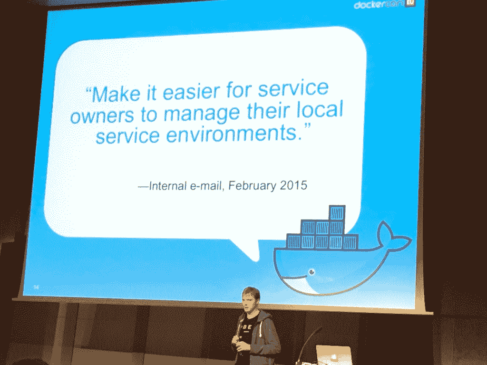

# Docker 如何推动优步的部署

> 原文：<https://thenewstack.io/docker-helped-turbocharge-ubers-deployments/>

无论你如何看待它的政治，毫无疑问[优步](https://www.uber.com/)是创新的同义词，因为它颠覆了交通行业，同时引领了共享经济。但是，最快的创新者——甚至包括微软、苹果和亚马逊——总是面临的问题是，一旦你开始创新并进入正轨，你就会走得太快，以至于你会被追得太快，有时你会忘记更大的图景，有时你会在前进的道路上被绊倒。

今年年初，当软件工程师 Casper S. Jensen 加入计算机平台团队时，优步就发现了这一点。

在 Dockercon EU 的第一天，Jensen 开始了他的演讲，他讨论了优步应用程序如何拥有一个易于使用的用户界面，但它只是一个简单的应用程序，它“实际上是一个非常非常大的东西”，“该应用程序只是冰山一角”，下面有无数的功能。毕竟，优步目前在 69 个国家都有自己的营销和监管，每天运行 100 万次旅行，有 4000 名员工使用该平台。

## 遗留软件开发模式

Jensen 和他团队的其他四名成员对优步来说都是相当陌生的，当时他们正在寻找一个解决方案来解决他们工作中“相当多的挫折”。

这是他们去年冬天的开发过程:

1.  写服务 RFC(征求意见)——优步是一家非常依赖反馈的公司。在开始任何新的东西之前，他们首先描述新服务背后的架构和推理，然后将它分发到邮件列表。
2.  等待反馈——比如，“你听说过这些人在其他地方做同样的事情吗”,集中精力在早期发现错误。
3.  手工搭建所有必要的脚手架。
4.  开始开发你的服务。
5.  等待基础设施团队编写服务脚手架。
6.  等待它找到服务。
7.  等待基础架构团队调配服务。
8.  部署到开发服务器并进行测试。
9.  部署到生产环境。
10.  监视器迭代。

他把第五步到第七步描述为“非常非常痛苦的部分。这些步骤可能需要几天，在某些情况下甚至几周。”这是为什么呢？“这并不是因为这些步骤很难，我们有大部分步骤的脚本，”只涉及大约十行集成。

“这相当简单，但它无法扩展，因为我们公司只有一小部分人真正知道如何在不破坏东西的情况下做到这一点，”Jensen 说。这再加上一些小错误——比如用斜线代替破折号——大大降低了速度。

2015 年 2 月，一封内部电子邮件传达了以下目标:

詹森说他们想:

*   允许服务所有者拥有一些专用的片，他们可以安装他们想要的任何东西，我们不关心他们安装什么，但它不能影响其他服务。
*   通过这样做，他们以一种我们不关心他们在做什么的方式来做。

有些事情必须在不破坏的情况下改变。

## 优步自身需要克服的障碍

当你的公司拥有如此快速增长的基础设施时，你会有某些限制，包括，正如 Jensen 所说，“当我们团队的其他人在比赛时，我们不得不这样做。”

优步不仅需要 24/7 的可用性和正常运行时间，以及大量的本地化功能，“我们没有人见过优步的所有东西。我们都看到了我们工作的一小部分。”他引用了像 [UberPOOL](http://newsroom.uber.com/announcing-uberpool/) 、 [UberKITTENs](https://newsroom.uber.com/2015/10/uberkittens-are-back/) 、[Uber icescan](https://newsroom.uber.com/2015/07/icecream2015/)和 [UberEATS](http://ubereats.com/eats/nyc/) 这样的功能，每一个都“像没有明天一样添加新功能”优步的飞速成功基于各个方面的高速增长，包括数据中心、服务器和基础设施。他们需要一个能够保持这种增长的解决方案。

“我们希望拥有真正简单的流程和真正简单的基础设施，以便我们的功能开发人员能够快速添加内容。其中最重要的一部分是创造新服务的过程，”詹森说。"我们意识到这意味着码头工人."他说，很容易决定 Docker 是他们的路线，因为它“真的很容易解释，人们已经读过它，理解它的简单概念。”他说 Docker 对于开发者社区来说是一个很容易的卖点，因为它是每个人都喜欢的容器。

## 海运集装箱规模的成长烦恼

他们对自己说，“我们都可以写代码，这应该很容易，对不对？两天后我们就完事了。”没有那么多。虽然他们在二月份就做出了这个决定，但直到仲夏，他们才开始使用 Docker。

詹森解释说，有了 Docker，“一切都会有所改变，我们需要以不同的方式思考问题。”

采用 Docker 的最大障碍之一是优步的内部集群管理系统 uDeploy。它需要继续滚动升级，但支持内在回滚。它有许多触发因素来表明出了问题，比如健康检查或图表，如果它们突然失控的话。它还包括负载测试和集成测试，如果有什么事情发生，这些测试可以快速回滚。我们的部署包括:

*   每周 4000 次升级
*   每周 3，000 次构建
*   每周 300 次回滚
*   管理系统中的 600 多项服务

根本没有办法摆脱或逐步淘汰 uDeploy，因此优步团队决定应该同时部署遗留服务和 Docker 服务。

“这也意味着我花了很多时间来完成这项工作，并为我们拥有的每个功能添加对 Docker 服务的支持，”Jensen 说。“当我们能够在 uDeploy 中显示标准输出和标准误差时，我们也必须在 Docker 中这样做。”

他们在没有太多计划的情况下启动了 Docker，Jensen 意识到这给了开发者太多的自由。“不是这样的，”他打响指说。“你真的需要重新考虑你的基础设施的所有部分。”

Jensen 说，如果你提前计划，真正考虑你的基础设施以及容器如何在其中发挥作用，Docker 的最终结果将会更顺利、更好。

## Docker 如何推动新的可扩展优步

现在优步大约有三分之一的记录在案，但很快就会达到百分之百。为什么？虽然过渡是痛苦的，但最终结果是他们所希望的，摆脱了阻碍持续部署的三个最大的痛点。有了 Docker，他们不再需要:

*   等待基础设施团队编写服务脚手架。
*   等待它找到服务。
*   等待基础架构团队调配服务。

现在，他们完成了所有必要的搭建工作，不是手动完成，也不是从以前的项目中复制，而是使用包含配置和构建文件的工具。他说，对于标准化服务来说，这是一帆风顺的，调配时间只需 10 分钟左右，而以前需要几个小时甚至几天才能完成。

在这个过程之外，优步认识到 Docker 消除了团队依赖性，提供了更多的自由，因为成员不再局限于特定的框架或特定的版本。框架和服务典当商现在能够试验新技术并管理他们自己的环境。

<svg xmlns:xlink="http://www.w3.org/1999/xlink" viewBox="0 0 68 31" version="1.1"><title>Group</title> <desc>Created with Sketch.</desc></svg>