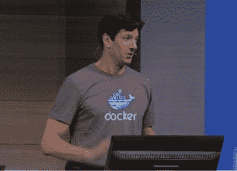

# 正如我们所知，Docker 刚刚改变了 Windows 服务器

> 原文：<https://thenewstack.io/docker-just-changed-windows-server-as-we-know-it/>

Windows Server 很少成为微软开发者大会的焦点；它今年为管理员举办的名为 Ignite 的主要展览将于下周开始，届时该公司计划展示其最近在后端减掉的体重，如果你愿意的话。

但是，当微软 Azure 的首席技术官马克·鲁西诺维奇(Mark Russinovich)周三上午在旧金山的 Build 2015 上登台演示容器化的微服务应用程序如何在 Windows Server 中工作时，对于人群中的许多人来说，这一定感觉像是一百年前来自外国大陆的探险家的演讲。

Russinovich 是微软为数不多的“摇滚明星”主持人之一，不仅以他的平易近人和衣冠楚楚而闻名，还因为他有能力在一场陷入火海的演示中救出高管。今年，他自己也是一名高管。

 按照他的习惯，他直接进入了使用 Docker Build(在 PowerShell 命令行上)来打包和部署一个 ASP.NET 网站作为 Docker 容器的演示。一个开发测试箱运行支持 Docker 容器的 Windows Server，在演示过程中还运行《我的世界》服务器和 Node.js 应用程序。他只用了几秒钟就将网站打包成一个容器映像，然后用 **docker run** 命令运行这个包。

一旦软件包运行，他就能够在 Internet Explorer 中从一个 IP 地址加载并运行网站。然后他停顿了一下，测量了房间的温度，可能已经意识到 Windows 开发人员可能已经完全被他们所看到的弄糊涂了。想象一下，一个资深的 Windows 专业人员，站在成千上万的人面前，谈论某种堆栈——或者更确切地说，是从 Linux 衍生出来的。

所以 Russinovich 要求在座的可能听说过 Linux 的人举手。(别担心，他以前干过这个。)

在他展示如何运行 SSH shell 来运行 Linux VM 之前，这是一个必要的问题。他把它作为一种兔子把戏的帽子，从使用 **docker ps** 命令显示帽子是空的开始。

然后，他使用在 Windows 中运行的 Visual Studio 的新版本将容器发布到 Linux 主机上。然后，他开始从 Visual Studio 调试正在运行的 Linux 应用程序，包括设置远程断点。

虽然没有明说，但 Mark Russinovich 在开发人员面前淘汰了 Windows Server 的大部分产品。

事实证明，演示的一部分是由一种新的可再发行形式的。NET 框架运行时，称为。网芯。在微软宣布它正在为容器制作自己的 CoreOS 的对应物——一个叫做 Nano Server 的服务器操作系统——两个星期后，本周它将推出它的可免费分发的(尽管可能不是开源的)容器运行时平台。

## 陌生土地上的陌生人

Azure 的首席技术官在一个人的带领下走上了讲台，这个人可能被与会者认为是来自远方的访客:[本·戈卢布，Docker Inc.](https://thenewstack.io/docker-raises-95m-talks-about-the-path-to-going-public/) 的首席执行官

[![[SCM]actwin,0,0,0,0;http://channel9.msdn.com/?rnd=1430319045603 Channel 9: Videos about the people building Microsoft Products & Services - Mozilla Firefox firefox 4/29/2015 , 11:55:58 AM](img/666ac50b23d0a2ba50dcb8d9ecbeef98.png)](https://thenewstack.io/wp-content/uploads/2015/04/150429-Build-2015-keynote-02-Ben-Golub-Docker.jpg)

“对于那些不知道的人，Docker 刚刚庆祝了它的第二个生日，”Golub 在登上舞台时大声说道。“坦率地说，我们认为 Docker 有点像一个两岁的人类，偶尔会绊倒，偶尔会呕吐，让我们最亲近的人晚上睡不着觉。”

Golub 讲述了 Solomon Hykes 创立自己公司的灵感来源——这个故事他可能在去年的一次 Docker 会议上讲过。他说，去年 10 月，他很自豪能够向微软展示在任何 Linux 服务器上运行任何 Linux 应用程序的能力。

“坦率地说，我们认为我们应该让 Redmond 同意让 Docker for Linux 在 Hyper-V 上运行良好，或者在 Azure 上运行良好，”他继续说道。“第一个大惊喜是，我们不仅要为 Linux 开发 Docker 我们要为 Windows 开发 Docker。我们将让 400 万 Docker Linux 开发人员加入到所有数百万 Windows 开发人员的行列中来，让使用标准 Docker、使用开源软件来获取任何 Windows 应用程序、对其进行 Docker 化，并在任何服务器上运行它成为可能。”

Golub 继续说，微软已经将 Docker Hub 集成到其开发平台中，并作为开源开发者积极为 Hub 做出贡献。他还称赞微软拥抱 Docker 的开放编排倡议，这是房间里的一些人第一次接触到。

这并不是说 Windows 开发人员不想被介绍给 Docker，或者不知何故害怕它。主题演讲会场人山人海，尽管微软高管可能喜欢假装兴奋的是最新版本的 Windows 10 中可能添加的新装饰，但他们来看的是马克·鲁西诺维奇和另一个穿着鲸鱼衬衫的人。

微软的主题演讲通常也是为了媒体的利益而准备的，所以技术细节通常会在当天晚些时候公布。对于周三的备审案件，该公司原定于太平洋时间晚上 9 点举行的溢出演示会议已经被推迟了几个小时。在后期会议中:与 Russinovich 的扩展 Docker 演示会议，以及与 Russinovich 的问答会议。

微软 Windows 服务器首席架构师杰弗里·斯诺弗也在现场，他是 PowerShell 的创造者，深受 Windows 用户的喜爱。虽然 Windows Server 的大部分在进展的热潮中实际上正在融化，但斯诺弗当然没有哀悼——事实上，在周三的镜头问答中，他的行为更像是拿着喷灯的人。

斯诺弗无意中透露，使用 Windows 10 系统内核的 Windows Server 新预览版将于下周末向测试人员开放。下周，微软将在芝加哥历史悠久的麦考密克广场举行 Ignite 大会，届时将会有更少的软件开发人员和更多的系统管理员、信息安全专业人员、开发运维专业人员以及他们的经理。

Docker 已经被安排在前台和中心。同化不仅仅是开始。已经发生了。

<svg xmlns:xlink="http://www.w3.org/1999/xlink" viewBox="0 0 68 31" version="1.1"><title>Group</title> <desc>Created with Sketch.</desc></svg>