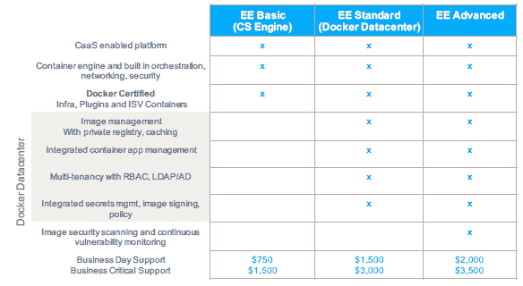

# Docker 推出企业版，完善市场策略

> 原文：<https://thenewstack.io/docker-launches-enterprise-edition-refines-market-strategy/>

Docker 已经重组了它的自我命名的容器技术系列，推出了一个新的专业应用包，叫做 Docker Enterprise，并且为开发者发布设定了一个快速的时间表。

该公司还推出了一项认证计划，以验证与 Docker Enterprise 合作的第三方软件。

Docker 营销和社区高级副总裁大卫·梅西纳(David Messina)说，任何流行软件平台的管理者都需要“找到一种既适合平台提供商又适合围绕平台构建的生态系统的模式”。“这种模式为我们和我们的合作伙伴创建了一个走向市场[计划]，并向企业保证，当他们在 Docker 上构建业务关键型应用程序时，他们将获得支持他们的内容。”

作为一项受欢迎的技术，Docker 拥有广泛而多样的用户基础，这导致了[在公司应该如何积极地扩展这项技术上的一些冲突](https://thenewstack.io/docker-fork-talk-split-now-table/)。

展望未来，用于创建和管理容器的 Docker 技术将有两种版本。一个是企业使用的付费版本，强调可靠性和稳定性，另一个是免费版本，面向那些对测试和扩展最新特性感兴趣的人。

据该公司称，新的 Docker 企业版(EE)订阅将提供“企业级支持”，并按季度发布，提供一年的后端口补丁和修补程序。

另外，面向“自己动手”的开发人员和管理员的 Docker Community Edition (CE)也是新的，它将通过两个渠道推出:一个是每月更新的(“Edge”版本)，包含最新的实验性功能。版本将采用 yy-mm 格式，因此今天发布的版本将是 17.03 版本。另一个是面向那些需要更稳定版本的人的季度版本，它将遵循相同的版本格式。

## 企业焦点

Docker 还开始了认证第三方软件的过程，这些软件已经被证明可以与 EE 版本无缝互操作。微软 Azure、亚马逊 Web Service 等基础设施云服务(虽然截至记者发稿时还没有谷歌云平台)和 Red Hat Enterprise Linux、CentOS、Oracle Linux、Ubuntu、SUSE、Windows Server 等操作系统都已经过验证。

除了云服务和操作系统，Docker 还认证其他用途的第三方插件和容器，如存储、网络和各种企业应用程序。迄今为止，Sysdig Cloud、Hedvig、Portworx、微软的 SQL Server、Weaveworks、Polyverse、Hypergrid、NetApp 和 Nimble Storage 等已经获得首肯，并可在 [Docker 商店](https://store.docker.com/)购买。

Docker 技术人员 [Patrick Chanezon](https://www.linkedin.com/in/chanezon/) 表示:“Docker Store 将提供大量打包成容器的工作负载，企业可以利用它们来构建自己的应用。

“Docker 认证的基础设施、插件和容器将为企业提供许多人在推进其容器战略时需要的保证，”RedMonk 分析师 [Fintan Ryan](http://redmonk.com/team/fintan-ryan/) 在一封电子邮件中写道。

Docker EE 将分为三个订购等级:基本、标准和高级。基本版包括核心容器引擎，而标准版则带有与 Docker 数据中心相关的所有功能，包括映像管理、私有注册表、多租户和身份管理支持。高级版本包括图像安全扫描和漏洞监控。

Docker 企业版，功能和定价。

EE 基础版的年费起价为 750 美元，高级版高达 3500 美元，并提供关键任务支持。

Docker CE 将内置对 Debian、CentOS、Fedora、Mac OS、Windows 10、Azure 和亚马逊 Web 服务的支持。

“Docker 企业版是 Docker 朝着正确方向迈出的坚实一步。社区和企业产品提供了一系列满足码头工人不同终端用户需求的产品，”Ryan 写道。

通过 Pixabay 的特征图像。

<svg xmlns:xlink="http://www.w3.org/1999/xlink" viewBox="0 0 68 31" version="1.1"><title>Group</title> <desc>Created with Sketch.</desc></svg>