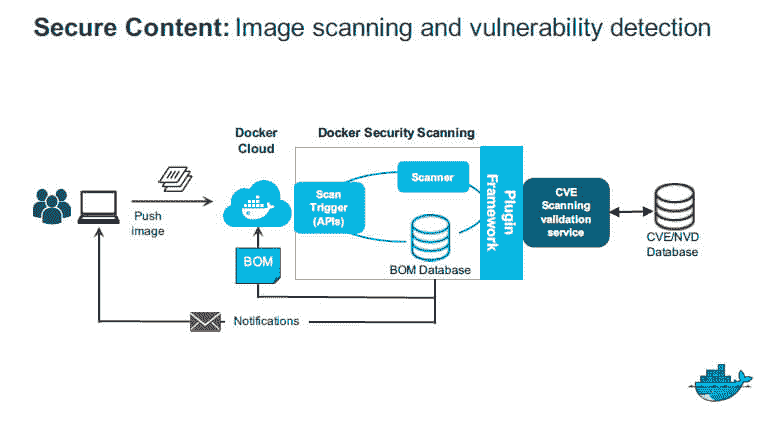

# Docker 推出针对容器的漏洞扫描器

> 原文：<https://thenewstack.io/docker-launches-vulnerability-scanner-containers/>

Docker Cloud 托管容器服务现在能够扫描容器中已知的安全漏洞。安全服务背后的技术称为 Docker 安全扫描，也将成为 Docker 数据中心的核心组件，Docker 的软件用于在内部运行容器管理服务。

有了这项新功能，“您就能够从一开始就防止易受攻击的软件被部署。Docker 安全总监[内森·麦考利](https://twitter.com/nathanmccauley)说:“如果存在易受攻击的软件，并且发现了漏洞，我们就能够进行补丁管理，减少暴露时间。”。

在过去的六个月中，Docker 已经在名为 Project Nautilus 的选定客户中测试了这种 Docker 安全扫描，扫描了超过 4 亿个集装箱。Docker Cloud 私人回购客户可以免费试用该服务。

顾名思义，Docker 安全扫描将通过对照[常见漏洞和暴露](https://cve.mitre.org/) (CVE)数据库检查容器中的二进制包来比较容器的内容，该数据库提供了最常用的开放源代码和专有软件包的已知安全漏洞的综合列表。

在典型的设置中，一个开发团队可能会构建一个 Docker 映像，然后将其推送到 Docker 云。在将图像存储到云中之前，将对其进行扫描，以查找存在已知漏洞的软件包。它会生成一个它可以识别的所有软件包和库的列表，并将它们与 CVE 列表进行交叉引用。如果映像中有任何漏洞，开发人员会收到通知。

当然，该服务可以嵌入到组织的安全策略和工作流中，甚至可以简化它。扫描可以很容易地集成到持续集成/持续交付(CI/CD)工作流中，这样每当开发人员完成一个新的容器时，扫描就可以自动开始。

如今，大多数管理员通常只能通过邮件列表或技术新闻来发现新的高知名度漏洞。不太引人注目的漏洞甚至可能根本不会被发现。扫描器自动识别可能被攻击者利用的脆弱代码。

更糟糕的是，“开发者甚至可能根本没有意识到漏洞，”麦考利说。

在理想的设置中，扫描仪就位后，运营团队可以构建一个图像，然后使用 [Docker 内容信任](https://blog.docker.com/2015/08/content-trust-docker-1-8/)对其进行签名，实际上是祝福图像可供开发人员使用。然后，开发人员可以拉下批准的图像，以填充内部程序。一旦完成，图像被上传到注册表。扫描器显示结果，如果漏洞被消除，允许开发者更新包。

当发现新的漏洞时，扫描器可以通过检查每个映像的材料清单中是否有新的漏洞来检查已经在生产中的映像。如果是这样，软件会向管理员发送通知，提醒他们需要用没有漏洞的新映像替换该映像。

因为它是基于 CVE 的，该服务不会识别每个组织内部开发的代码中的任何漏洞。组织仍然需要对其软件进行内部代码审查和审计。

Docker Inc .正在投资将静态分析器整合到扫描器中的可能性，该扫描器可以检查第一方代码中可能导致安全漏洞的错误。“到目前为止，我们只是专注于已知的漏洞软件，但可以想象的是，未来我们可以使用这种机制来插入静态分析器。”

“我们从 Docker 安全扫描中获得的输出数据对我们来说非常有价值，”3D 家居设计服务公司[home byme-3D via 云服务高级经理 Valentin Chartier 在一份声明中说。“该工具对于审查我们的组件以及为我们扫描的私人回购中的图像建立安全配置文件非常有效。这个过程是无缝的。我们的图像是从托管在 Docker Hub 中的私有存储库中扫描的，无需对现有流程进行任何更改。”](http://www.3ds.com/products-services/3dvia/space-planning-software/homebyme/)

Docker 并不是唯一一家为客户提供扫描服务的公司。CoreOS 通过其开源 Clair 软件提供了类似的功能[。Red Hat 也提供了这种功能](https://thenewstack.io/coreos-adds-remediation-hooks-clair-container-security-scanner/)和[扭锁](https://thenewstack.io/twistlock-future-container-security/)。

除了使扫描服务普遍可用，Docker 还更新了 [Docker Bench](https://github.com/docker/docker-bench-security) ，这是一个根据 [CIS 基准建议](http://www.networkworld.com/article/3056031/open-source-tools/22-new-concerns-added-to-docker-security-benchmark.html)验证主机配置的脚本，用于保护 Docker 引擎。

<svg xmlns:xlink="http://www.w3.org/1999/xlink" viewBox="0 0 68 31" version="1.1"><title>Group</title> <desc>Created with Sketch.</desc></svg>