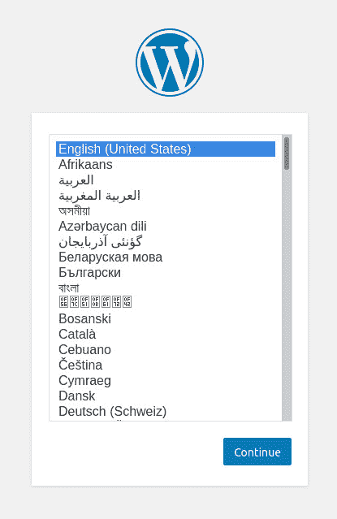
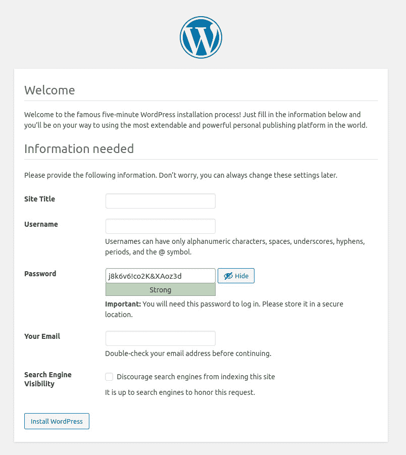

# Docker 使得部署 WordPress 比以往任何时候都容易

> 原文：<https://thenewstack.io/docker-makes-deploying-wordpress-is-easier-than-ever/>

尽管在 Linux 服务器上安装一个成熟的网站并不十分具有挑战性，但是现代技术的趋势和需求可能会让你认为你更愿意将这种部署容器化。这个想法有道理。毕竟，为什么不选择一条允许你在任何支持 Docker 运行时引擎的平台上释放 WordPress，或者允许你扩展部署以满足你的需求的路线呢？

尽管你可能认为这需要一个完整的 Kubernetes 集群，但你会惊讶于只用 Docker 就能轻松部署 WordPress。你可能也想知道这有什么用。除了部署 WordPress 站点之外，使用 Docker 这样做对于开发 WordPress 扩展和主题的开发人员来说非常有意义。如果这是您的用例，那么您不希望经常不得不使用常规的基于 LAMP 的途径来安装世界上使用最广泛的博客平台。

因此，无论你是想让你的 WordPress 工作起来更简单的开发者，还是有一定技术技能的博客作者，或者是需要快速部署可扩展的 WordPress 站点的公司，我都有一个巧妙的技巧给你。

用 Docker 部署 WordPress。

让我们实现它。

我将在 Ubuntu Server 20.04 上演示这个过程，但是这个过程可以在任何支持 Docker 运行时的平台上运行。

## 安装 Docker

首先，我们需要安装 Docker。正如我提到的，我将在 Ubuntu Server 上演示，因此下面的说明会有所不同，这取决于您使用的平台。

为了在 Ubuntu 服务器上安装 Docker 运行时引擎，请登录到您的 Ubuntu 服务器并发出以下命令:

`sudo apt-get install docker.io -y`

一旦安装了运行时，您需要使用以下命令启动并启用它:

`sudo systemctl start docker` `sudo systemctl enable docker`

接下来，您需要将您的用户添加到 Docker 组，这样您就可以在没有 sudo 特权的情况下运行 *docker* 命令(这将是一个安全风险)。为此，发出以下命令:

`sudo usermod -aG docker $USER`

最后，使用以下命令让系统知道添加了组:

`newgrp docker`

你现在已经准备好部署 WordPress 了。

## 部署数据库容器

我们必须做的第一件事是部署一个数据库容器。为此，我们将使用 MariaDB。在实际部署数据库容器之前，我们将使用以下命令提取映像:

`docker pull mariadb`

一旦图像被提取出来，我们将创建几个目录来存放 WordPress 数据。使用以下命令执行此操作:

`sudo mkdir /opt/wordpress`

`sudo mkdir -p /opt/wordpress/database`

`sudo mkdir -p /opt/wordpress/html`

现在让我们部署我们的数据库，使用新创建的 */opt/wordpress/database* 目录来存放数据。这个命令还将创建一个 **wpuser** 帐户和 **wordpress_db** 数据库。此部署的命令是:

`docker run -e MYSQL_ROOT_PASSWORD=**PASSWORD1** -e MYSQL_USER=wpuser -e MYSQL_PASSWORD=**PASSWORD2** -e MYSQL_DATABASE=wordpress_db -v /opt/wordpress/database:/var/lib/mysql --name wordpressdb -d mariadb`

其中**密码 1** 和**密码 2** 是强且唯一的密码。

接下来，我们需要找出数据库容器的 IP 地址。为此，我们发出命令:

`docker inspect -f '{{ .NetworkSettings.IPAddress }}' wordpressdb`

上面的命令将打印出一个 IP 地址，您将使用该地址连接到容器中的数据库服务器。确保可以使用以下命令连接到数据库服务器:

`mysql -u wpuser -h ADDRESS -p`

其中 ADDRESS 是数据库容器的 IP 地址。系统会提示您输入密码。确保使用您在数据库容器部署命令中为 wpuser 帐户创建的密码(上面的 **PASSWORD2** )。

使用以下命令退出 MySQL 控制台:

`exit`

## 如何部署 WordPress

现在是时候部署 WordPress 了。要做的第一件事是用命令拉下最新的 WordPress 图片:

`docker pull wordpress:latest`

一旦提取了图像，使用命令部署新的 WordPress 容器:

`docker run -e WORDPRESS_DB_USER=wpuser -e WORDPRESS_DB_PASSWORD=**PASSWORD2** -e WORDPRESS_DB_NAME=wordpress_db -p 8081:80 -v /opt/wordpress/html:/var/www/html --link wordpressdb:mysql --name wpcontainer -d wordpress`

其中 **PASSWORD2** 是您为 **wpuser** 帐户创建的密码。

部署应该几乎立即发生，并将报告容器 ID。一旦发生这种情况，您就可以将 web 浏览器指向托管 Docker 的机器的 IP 地址，就像这样:

http://地址:8081

其中 ADDRESS 是托管 Docker 的服务器的 IP 地址。

你会看到语言选择页面(**图 1** )。选择您的语言，然后点按“继续”。



图 1: 为你的 WordPress 安装选择语言。

在下一个屏幕中(**图 2** )，填写必要的信息并点击 Install WordPress。



**图 2:** 为您的安装填写细节。

最后，出现提示时，单击登录。然后你会看到标准的 WordPress 登录界面。一旦你成功认证，你就可以开始使用 WordPress，就像你已经在裸机上安装了它一样。

## 一种更快的方法

这一切都很好，但是如果你想更快地部署 WordPress 呢？你可以在 *docker-compose* 命令的帮助下。当然，您首先必须安装这个命令。为此，返回到您的终端窗口，发出以下命令:

`curl -L https://github.com/docker/compose/releases/download/1.26.2/docker-compose-`uname -s`-`uname -m`->~/docker-compose
-`

`chmod +x ~/docker-compose` 

`sudo mv ~/docker-compose /usr/local/bin/docker-compose`

在您的机器上使用 *docker-compose* ，使用以下命令创建一个新目录:

`mkdir WORDPRESS`

使用以下命令切换到该目录:

`cd WORDPRESS`

用以下命令为 WordPress 创建一个 docker-compose 文件:

`nano docker-compose.yml`

在该文件中，粘贴以下内容:

```
version:  '3.3'

services:
db:
image:  mysql:5.7
volumes:
-  db_data:/var/lib/mysql
restart:  always
environment:
MYSQL_ROOT_PASSWORD:  somewordpress
MYSQL_DATABASE:  wordpress
MYSQL_USER:  wordpress
MYSQL_PASSWORD:  wordpress

wordpress:
depends_on:
-  db
image:  wordpress:latest
ports:
-  "8000:80"
restart:  always
environment:
WORDPRESS_DB_HOST:  db:3306
WORDPRESS_DB_USER:  wordpress
WORDPRESS_DB_PASSWORD:  wordpress
WORDPRESS_DB_NAME:  wordpress

volumes:
db_data:  {}

```

保存并关闭文件。现在你可以用命令部署 WordPress:

`docker-compose up -d`

当您的命令提示符返回时，您可以将浏览器指向 *http://ADDRESS:PORT* (其中 ADDRESS 是托管服务器的 IP 地址，PORT 是您在 YAML 文件中分配的端口)。如果要分配不同的外部端口，请修改 YAML 文件中的“ *8000:80* ”行(外部端口是左边的端口号)。通过这样做，你可以在同一台机器上部署多个 WordPress 实例。

这就是使用 Docker 引擎和 *docker-compose* 命令安装 WordPress 的全部内容。享受快速推出的能力。

<svg xmlns:xlink="http://www.w3.org/1999/xlink" viewBox="0 0 68 31" version="1.1"><title>Group</title> <desc>Created with Sketch.</desc></svg>