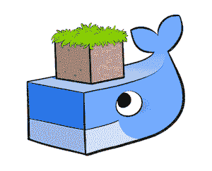

# 码头工人遇上僵尸

> 原文：<https://thenewstack.io/docker-meets-zombies/>

上周，Wehkamp Labs 的一名荷兰站点可靠性工程师分享了一种将 Docker 容器管理与视频游戏 Half-Life 2 相结合的方法。实验室创造了一种奇特的混合体，其中应用程序在游戏世界中表现为虚拟人，他们都需要抵御僵尸的攻击。

“我们都听说过来自网飞的令人难以置信的混沌猴，它会大规模杀人。在 Wehkamp，我们有类似的东西来攻击我们的微服务集群:Half-Life2，”Wehkamp 技术负责人 [Harm Weites](https://github.com/harmw?tab=activity) 在一篇详细介绍该项目的博客帖子中解释道。

网飞的[混沌猴](http://techblog.netflix.com/2012/07/chaos-monkey-released-into-wild.html)故意攻击正在运行的实例，以验证负载平衡器和重建进程都在顺利运行。方法有点类似 Wehkamp 的 hack。

基本上，Wehkamp Labs 提供了一个名为 Blaze 的微服务平台，Blaze 建立在 Mesos 和 Marathon 之上，它提供了一个通过 HTTP 进行 REST 调用的 API。所以用 Lua 写一些代码，实验室研究人员教 Half-Life 2 获取所有当前运行的应用程序的名字和它们的容器数。这就是乐趣的开始。

使用“Garry 的 Mod”版本的半条命 2，每个应用程序都被表示为一个现实世界中的角色——随机选择的几个角色配备了虚拟撬棍。

然后游戏开始产生僵尸…

https://youtu.be/r0pAzujyM-M

当开发团队加入游戏时，他们每个人都会得到一组代表容器的角色来抵御僵尸。很多僵尸。“因为我们被包裹在一个大的 while(forever)循环中…你将每 5 秒钟获得一个新的免费僵尸！”韦特斯写道。(小抄:从源代码来看，紫队得到的是游戏的 RPG——火箭推进榴弹发射器)。

当你的一个角色死了，你的一个容器也死了，感谢一个 HTTP 调用。这种死亡不可避免地触发了平台上新鲜容器的部署——这当然意味着游戏中会突然出现一个新的代表容器的角色。

韦特斯称之为“一种与 API 交互和测试平台弹性的有趣方式。”

wehkamp Labs[在 GitHub](https://github.com/wehkamp/blaze-extreme-container-manager) 上分享他们的代码——自述文件将其描述为“以时尚的方式管理您的 Mesos 平台！”—令人惊讶的是，它是如此简单。只需将两个文件复制到适当的目录中，启动游戏，然后将两个附加参数粘贴到控制台中。“记住，加载后，所有东西都会开始移动，所以要小心；)"

当然，这并不是极客们第一次将系统管理和视频游戏结合在一起。有一个 2001 年的项目使用游戏 Doom [作为进程管理](https://www.cs.unm.edu/~dlchao/flake/doom/chi/chi.html)的界面。也有项目使用《我的世界》来[可视化 Docker 容器](https://github.com/docker/dockercraft)和 [Kubernetes pods](https://github.com/stevesloka/kubecraft) 。两者的代码都可以在 GitHub 上找到——而且都使用了一个插件，这个插件也是用 Lua 编写的。

谁说可视化你的数据就不好玩了？

* * *

# WebReduce

Docker 是新堆栈的赞助商。

<svg xmlns:xlink="http://www.w3.org/1999/xlink" viewBox="0 0 68 31" version="1.1"><title>Group</title> <desc>Created with Sketch.</desc></svg>