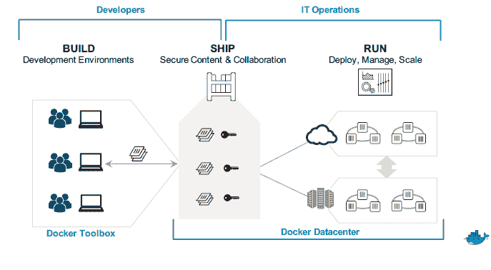
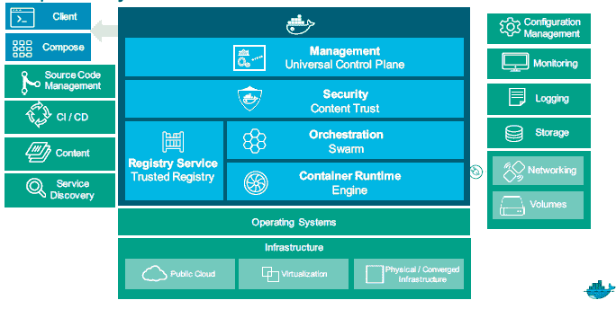

# Docker 提供了一个企业“容器即服务”包

> 原文：<https://thenewstack.io/docker-offers-enterprise-containers-service-package/>

Docker 希望让企业更容易建立自己的内部“容器即服务”(CaaS)运营，发布一个集成的开源技术包来部署和管理容器。

Docker 产品管理和产品设计高级副总裁 Scott Johnston 解释说，Docker 数据中心(DDC) [可以作为订阅，为组织提供一种方式](https://blog.docker.com/2016/02/docker-datacenter-caas/),让他们的开发人员能够轻松部署他们的应用程序，而不必担心将代码库从开发转移到生产可能会出现的问题。

Docker 的容器即服务架构

开发人员用于在本地工作站上构建应用程序的容器也用于生产端，确保两个环境之间的差异不会产生任何问题。它还可以为开发人员提供开发新资源的能力，而无需等待 It 部门。

Johnston 说，这个想法是系统管理员可以建立一个预先构建的安全容器映像的服务局，开发者可以在需要时使用。管理员可以构建经过安全强化的容器映像，并设置生成的容器可以在组织的服务器上执行的允许操作。

“我们从许多客户那里听到的是，他们希望有一个自助服务局，让开发人员尽可能快地行动，”Johnston 说。实际上，DDC 允许组织建立自己的内部 [CaaS](https://thenewstack.io/the-year-ahead-ops-and-the-rise-of-container-as-a-service/) 。

DDC 由 Docker 可信注册中心和 Docker 通用控制平面组成，后者[为跨不同环境运行容器提供了基础](https://thenewstack.io/dockers-universal-control-plane-goes-public-beta/)。控制平面在 11 月份进行了预演，现在已经正式上市，集成了 Docker Swarm 和 Docker Compose。该软件包旨在与安装在组织服务器上的 Docker 引擎的副本一起工作。

Docker 数据中心可以与现有的 IT 基础设施协同工作。

许多公司已经在使用该软件的预览版来运行他们自己的 CaaS 操作。ADP 使用该软件允许开发者提供他们自己的基础设施。澳大利亚银行公司 SA Home Loans 正在使用 Docker Datacenter 转换一套单片。Net 应用程序，内置在 Mono 中，集成到一组微服务中。

Docker 数据中心订阅的起价为每个节点每月 150 美元。

Docker 是新堆栈的赞助商。

<svg xmlns:xlink="http://www.w3.org/1999/xlink" viewBox="0 0 68 31" version="1.1"><title>Group</title> <desc>Created with Sketch.</desc></svg>