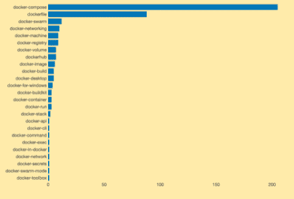
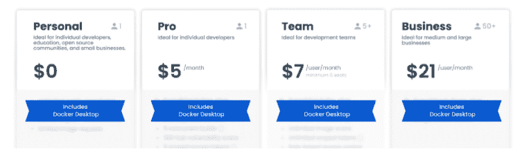
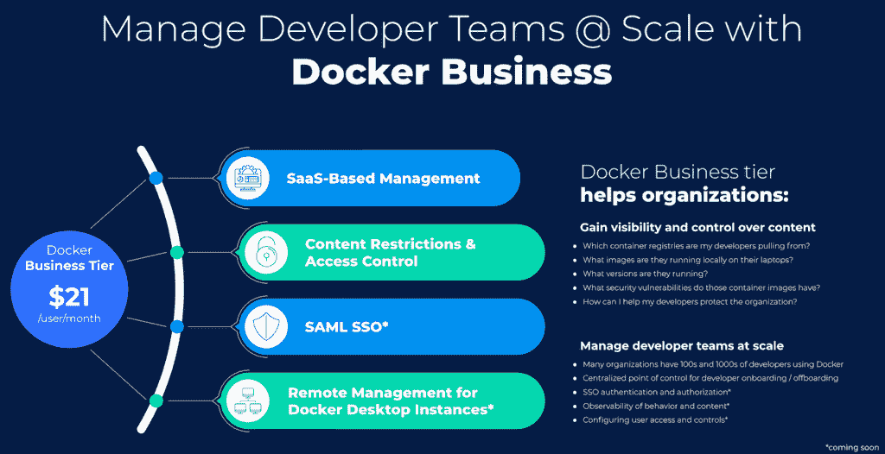

# Docker 说有些用户必须付费:但是它能赚钱吗？

> 原文：<https://thenewstack.io/docker-says-some-users-must-pay-but-can-it-make-money/>

Docker 决定开始向企业客户收费，作为业务改革的一部分，这一决定引起了人们的关注，因为这家领先的集装箱编排提供商正在努力实现盈利。

“这不是秘密，但我们正在寻找一种可持续的商业模式，”for Docker 的产品管理高级总监 Dieu Cao 告诉 New Stack，反映了 Docker 首席执行官 [Scott Johnston 在](https://www.linkedin.com/in/scottcjohnston)[博客帖子](https://www.docker.com/blog/updating-product-subscriptions/)中关于 Docker 如何随着许可变化而可持续发展的评论。

根据公司统计，Docker 仍然广受欢迎，目前有 55%的专业开发人员使用它，到 2030 年，开发人员的数量预计将达到 4500 万。Docker 容器需要在 Kubernetes 和包括本文作者在内的数百万人所依赖的其他环境中运行许多应用程序。尽管它很受欢迎，但该公司一直难以盈利。

[Enterprise Management Associates](https://www.enterprisemanagement.com/)的分析师 [Torsten Volk](https://www.linkedin.com/in/torstenvolk) 告诉 The New Stack 说:“Docker 确实是 Kubernetes 环境中使用最多的开发人员技术，Docker Hub 今天仍然为大约 50%的生产容器映像提供服务。“但 Docker 的收入模式依赖于这些开发人员说服他们的高管，当他们的公司已经在运行 Kubernetes 管理平台时，他们确实需要使用他们自己的商业 DevOps 工具链。是的，Docker 桌面很受欢迎，提高开发人员的效率几乎是每个人的首要任务，但最大的问题是替代产品对大多数用户来说是否足够好。”

过去三周的 Stackoverflow 开发者平台统计数据。

参考上面关于过去三周 Stackoverflow 开发人员平台统计数据的图表，Docker Compose 和 Dockerfile 是当今最常用的 Docker 组件中的关键主题。两者都在 Docker 的流行中发挥了重要作用，因为它们允许开发人员通用地定义在任何支持 Docker 运行时的平台上运行的应用程序环境，“但这足以让组织开始支付以前免费的费用吗？”沃尔克说。

Volk 指出，现在还有其他开源软件可供开发者使用，比如 Kubernetes Minikube、Google Skaffold、Tilt、Lando 等。“虽然 Docker Desktop 不仅仅包括 Compose，但问题是这些主要围绕 SecOps 的额外功能是否足以说服组织花钱，而不是使用他们已经付费的开源软件和 SecOps 工具的组合，”Volk 说。“我打赌是后者，但如果能看到码头工人证明我是错的，那就太好了。”

Docker 桌面版订阅服务协议(SLA)的更新包括:

*   付费订阅(专业版、团队版或企业版)起价为每个用户每月 5 美元，用于大型企业的专业用途，有效期至 2021 年 8 月 31 日，宽限期至 2022 年 1 月 31 日。Docker Pro、Docker Team 和 Docker Business 订阅包括 Docker Desktop 的商业用途。
*   现有的 Docker 免费订阅已被重命名为 Docker 个人。
*   没有改变 Docker 引擎或任何上游开源 Docker 或莫比项目。Docker Desktop 对小型企业(员工少于 250 人，年收入少于 1000 万美元)、个人使用、教育和非商业开源项目保持免费。

对企业用户来说，每月 5 美元的费用算不上是一个欺诈率。该公司表示，额外的收入可以改善 Docker 的用户体验。

“在寻找如何可持续地发展我们自己方面，我们正在推动更多的投资到开发者想要使用的工具上:这就是我们在这里的目标，”曹说。“这实际上是关于投资 Docker desktop，它深受每个人的喜爱。”

然而，一些观察人士对此举不太看好。[乔·贝达](https://www.linkedin.com/in/jbeda/)，VMware 的首席工程师，也是 Kubernetes 的三个创始人之一，在一条推特上写道，他是如何“理解许多人认为这是‘诱饵和开关’的观点的”他们当然可以这么做。但也燃烧了善意。"

Beda 的评论——以及其他批评 Docker 举措的评论——被一些观察人士视为具有讽刺意味，因为 Docker 的集装箱化概念为我们所知的 Kubernetes 提供了基础，现在仍然可以获得，只需支付象征性的费用，只有大公司的用户必须支付。

Volk 说他同意，但“当组织用 Kubernetes 代替 Docker Swarm 以便在一个行业标准的开源平台上运行他们的应用程序时，这种想法没有发挥作用。过去，当软件公司开始对其他地方免费提供的工具收费时，我们从未见过如此高的品牌忠诚度。”

Docker 的决定也得到了其他行业观察人士和分析师的赞许。RedMonk 的分析师兼联合创始人詹姆斯·总督(James Governor)在推特上说:“任何让开发人员更具生产力的软件都可能值得购买。”

在 Docker [于 2019 年将 Docker Enterprise 出售给](https://thenewstack.io/mirantis-acquires-docker-enterprise/) Mirantis 之后，该公司现在正在提供一系列针对开发者的服务**和围绕 Docker 容器构建的**，称为 Docker Business，作为其许可协议变化的一部分。"

除了 Docker Pro 和 Docker Team 订阅中提供的所有功能，Johnston 在他的博客文章中描述了 Docker Business 如何为组织提供控制开发人员可以从 Docker Hub 访问哪些容器映像的能力，“确保团队从一开始就通过仅使用可信内容来安全地构建。”Docker Business 也将很快提供 SAML SSO 等功能，即控制开发人员可以访问哪些注册中心以及远程管理 Docker 桌面实例的能力。

“我们并不是说，如果你认为 Docker 业务没有足够的价值，或者没有合规性，你就需要使用 Docker 业务，”曹说。有许多组织给他们的开发人员一定的预算，可以让他们的开发人员每月花费他们的经理 5 美元，这也是一种不错的方法。"

然而，Volk 说，在 Mirantis 收购 Docker Enterprise 业务后，代表 Docker 部分仍留在公司的公司高管必须证明，企业用户应该在需要时支付新的许可费。“Docker 需要向客户展示 Docker Desktop 的价值远远超过 Docker Compose，是释放如此多额外开发人员生产力的关键，以至于每个座位收取 5 美元是显而易见的，”Volk 说。

<svg xmlns:xlink="http://www.w3.org/1999/xlink" viewBox="0 0 68 31" version="1.1"><title>Group</title> <desc>Created with Sketch.</desc></svg>