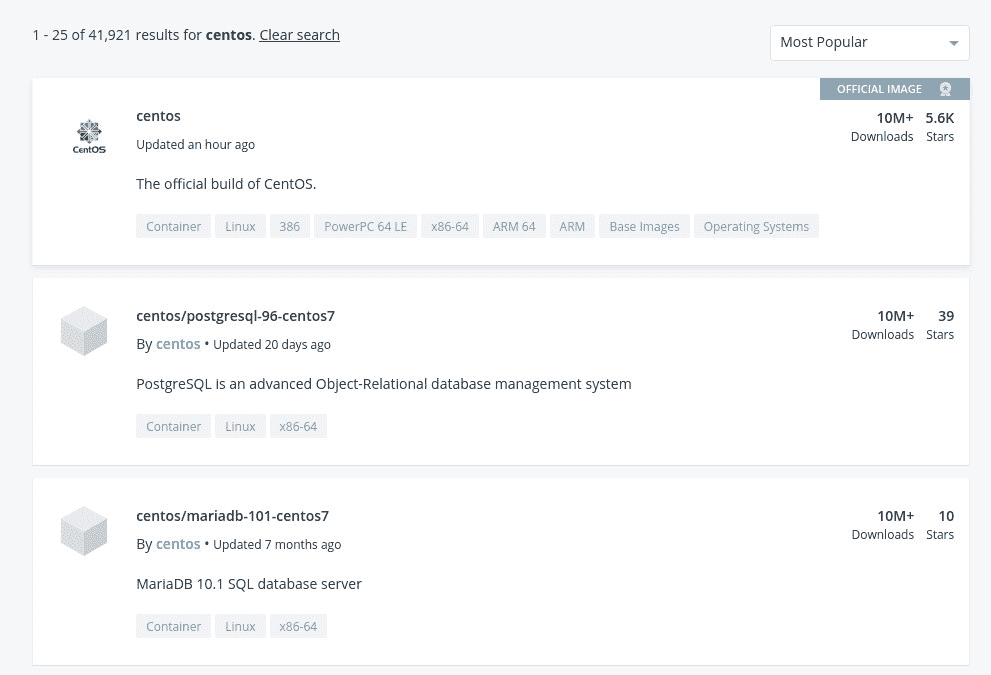

# Docker 安全基础和最佳实践

> 原文：<https://thenewstack.io/docker-security-fundamentals-and-best-practices/>

码头工人。你知道的。你用它。你可能会被它弄糊涂。是 Docker 吗？还是 docker？为什么 docker(或 Docker)已经退居 Kubernetes 之后？关于这项技术有很多问题。但是有一个问题一直困扰着许多容器管理员，那就是安全性。

你可能认为，鉴于容器的隔离性质，它们是无害的。在某些层面上，情况确实如此。如果容器部署正确，它就不能访问部署生态系统。理论上。但是，正如我们在技术领域所发现的，有志者事竟成。

[Docker 安全基础和最佳实践](https://thenewstack.simplecast.com/episodes/docker-security-fundamentals-and-best-practices)

订阅[simple cast](https://thenewstack.simplecast.com/)|[fireside . FM](https://thenewstackmakers.fireside.fm/)|[Pocket Casts](https://pca.st:443/6Ltf)|[Stitcher](https://www.stitcher.com/podcast/the-new-stack-makers)|[苹果播客](https://apple.co/2Dj1tv8) | [阴](https://overcast.fm/itunes915443155/the-new-stack-makers)|[Spotify](https://spoti.fi/2DYrLEf)|[tune in](https://tunein.com/podcasts/Technology-Podcasts/The-New-Stack-Makers-p989517/)

尽管您可能完全了解如何部署容器化的应用程序并将其扩展以满足您公司的需求，但您是否采取了必要的措施来确保该应用程序和托管环境尽可能安全？

你能做什么？

## 安全始于图像

集装箱安全面临的最大问题是这些集装箱所基于的图像。据 Red Hat 的容器首席产品经理 Scott McCarty 说，“由于开发人员现在负责从容器基础映像开始，下载和使用库，并添加他们自己的代码，他们本质上有一个融合的供应链，在接触网络的堆栈的任何部分都可能有漏洞。”供应链从图像开始，对此 McCarty 说开发者应该“总是从坚如磐石的基础图像开始。”请在上面的新 Stack Makers 播客中收听对 McCarty 的完整采访。

那是什么意思？简单。仅使用已知实体的官方图片。您必须记住，图像包含来自互联网的代码和由一个开发人员(或一组开发人员)创建的代码。如果您使用官方的红帽图片(来自[红帽容器目录](https://catalog.redhat.com/software/containers/explore/))，您可以确保该图片是安全的。为什么？因为它背后有一家知名公司的支持。那些照片已经被审查过了。相反，一个非官方的图片(从一个非官方的注册处下载)可能隐藏着恶意代码，等待着被释放到你的网络或客户端上。

以 Docker Hub 上的 CentOS 图片为例。首先列出的是官方 CentOS 图像。那张照片明显是官方的(**图 1** )。

图 Docker Hub 上的官方 CentOS 图片。

然而，如果你看看下面的官方图片，你会发现一些非官方的图片已经准备好了。您无法保证这些图像不包含恶意代码。如果安全是你必须要做的事情中最重要的事情(这是应该的)，不要从注册表中取出除了官方图片之外的任何东西，也不要使用不知名的注册表。

如果您是一名开发人员，正在设计一个作为容器基础的图像，那么您可以遵循一些最佳实践来确保这些图像得到更好的保护。按照 McCarty 的说法，“……开发者应该把他们的应用程序分成代码、配置和数据。”代码(如 web 服务器、Python 和 Java 等二进制文件)应该存在于容器映像中。配置和数据应该来自环境(比如通过. env 文件传递的信息)。

“例如，开发集群应该使用开发密码，而生产集群应该使用生产密码(包括加密密钥)，”McCarty 继续说道。"密码、证书、令牌、API 密钥和其他秘密可以通过 Kubernetes 下载到外部存储."

换句话说，不要把所有东西都打包到一个图像中。

## RBAC 是关键

为了获得尽可能多的安全性，容器管理员必须了解基于角色的访问控制(RBAC)。这些访问控制确定是否允许用户在容器或项目中执行操作。RBAC 类似于 Linux 操作系统中的 ACL。关于容器，McCarty 说，RBAC“……允许开发者使用本地角色和绑定来控制谁可以访问他们的项目。”但是，重要的是要知道“……授权是与身份验证分开的一个步骤，身份验证更多的是确定谁在采取行动。”

使用容器时，开发人员可以访问集群来定义路由、DNS 名称、组件通信(如客户端到服务器、服务网格和微服务)等内容。当开发人员可以访问这些特性时，就意味着他们也可以访问 Kubernetes APIs。如果没有 RBAC，这些开发人员将拥有绝对的控制权，如果他们愿意的话，可能会对容器安全性造成严重破坏。有了 RBAC，恶意或意外造成的损害是有限的。

通过使用 RBAC，可以为开发人员创建非常精细的权限。您可以创建团队，如 DevOps、developers、alpha 和 beta，每个团队都有不同的权限(如仅查看、受限控制、完全控制和管理)，然后将用户分配给团队。当用户被分配到团队时，将应用相关的访问权限。

Grafana Labs 的联合创始人兼首席技术官 Anthony Woods 在讨论 RBAC 时说道:“最低特权原则是一种成熟的安全管理方法。根据这种方法，基于角色的访问控制(RBAC)提供了一种机制，根据个人在系统中的角色，将个人对系统的访问权限限制在他们需要的范围内。”然后，他描述了 RBAC 需要覆盖的三个关键领域，以维护一个安全的环境。这些键是:

*   容器的资源和权限级别。Woods 说，“需要制定政策来限制允许用户部署到环境中的容器配置类型。”Woods 还警告说，“开发团队部署的应用程序应该只有有限的资源访问权，并且应该以最少的特权运行。”
*   用户应该能够看到的特定容器。在这一点上，Woods 认为，尽管“一个 Docker 主机可以运行由多个团队部署的容器，但是需要控制来限制用户只能看到他们团队的容器。”
*   用户可以对容器执行的操作类型。Woods 认为用户可以执行的某些操作具有一定的安全隐患。例如，“创建和删除容器、查看日志或能够在运行的容器内执行命令。并非所有用户都需要执行所有这些操作，因此应该制定策略来限制用户可以执行的操作。”

## 集装箱安全最佳实践

在每项技术中，都有需要考虑的最佳实践。容器也不能幸免。事实上，在部署容器时，有许多因素需要考虑。McCarty 从基础层面开始了他的最佳实践总结，他说，“首先，他们应该认识到，容器只是静态的花哨文件(字面上是 tar 文件)，以及运行时的花哨进程(只是启用了额外安全性的 Linux 进程)。”McCarty 随后进一步阐述了最佳实践应该应用的一系列想法:“这两个基本概念将允许安全管理员围绕机密性、可用性、完整性、不可否认性(签名)、纵深防御和租用应用标准最佳实践。”

(对 McCarty 来说)最大的担忧是，太多的管理员希望通过清单找到简单的方法，“当他们应该寻找方法将他们已经知道的概念与我们正在用容器和 Kubernetes 之类的东西实现的更新的模型和技术联系起来时。”

Woods 提供了一个简明扼要的最佳实践列表，其中包括:

*   使用编排平台(如 Kubernetes ),它将提供工作负载控制工具以及用户如何与容器交互。
*   遵循“最小特权”的原则，用户的访问级别仅限于他们需要的权限，不能超过。
*   使用漏洞扫描器检查图像中的已知问题。
*   将容器构建为 CI/CD 管道的一部分，并确保更新所有相关层。
*   使用变更管理流程来确保只部署批准的容器。

容器对于帮助企业高效、可靠地运行变得至关重要，并且具有前所未有的灵活性。但是保持这些容器的安全，这样你的公司就不会面临一场噩梦，这需要一些工作。通过适当的规划和精心的管理，您的容器部署可以享受与其他业务相同的安全级别。

Red Hat OpenShift 是新堆栈的赞助商。

通过 Pixabay 的特征图像。

<svg xmlns:xlink="http://www.w3.org/1999/xlink" viewBox="0 0 68 31" version="1.1"><title>Group</title> <desc>Created with Sketch.</desc></svg>