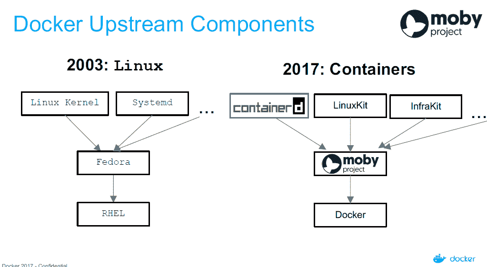

# Docker 推出 LinuxKit 和莫比项目，打造集装箱化基础设施

> 原文：<https://thenewstack.io/docker-seeds-two-new-projects-building-containerized-infrastructure/>

Docker 希望制造容器，而不是操作系统，它是数据中心运营的基础构件。该公司推出了两个新的开源项目，让系统构建者使用 Docker 和第三方组件来创建自己的基于模块化容器的系统。

Docker IT 负责人 Patrick Chanezon 在接受 New Stack 采访时表示:“为了让我们能够利用我们作为一个生态系统正在整合的所有创新，我们需要开始在组装层面进行合作。该公司本周在奥斯汀举行的年度用户大会 DockerCon 上展示了这些工具。

一个名为 [LinuxKit](https://github.com/linuxkit/linuxkit) 的项目是为容器组装操作系统的工具包。第二项努力是[莫比项目](https://mobyproject.org/)，它为可互换组件的合作奠定了基础，允许第三方从组件库和参考蓝图构建基于容器的系统。

LinuxKit 提供了一种基于容器的方法来为每种类型的容器构建一个定制的、精简的 Linux 子系统，这对于那些想要为特定的硬件或特性组装自己的精选 Linux 特性的系统构建者来说是非常有用的。基于 containerd，每个 LinuxKit 子系统都有自己的 Linux 内核，每个系统守护进程或系统服务都有自己的容器。

子系统一旦打包成 ISO 映像，就可以在裸机或虚拟化环境中启动。Docker 将维护它使用的所有 Linux 子系统组件，作为它自己的 Docker 产品的一部分。

> “Linux 是 Docker 的一个组件”——Patrick chane zon

容器可以为运行所有数据中心操作提供一个自然而灵活的基础，因为它们允许轻松组装组件，并最大限度地减少对操作系统的依赖，以及所有随之而来的安全缺陷。通过将操作系统与所需的组件配对，Docker 本身已经将其容器操作系统缩减到相对较小的 35Mb 到 100Mb 范围。

“我们的许多客户要求我们超越 Linux，”Chanezon 说。“Linux 是 Docker 的一个组件。有了 LinuxKit，我们可以让您以一种安全且可移植方式来组装组件。”

Docker 本身已经使用 LinuxKit 中的技术为 Docker 桌面版和云企业版 SKU 构建定制的操作系统。为了这项工作，Docker 与 Linux 基金会合作，并从 ARM、IBM、英特尔和微软获得了投入。

例如，Intel 可以利用 LinuxKit 在自己的芯片安全透明容器技术上构建基于容器的系统。HPE 可以利用这项技术为自己的硬件制造定制的集装箱系统。

## 叫我以实玛利

莫比项目旨在为日益笨拙的基于系统的组装过程带来一些秩序，通常来自 Docker 和第三方提供商的多个组件。

Chanezon 说，莫比“是自最初的 Docker 以来，Docker 推出的最重要的开源项目”。

该公司在 2014 年左右开始将其系统的部分组件化，如[公证人](https://github.com/docker/notary)，这项工作导致了莫比。Chanezon 说，Docker 开发人员“需要在不同的配置中组装组件，所以我们总是试图利用或重用我们拥有的任何东西”。

莫比将为容器供应商和服务提供商提供一个框架和各种共同的合作领域，以组织和建立一套共同的工具和最佳做法，以建立和扩大基于容器的系统，涵盖所有方面，如监测，协调，网络等。

到目前为止，Docker 已经拥有超过 80 个容器化组件的库，包括 Swarm、containerd、Docker Build 甚至 LinuxKit。许多第三方组件现在被硬连接到 Linux 发行版中。Docker 欢迎来自社区的更多贡献。

物联网设备的制造商可能需要一套与构建数据中心系统的公司完全不同的组件。有了莫比，两者都可以共享通用组件，还可以灵活地将自己的组件连接到一个通用组件中。

“有很多人正在进入容器生态系统，他们超越了在云上运行云原生应用程序:物联网、桌面和许多不同的环境，”他说。

Docker 正在将所有自己的组件打包成容器，并将提供一个基于 Docker Community Edition 的参考程序集。莫比工具本身可以用来从不同的组件组装项目。

综上所述，这些项目将 Docker 容器视为运行容器化应用程序的更大技术集合的一部分，这种技术既依赖于 Docker 本身，也依赖于第三方提供商。Docker 认为，拥有一个构建系统的公共基础可以帮助系统构建者加速他们构建新功能的努力。

监测公司 Datadog 在对 1 万名用户的最新调查中发现，18.8%的用户采用了 Docker，比一年前的 13.6%增加了 40%。也许更令人惊讶的是，一旦上船，码头用户，平均而言，近五倍的集装箱数量，他们运行的生产在 10 个月内。并且这种成功扩展到 Docker 工具的第三方提供商。Datadog 还发现，40%的 Docker 用户正在部署外部 orchestrator，如 Kubernetes 或 Amazon ECS。

据该公司称，迄今为止，Docker 组件——包括 containerd、Swarm、libcontainer 等——已被下载超过 120 亿次。

<svg xmlns:xlink="http://www.w3.org/1999/xlink" viewBox="0 0 68 31" version="1.1"><title>Group</title> <desc>Created with Sketch.</desc></svg>