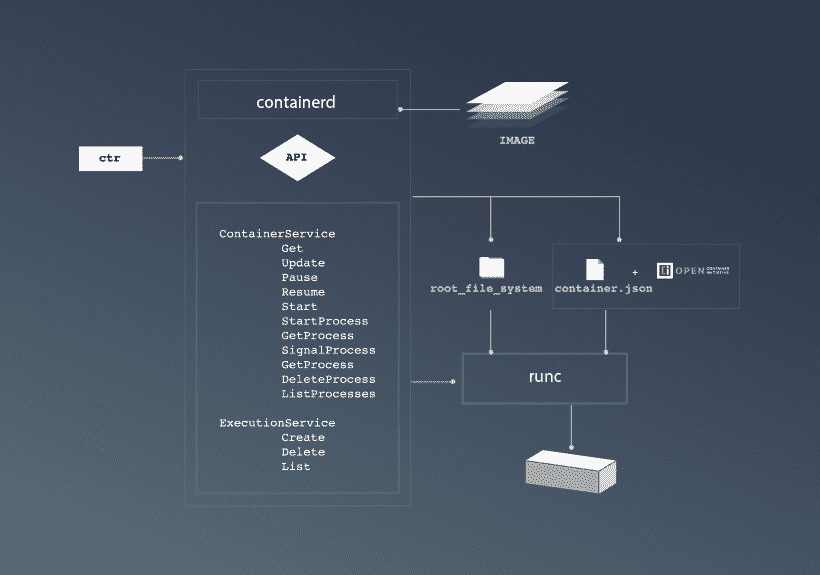
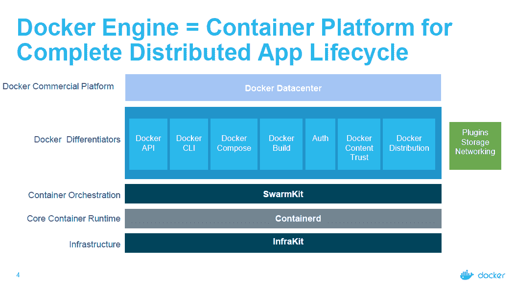

# Docker 将 containerd 作为一个独立的开源项目推出

> 原文：<https://thenewstack.io/docker-spins-containerd-independent-open-source-project/>

为了回应合作伙伴和用户对捆绑的担忧，Docker 发布了其核心容器组件之一, [containerd 运行时引擎](https://containerd.io/),作为一个独立的开源项目，并正在寻找一个“中立的”第三方基金会来管理这项工作。

“随着平台范围的扩大，我们的客户和更广泛的生态系统都有很多需求，要求我们的平台更加模块化。Docker 的创始人、首席技术官和首席产品官 [Solomon Hykes](https://twitter.com/solomonstre) 说。

亚马逊网络服务(AWS)、谷歌云、IBM Bluemix 和微软 Azure 已经承诺为该项目提供维护者和贡献者。Docker 希望专注于开源的企业软件供应商，如 Red Hat 和 VMware，也能参与推进 containerd。

Docker 已经开源发布了 containerd 的早期版本，尽管这个新版本是正式的 1.0 版本。对[容器代码库](https://github.com/docker/containerd/)贡献者的快速分析显示，自 8 月份以来，它已经获得了许多新的贡献者，包括谷歌工程师[杰斯·弗雷泽勒](https://github.com/jfrazelle)和[迈克·丹内塞](https://github.com/mikedanese)，他们也在 [Kubernetes](/category/kubernetes/) 容器编排引擎上做了相当多的工作。据我们所知，没有来自红帽或 CoreOS 的贡献。43 位投稿人中只有 13 位(30%)是 Docker 的员工，但 87%的投稿来自 Docker。中国是主要贡献者，有 9 名(21%)贡献者，其中 4 名来自华为，1 名来自 Hyper.sh，1 名来自腾讯，另外 2 名来自不明公司。

Docker 已经为开放容器倡议贡献了它的核心容器引擎，为容器的执行和监督提供了基础。Containerd 构建于 runc 之上，但提供了高级功能，如映像分发、网络接口和管理、本地存储管理和 API。

Docker 从其栈中开源的其他组件包括 [libcontainer](https://github.com/docker/libcontainer) 、 [libnetwork](https://github.com/docker/libnetwork) 、[公证人、](https://github.com/docker/notary) [HyperKit](https://github.com/docker/hyperkit) 、 [VPNkit](https://github.com/docker/vpnkit) 、 [Datakit](https://github.com/docker/datakit) 、 [swarmkit](https://github.com/docker/swarmkit) 和 [Infrakit。](https://github.com/docker/infrakit)

Hykes 说，尽管将 runc 交给了 OCI，Docker 正在寻找另一个组织来管理 containerd，如 Linux 基金会或 Apache 软件基金会。云本地计算基金会可能是另一个可能的家。这一决定预计将于 2017 年第一季度做出。

最初，Docker 向 OCI 发布 runc 至少部分是为了回应来自合作伙伴的压力。“在某些方面，我们已经看到 Docker-the-company 的继续努力跟上更广泛的生态系统。外面有很多初创企业。一切都在快速发展，”451 Research 分析师 [Donnie Berkholz](https://451research.com/analyst-team/analyst/Donnie+Berkholz) 在本周晚些时候发布的[新堆栈分析师](https://thenewstack.io/podcasts/analysts/)播客中说道。"在许多方面，这有助于解决社区的一些问题."

在过去的一年里，Docker 的合作伙伴和用户表达了对的担忧，认为 Docker 的技术进步太快，为第三方提供的稳定基础太少。Hykes 说，这个版本去掉了 Docker 引擎的一些稳定组件，因此它可以作为基础设施的“无聊”部分。

“随着这一领域的不断创新。Hykes 说:“人们有兴趣看到较低层次的稳定和放缓，并与较高层次完全分离，这样每个人都可以继续创新，但要将创新向上移动。”“但与此同时，我们都希望堆栈的下层能够稳定，这样整个平台就不会在自身重量的作用下分崩离析。”

Hykes 表示，对于最终用户来说，这一举措带来的变化将是最小的。

“如果你现在使用 Docker，你不会注意到区别。命令保持不变，接口保持不变。管道已经改变了；它现在更加模块化。但除非你想知道管道里有什么，否则什么都没有改变，”Hykes 说。

containerd [的 API 草案在这里](https://github.com/docker/containerd/tree/master/api/.)，路线图[已经发布在这里](https://github.com/docker/containerd/blob/master/ROADMAP.md)。

TNS 研究分析师劳伦斯·赫克特(Lawrence Hecht)为本文做出了贡献。

Core OS、Docker、Red Hat 和 VMware 是新堆栈的赞助商。

<svg xmlns:xlink="http://www.w3.org/1999/xlink" viewBox="0 0 68 31" version="1.1"><title>Group</title> <desc>Created with Sketch.</desc></svg>