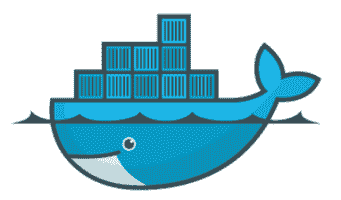

# Docker 基础:深入了解基本概念、工具和术语

> 原文：<https://thenewstack.io/docker-station-part-one-essential-docker-concepts-tools-terminology/>

这篇文章是关于理解和使用 Docker 容器、Docker 基础知识的系列教程的最新部分。

有许多“使用 Docker 开始运行”的资源，几乎所有这些资源都假定您已经熟悉了该技术。Docker 的确很强大，但是为了有效地利用它，在深入下载之前，对平台的底层概念和术语有一个坚实的理解是有帮助的。

了解这些基本的 Docker 术语将有助于你在 Docker 世界中导航，如果你最终迷失了方向，也更容易问出正确的问题。

## 容器

我喜欢 Docker 的标志，因为它在一个可爱的图形中巧妙地概括了集装箱哲学:一条鲸鱼承载着一堆集装箱。(有趣的事实:这条鲸鱼的名字叫“莫比码头”)。虚拟集装箱非常像那些金属运输立方体，将产品从海外工厂运送到货船、港口、送货卡车，然后到达当地商店。

容器内的东西与运输系统无关；容器的统一外观意味着分配过程中的每一步都很容易标准化。

包含应用程序的 Docker 容器也是如此。Docker 容器是自给自足的，只要求它们运行在足够强大的 Linux 或 Windows 操作系统上。任何运行集装箱的机器都不需要关心里面的东西。Docker 化的应用程序并不关心它是在一个 [Kubernetes](https://kubernetes.io/) 集群上还是一个单独的服务器上——只要安装了 Docker 平台，它将能够在任何地方的任何环境中运行。

容器架构意味着运行在容器内部的应用程序进程认为它是唯一的；向外看，它只看到一个准系统的 Linux 发行版。所有必需的依赖项都整齐地打包在。单个服务器上的多个容器化应用程序是独立的，即它们不会相互干扰——这意味着你可以更新特定的进程，而不用担心任何其他进程会中断。

尽管有些用户限制每个容器一次只能运行一个进程，但容器实际上可以运行多个进程。你可以将许多服务打包到一个容器中(使用代理服务器，如 [Nginx](https://nginx.org/en/) ，或者 [Gunicorn](http://gunicorn.org/) ，如果你是一个 [Python](https://www.python.org/) 人的话)并让它们一起运行。这种效用很好，最终取决于从业者和项目。

纯粹的[容器架构](/category/microservices/)可能支持单进程/单盒子，但是有许多使用多服务容器的真实成功故事。

## 形象

所以:容器是运行应用程序的环境的轻量级和可移植封装。要想象一个容器，可以使用 Docker 图像。图像就像一张蓝图，是创建全新容器的基础——可以是一个，也可以是任意多个。

这两者密切相关，经常混淆，但这是一个本质的区别，以内化当第一次学习 Docker-fu。

就其本身而言，图像是一个惰性的、不可变的文件，这意味着图像不做任何事情，也不能被改变。但是，您可以从一个映像启动一个容器，在其中执行操作，然后根据容器的最新状态保存一个全新的映像(以便创建更多与该映像完全相同的容器)。图像是用 **[build](https://docs.docker.com/engine/reference/commandline/build/)** 命令创建的，当用 **[run](https://docs.docker.com/engine/reference/commandline/run/)** 启动时，它们会产生一个容器。

请这样想:图像就像一台关机的计算机。启动一个容器就像创建一个全新的计算机、软件和所有东西的精确副本，只有一个在运行。原来的电脑(图像)仍然在你的桌子上，仍然处于关机状态，而新的电脑(容器)则忙于分配给它的任务。或者换句话说，如果一个映像正在运行，那么它就是一个容器。大概吧。

现在让你迷惑一下:为了将一个图像转换成一个容器，Docker 引擎获取图像，在其上添加一个读写文件系统，并初始化设置(容器名、ID、网络端口等)。).正在运行的容器有一个当前正在执行的进程，但是容器也可以被停止(或者，用 Docker 的术语来说，被退出)。一个退出的容器没有运行，但这并不意味着它已经成为一个映像:它可以重新启动，并将保留所有设置和任何文件系统更改。但是请记住，您可以将任何给定的容器保存为图像。

像泥浆一样清澈，对吗？当我用编程术语来思考这个问题时，我终于理解了这种二分法:如果图像是一个类，那么容器就是一个类的实例——一个运行时对象。

## 卷

容器被设计成不会留下任何东西——一旦 Docker 容器被移除，您对其内容所做的任何更改都会丢失。(当然，除非您先将其保存为图像)。但是让数据持久化呢？这很有用，对吧？

这就是数量的来源。当启动 Docker 容器时，您可以指定目录作为卷的挂载点，这些目录是共享或持久数据的存储库，即使容器被删除，这些数据仍然存在。这里的美妙之处在于，您不需要了解主机的任何信息:您指定一个卷，Docker 确保它保存在主机系统上的某个地方，并且可以从主机系统中检索到。当一个容器退出时，它正在使用的任何卷都将保留，因此如果您启动第二个容器，它可以使用前一个容器中的所有数据。

## Dockerfile 文件

一个 [Dockerfile](https://docs.docker.com/engine/reference/builder/) 是一个简单的文本文件，包含 Docker 客户端在组装图像时调用的命令列表(在命令行上)。这实际上自动完成了映像创建过程，因为这些特殊的文件基本上是脚本，即一组命令/指令和参数的列表，可以自动对所选的基本映像执行操作。docker 文件本质上是一个新项目的构建指令，用可执行代码编写。Dockerfile 在概念上类似于基础设施自动化(IA)工具中的菜谱和清单，如 [Chef](http://www.getchef.com/) 。

因此 Dockerfile 安装操作系统、所有相关组件，然后确保所有必要的依赖项都已就绪。Dockerfiles 首先定义一个图像( **[from](https://docs.docker.com/engine/reference/builder/)** )作为构建过程的起点。然后，您可以执行命令，例如，从上一步的映像快照启动一个新容器，然后执行它并将结果(复制本地文件)保存为新的最新映像。通常，当从这个映像启动一个容器时，您还需要指定一个默认命令来运行([**【entry point】**)](https://docs.docker.com/search/?q=entrypoint)和默认参数( **[cmd](https://docs.docker.com/engine/reference/builder/#cmd)** )。

## 登记处

注册中心是部署 Docker 容器的中心分发点。你可以直接从你的 Docker 主机上编排发布，或者使用像 [Kubernetes](http://kubernetes.io/) 或 [Docker Swarm](https://docs.docker.com/swarm/) 这样的代理来获得自动化部署和扩展等特性。

注册中心的工作方式基本上类似于 git 存储库，允许您推和拉容器图像。例如，一个项目的 DevOps 人员可能会负责创建 docker 文件，构建相关的容器映像，然后将其推送到注册中心。从事该项目的任何其他开发人员现在可以简单地从注册表中取出最新版本并使用它。

## 工具带:已加载并准备好

读到这里，你有望对 Docker 的基本概念和术语有一个好的了解。起初，浏览 Docker-verse 可能很有挑战性，但知道事物的名称以及它们是如何组合在一起的，可以帮助你在陷入困境或完全迷失时提出正确的问题。

知识就是力量！下一步:进入你的第一个 Docker 教程。你的编码生活将会变得更加艰难，至少在一开始是这样(学习曲线很糟糕)，但最终会变得更加容易。真的。

<svg xmlns:xlink="http://www.w3.org/1999/xlink" viewBox="0 0 68 31" version="1.1"><title>Group</title> <desc>Created with Sketch.</desc></svg>