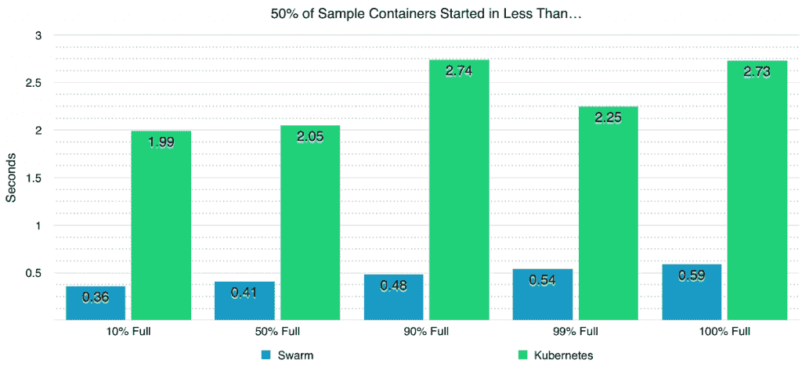
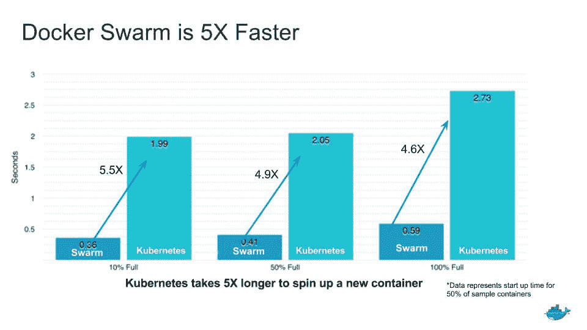

# Docker Swarm 赢得了扩展基准测试，但不要认为这是真理

> 原文：<https://thenewstack.io/docker-swarm-wins-scaling-benchmark-dont-take-gospel/>

随着基于容器的 orchestraton 平台的出现，如何比较 Docker Swarm 和 Kubernetes 越来越成为一个问题。

有争议的是，这些框架有足够的不同，因此在某些情况下每个框架都会表现得更好。

因此，性能基准现在已经进入竞争日益激烈的容器编排市场也就不足为奇了，Docker 赞助的一项研究发现，与 Google Kubernetes 相比，Docker Swarm 似乎更擅长扩展到非常大的工作负载。

在 Docker 赞助的一项研究中，软件工程师 [Jeff Nickoloff](http://allingeek.com) 发现，与 Kubernetes 相比，Swarm 的容器启动时间平均快五倍。

这项研究质疑了这样一种假设，即虽然 Docker Swarm 是小型编排工作负载的良好选择，但真正大规模的工作负载最好由 Kubernetes 或其他一些编排框架(如 Mesos)来处理。认识到人们可能会发现 Docker 赞助的研究有偏见，Nickoloff 公布了该研究的所有原始数据，鼓励进一步的检查。

Nickoloff 开始从经验上回答 Swarm 和 Kubernetes 在真正的大型集群中表现如何的问题？这个问题与那些想要提供大规模的、响应迅速的、基于容器的服务的企业有关。

Nickoloff 写道，迄今为止，还没有一项比较编排工具性能的大规模研究，至少没有任何测试进行了逐个功能的比较，并提供了足够的信息，可以轻松复制。

## 方法和结果

Nickoloff 在亚马逊网络服务的 1000 个节点的集群中测试了 Kubernetes(v 1 . 2 . 0-α7)和 Swarm (v1.1.3-rc2)。两个集群都依赖 etcd (v2.2.1)作为键值数据库。每个节点将运行 30 个容器，总工作负载为 30，000 个容器。

该研究考察了当两个编排引擎各自的集群达到 10%、50%、90%、99%和 100%满时，它们启动一个新容器所需的时间。

虽然 Swarm 和 Kubernetes 在各自的集群利用率低于一半时表现良好，但在 50%至 90%之间，“Kubernetes 超过了某个阈值，此时性能下降的速度比“10%至 50%之间”要快，”Nickoloff 指出。

Kubernetes 在第 50 百分位的完成时间是 6.45 秒，而在第 75 百分位是 28.93 秒。相比之下，Swarm 直到集群满 90%时才开始受到影响。

Nickoloff 总结说，总体而言，在所有测试级别上，第 99 百分位的群体性能比 Kubernetes 的第 10 百分位性能快 4 到 6 倍。

“这些基准测试表明，在 Swarm 上测试的操作比 Kubernetes 更快，”Nickoloff 总结道。“我们可以推断，差异的原因是根植于架构或算法选择。”

Nickoloff 总结说，在这两个系统中，Kubernetes 在架构上更复杂，因此需要更多的努力来支持。

## 讨论

Kubernetes 在架构上的不同是要记住的重要一点，Kubernetes 的贡献者和谷歌福音传播者凯尔西·海塔尔在一系列推文中反驳道。他指出，Kubernetes 更像是分布式系统的框架 T4。

“Docker Swarm 是否在几个孤立的基准测试中胜出？没错。你真的能比较这两个项目吗？现在答案是否定的，”海托华[写道](https://twitter.com/kelseyhightower/status/707657346714091520)。

Docker Inc .自然对这项研究的结果感到满意。

“将一个集群扩展到 30，000 个容器是一回事，能够有效地管理这种环境是完全不同的事情，”Docker 高级技术营销工程师 Mike Coleman 在一篇博客文章中写道。“负载下的系统响应能力对于有效管理至关重要。在一个容器可能只能存在几分钟的世界里，在收集对环境状态的实时洞察方面有很大的延迟意味着您永远不会真正知道在任何特定时刻您的基础架构中正在发生什么。”

“我们对论文中的一些结论并不感到惊讶，”DevOps 工具供应商 Codenvy 的首席执行官泰勒·朱厄尔在一封电子邮件中写道。在评估了包括 Kubernetes 在内的许多不同的容器编排提供商后，Codenvy 将 Swarm 嵌入到其 Che [按需开发人员工作区软件](https://thenewstack.io/eclipse-che-provides-portable-shared-development-workspaces-built-runtimes/)中。

朱厄尔解释说，在评估过程中，Codenvy 考虑了三个基本标准:容器激活的延迟和速度，物理节点上的线性容器可扩展性，以及低配置占用空间。

他指出，Swarm 在这三个方面都很出色。“我们可以在不到 10 分钟的时间内将自定义 Codenvy 安装到一个新帐户中，该帐户可以扩展到支持数千个节点或数十万个工作区容器。”

“很难想象 Swarm 和 Kubernetes 会直接竞争，”朱厄尔说。“Kubernetes 的目的是在高度治理的环境中提供容器编排。这种治理控制必然会带来更多的复杂性，从而影响速度、设置和规模。Swarm 没有相同的目标。”

“有许多因素需要考虑，但我们认为企业应该专注于性能、简单性和便携性，”Docker 营销高级副总裁 David Messina 在后续的电子邮件中表示同意。“问他们自己这样的问题:我能多快让容器大规模运行起来？系统在负载下的响应速度如何？需要建立什么样的学习曲线，需要维持什么样的负担？我的应用程序会无缝地从开发到测试再到生产吗？我会被锁定在特定的数据中心或云环境中吗？”

New Stack 分析师劳伦斯·赫克特(Lawrence Hecht)在一个内部 Slack 频道中写道:“我想了解更多关于更大的计划节省了多少时间。”“此外，我敢打赌，但我不知道，编排的技术决策主要不是由技术标准驱动的。”

Hecht 正在领导一项针对新堆栈的研究，以了解正在使用哪些编排引擎以及它们是如何使用的(请随意[参与此处](https://thenewstack.io/container-orchestration-survey/))。

这项研究的发布无疑是及时的，因为周四非营利云原生计算基金会( [CNCF](https://cncf.io/) )已经[正式接管了 Kubernetes 项目的](http://lists.cncf.io/pipermail/cncf-toc/2016-March/000080.html)控制权，谷歌将软件的技术监督委员会(TOC)移交给了该基金会。

《书库》新任主编亚历克斯·威廉姆斯对此文有贡献。

Docker 是新堆栈的赞助商。

<svg xmlns:xlink="http://www.w3.org/1999/xlink" viewBox="0 0 68 31" version="1.1"><title>Group</title> <desc>Created with Sketch.</desc></svg>