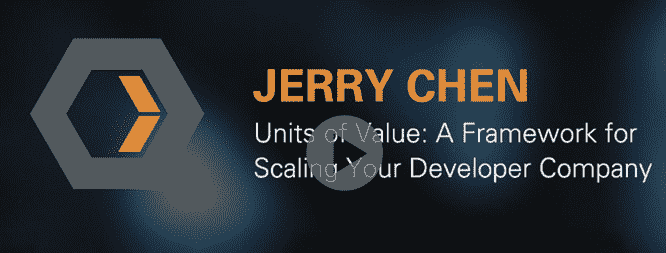

# Docker 的价值单位和它为开发者工具提供商提供的窗口

> 原文：<https://thenewstack.io/docker_investor/>

在 Heavybit 最近的一次演讲中，Greylock 的陈佳瑞讨论了 Docker 的价值单位是如何定义的，以及它如何作为一种方法来衡量一家开发工具公司的价值。

他提出，“价值单位是你定价的方式，是你扩展的方式，是你向客户销售产品的方式。”陈认为，云公司倾向于通过单个单位、小团队或大单位提供价值。这里的概念是，这些单元中的每一个都决定了公司如何发展，以及它们如何决定它们的走向市场战略。公司如何扩大其价值(进而扩大其收入)的例子可能包括:

*   **单个单元** : Dropbox 的价值来自单个用户，VMware 的来自单个服务器，Docker 的来自单个容器，Office Suite 的价值来自单个用户。对于这些类型的产品，公司的其他部门是否使用该产品并不重要。为这些产品创造价值的门槛非常低，因为它们只需要被一个人使用。也就是说，为了真正扩大业务，你必须卖出大量的单位。
*   **中型单位或小型团队** : Salesforce 的价值来自使用该产品的三到四名销售代表，Box 或 Sharepoint 要求团队或部门采用该产品，Atlassian 和 GitHub 要求开发团队采用该产品，以便他们获得价值。这些产品不需要整个公司采用一个产品，但真正的价值不是来自单个用户，而是来自多个用户或团队之间的协作和沟通能力。
*   **大价值单位** : Hadoop 在用于大数据时很有价值，Mesos 在服务器集群方面很有价值，Workday 要求整个公司使用它们进行人力资源和财务管理，而 SAP 和 Oracle 在整个企业中部署时最有价值。这里的要点是，只有当客户全身心投入时，这类产品的真正价值才会实现。

陈认为，为产品创造价值没有对错之分。但是每一种都有权衡和不同的销售周期。建立在大单位价值基础上的公司需要更长的销售周期，成熟的销售团队和流程，以及每件产品更高的价格标签来证明这一周期的合理性。按较小价值单位生产的产品需要较短的销售周期，客户通常用公司信用卡购买产品。这些“小单位”公司需要更有效地销售产品，虽然销售往往带来更少的收入，但它们发生的频率更高，销售支持最少。据陈说，每个公司都需要问的问题是:“我如何创建一个具有成本效益的渠道？我该如何提升这一价值？”

## 投资者在寻找什么？

陈说，像 Greylock 这样的投资者正在寻找有明确增长路径的公司。在上图中，他计算了不同价值单位的公司需要多长时间才能达到 1 亿美元的预订量或收入。最左边是一家公司，其价值单位是每个 API 调用 10 美分。为了达到 1 亿美元的收入，他们必须进行 10 亿次 API 调用。在这张图表的最右边是一家价值单位非常大的公司(100，000 美元以上)。这家公司只需向 1000 名客户销售就能获得 1 亿美元的订单，但可能需要一支相当成熟的直销队伍。在这两者之间，还有许多其他的销售周期和模式，但在陈的经历中，那些正好位于图表中间的公司并不成功。

他还谈到了非线性扩展。例如，不仅仅是销售更多的文件存储等。公司应该思考他们如何随着时间的推移创造更多的价值，反过来，谁是他们的经济买家。陈说:“如果你能以非线性方式扩张，为你的客户创造大量价值，你就越来越难被取代。..你可能会从开发人员、开发运营人员或系统管理员开始，但随着消费规模的扩大，你会向首席信息官、首席财务官、首席技术官或首席安全官推销。”

在他对创业公司增加非线性价值的建议中，他提出了以下几点:

*   **网络效应** : [Slack](https://slack.com) 是一种 it 价值随网络规模增加的产品。本质上，越多的团队成员涌向这个产品，它对那些早期采用者就越有用。
*   **事实上的标准**:亚马逊 API 成为云服务事实上的标准，这种非线性价值对决策者来说非常强大。为了降低复杂性和标准化流程，企业愿意接受公司范围或行业范围的标准。这个想法是，如果每个团队都在说同一种语言，沟通会变得不那么麻烦，购买会变得容易证明。
*   **平台**:“平台是最长的，也是最难建造的，但是，如果你建造正确，你会得到最经济的租金。”陈认为 Docker 的真正机会是一个平台，他说:“Docker 有机会成为基础设施、存储、网络、监控、管理和安全之间的粘合剂。”在这种情况下，平台的非线性价值来自企业和第三方对代码、数据集和应用的投资。

他敦促尚未定义其价值单位的公司坐下来，定义他们的“客户正在消费并从中获取价值的产品、服务或技术的小亚原子单位”欲了解陈的完整重磅演讲，请访问大学。

【T2

Dana Oshiro 是 Heavybit 的项目总监，这是一个为期九个月的基于 SF 的项目，致力于帮助公司建立面向开发者的产品和服务。

<svg xmlns:xlink="http://www.w3.org/1999/xlink" viewBox="0 0 68 31" version="1.1"><title>Group</title> <desc>Created with Sketch.</desc></svg>