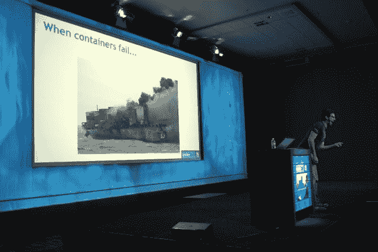
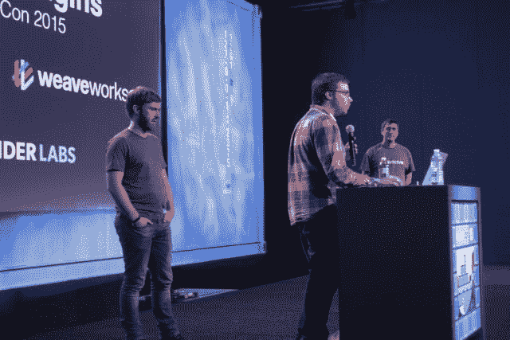
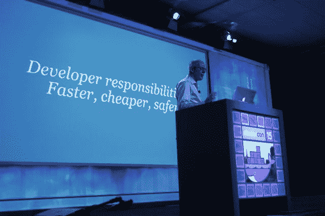
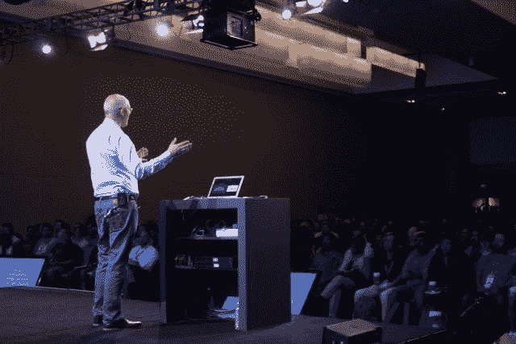
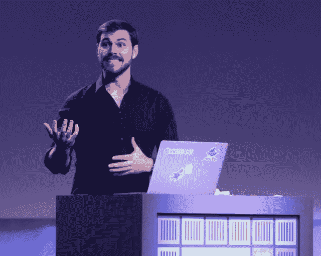
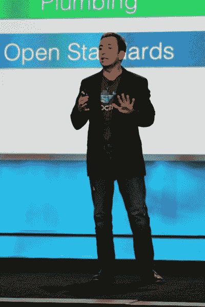

# DockerCon 2015:本周我们学到了什么？

> 原文：<https://thenewstack.io/dockercon-2015-what-did-we-learn-this-week/>

更正:这篇报道需要更新和澄清 Docker 安全主管迪奥戈·莫尼卡所做的演示。在他的演示中，迪奥戈展示了一个 PHP 应用程序，为了演示

[Notary](https://github.com/docker/notary)

，Docker 的新服务。我们对我们的不明确和错误感到遗憾。

今年北美 DockerCon 的主题在展厅的压缩手套中反复出现，在一些情况下，还印在 t 恤的背面:让我们将集装箱化从实验阶段转移到生产阶段。在旧金山 DockerCon 2015 周一和周二的非正式调查中，包括举手的呼吁，不到三分之一的开发人员在生产中部署容器的组织中工作。

Joyent 首席技术官 Bryan Cantrill 向观众讲述了现实世界中的集装箱故事。

阻止容器逃离沙箱的原因并不像开发人员缺乏主动性或意志力那么简单。缺少合适的工具。有人担心，从长远来看，供应商将如何继续支持容器化环境，以及一些供应商是否能坚持那么久。

Docker 同意创建开放集装箱项目(OCP)确实让许多人感到惊讶。它表示将与社区合作，至少通过向开放标准项目发布其容器格式和运行时的代码。Docker 将加入一个包括 CoreOS 和 Linux 基金会许多其他领导成员的小组，包括与许多技术公司合作，为 OCP 开发一个草案规范。在会议召开时，约有 20 家公司承诺参加，尽管 Docker Inc .的首席技术官所罗门·海克斯(Solomon Hykes)表示，其他公司也计划在未来几天内加入。

直到上周，CoreOS 一直在推广其 **appc** 容器格式，并积极建立基于其自动更新服务器技术的业务，就像谷歌 Chrome 浏览器自动更新自己，不需要人工干预。

OCP 的成立旨在让客户对集装箱技术更有信心。两家公司都将寻求开发自己的容器功能，其他无数公司也是如此，如 VMware 和 Canonical，后者开发了 Linux 容器管理程序 LXD。

我们与 Docker Inc .的营销副总裁 Dave Messina 分享了我们从与会者那里听到的一些关于 Docker 在 OCP 成立后保持其在集装箱领域的领导地位的担忧。他的回应似乎也回应了上周的一个观点，即 Docker Inc .在提出 runC 时很聪明:

Docker 的平台覆盖了整个开发生命周期，并使分布式应用程序 100%可移植，即使利用我们的容器格式和运行时，也不容易复制。现在，整个行业都在一个共同的标准上保持一致，Docker 能够将精力完全集中在它的平台上，从 DockerCon 开始，它已经变得更加具有动态插件架构和多主机网络的可扩展性。Docker 的分布式应用平台已经过 GSA、CE、华特·迪士尼公司、Orbitz 和 Lyft 等组织的验证，这些公司都参加了 DockerCon，分享他们在 Docker 上构建强大的新应用的经验。

## 生态系统有一些问题

Docker 能否在自身业务发展的快速启动阶段生存下来还存在疑问——这种疑问比我们几天前意识到的更深入到生态系统中。

容器感知存储提供商 [Portworx](http://portworx.com) 的联合创始人苟饶(Gou Rao)在接受 New Stack 采访时表示:“无论对错，这只是首席信息官们的心态:他们希望一家成熟的大型供应商认可他们的 Docker 部署。

当我问, [SUSE 的](https://www.suse.com)全球联盟副总裁迈克尔·米勒，Docker 是否应该在开放容器项目的其他成员之上承担一些领导角色时，他非常直接地回答，“我会说不

“我是从开源商业开发模式的角度来说的，”米勒补充道。“对于像 Docker 或任何其他例子这样的技术，需要有一个可行的、可持续的、长期的社区。需要有一个项目和一个基础，需要足够多的不同贡献者和供应商的承诺来使它长期可行。这是一个棘手的问题，人们开始做一些事情——是时候放手了，让鸟儿离开鸟巢。怎么知道是不是发达到可以起飞了？这是一场赌博。”

也有困惑和怀疑的种子继续被埋下，包括那些可能对尚未解决的格式争议感兴趣的开发人员，但他们可能还不太愿意公开。一些开发人员和第三方支持者质疑 Docker Inc .是否会试图通过有效地概述他们未来讨论的主题来规定新的开放容器项目的条款，并在默认情况下这样做，规定未来容器系统的格式。

上周日，我们提出了 Docker Inc .需要解决的三个问题，以使今年的 DockerCon 取得成功。毫无疑问，该公司正面解决了这些问题。让我们来看看他们是怎么做的，结果会是什么。

**1。Docker 将如何调和它的无状态架构和日常世界的有状态需求？科技大会面临的一个大问题终于在这里得到了有效解决。对于这个问题的结果，集装箱化行业的主要参与者和软件开发人员(曾经关注过)不再有任何担心:**

从左至右:滑翔机实验室的杰夫·林赛；卢克·马斯登，集群总部；亚历克西斯·理查森，纺织厂

完全无状态的架构永远不会出现在整个容器的上下文中。这一事实在[周一 Docker 新插件架构](https://thenewstack.io/the-real-docker-ecosystem-launches-with-plugins/)的展示中变得明显而不可辩驳，这次展示汇集了[weaver works](http://weave.works/)、 [ClusterHQ](https://clusterhq.com/) 和 Glider Labs。他们的演示展示了容器如何利用来自两个插件的服务，在网络中的两个 IP 地址之间进行自我迁移，并且仍然保持状态——绑定到数据库，以及当前服务的网页内容。

插件架构必须完全重建，至少第二次，如果不是更多，为了适应这一点。换句话说，管道被打开得更宽，以方便国家管理。这是实现类似实时迁移的唯一方法。

在被容器化的流程中运行的服务当然可能是无状态的。但是这种美德的重要性正在减弱，这一点在周一由阿德里安·科克罗夫特[清楚地表达出来，他被在场的许多开发人员认为是“微服务之父”](https://thenewstack.io/the-new-stack-makers-an-interview-with-adrian-cockcroft-of-battery-ventures/)

电池风险投资公司的阿德里安·科克罗夫特

“我认为我们需要这两种技术，”科克罗夫特在周一的会议上回答了我的问题。“他们构建的 Docker 的早期生产使用具有无状态的前端，并且他们的后端数据库没有容器化。然后，我们看到为游戏引擎进行数字运算的系统，其中有许多 Docker 容器在运行，它们并不真的关心那么多，而且大部分是无状态的。

“但我认为肯定有无状态的应用程序，这个成熟过程和工具以及最佳实践的一部分是让有状态的东西也在那里，”科克罗夫特继续说。

他解释说，Cassandra 节点的工作方式是通过一定程度的复制，使一个节点不会丢失，也不会牺牲任何数据。“他们是短暂的，但他们保持状态。在这两者之间有一个混合的层次，你可以构建两者结合的系统。但是毫无疑问，你会想要建立一个有状态的系统。我们已经看到了许多 Docker 插件和公司，如 ClusterHQ，你可以插入并管理你的状态。”

他继续说，容器的架构和连接它们的网络节点现在大部分已经确定了。存储仍然是一个开放的话题。在他看来，ClusterHQ 可以在这方面有所作为，但 VMware 也可以。他预测，到明年，这个公开的话题也可能得到解决。但考虑到这两种选择，无论如何，无国籍状态只会是最细微的环境中的一个因素。

Docker Inc .安全主管迪奥戈·莫尼卡

**2。Docker 会为集装箱展示一个安全的虚拟网络模型吗？这个模型足够强大，足以让风险经理相信投资是值得的吗？**这个问题仍然没有答案。Docker Inc .的安全负责人[迪奥戈·莫尼卡试图说服我](http://www.cmswire.com/information-management/docker-engineer-our-containers-are-secure/)网络化容器从设计上来说是固有安全的，只通过显式地启用与外部世界的连接。

在 DockerCon，Mónica 做了一个公证人的演示，展示了这个仍处于萌芽状态的平台如何为人们发布和验证内容提供一个安全的环境。这是第一天主题演讲的视频。莫妮卡的演示大约在 1:25:28 开始。

[https://www.youtube.com/embed/at72dhg-SZY?feature=oembed](https://www.youtube.com/embed/at72dhg-SZY?feature=oembed)

视频

在[黑客新闻](https://news.ycombinator.com/item?id=9759902)上，Docker 在该项目的负责人 [David Lawrence](https://github.com/endophage) 说，公证人提供了加密保证，保证“你使用的基本图像确实是由 Ubuntu、RedHat 甚至是我发布的，并且没有在他们的构建系统和你之间被篡改。是否决定信任那些出版商，就看你自己了。”

一个回答者指出，用户可以运行一个注册中心，但是“决定与验证你正在安装的东西，或者签署可能安装在其他地方的东西的任务是正交的。”

以下是在 [GitHub](https://github.com/docker/notary) 上对公证人的描述:

我们经常依赖 TLS 来保护我们与存在固有缺陷的 web 服务器的通信，因为服务器的任何危害都会使恶意内容替换合法内容。

有了公证人，出版商可以使用高度安全的密钥离线签署他们的内容。一旦发布者准备好提供内容，他们就可以将他们签名的可信收藏推送到公证服务器。

消费者通过安全通道获得发布者的公钥后，就可以与任何公证服务器或(不安全的)镜像通信，只依靠发布者的密钥来确定所接收内容的有效性和完整性。

为了让 [Docker Inc .建立一个私人注册服务](https://thenewstack.io/docker-trusted-registry-goes-on-prem-promises-better-security/)，与[主要 Linux 制造商添加到他们发行版中的注册服务](https://thenewstack.io/linux-distros-red-hats-new-deep-ties-to-docker-suse-similarily-so/)竞争，公证是必要的。

Docker Inc .尚未直接面对我正在讨论的风险经理——那些将容器视为他们用来带午餐去工作的东西的人，以及那些通过计算他们尚未看到其开始的火灾次数来估计技术风险因素的人。对于太多的企业来说，在设计安全问题得到解决之前，集装箱化的话题永远不会出现在议程上。

在 GitHub 上，人们注意到公证仍然是一项正在进行的工作。他们现在正在邀请安全社区的贡献和评论。“在生产中使用之前，公证人需要通过正式的安全审查程序。”

值得注意的是一些已经在 GitHub 问题线程中的[讨论](https://github.com/docker/notary/issues/22)。

**3。Docker Inc .计划与其他容器模型竞争还是“拥抱和扩展”它们？《码头工人》中的所罗门·海克斯和 CoreOS 中的亚历克斯·波尔维握手，这是《码头工人》中展示优雅和莫邪的一幕。如果你仔细观察，你还会发现我们在四分之一世纪前看到的一个操作系统制造商公开与一个电子表格制造商握手的那种傲慢的原始形式……这一举动结束了 Lotus 1-2-3 的统治时期。目前，Docker 已经将它的竞争对手拒之门外。**

Docker Inc .首席执行官本·戈卢布

商业出版物报道了开放容器项目的形成，这是微软、谷歌、红帽、IBM、思科和其他一些通常不会一起做生意的大公司的合作。让我们诚实地面对这一点:微软和谷歌本周在 OCP 的旗帜下走到一起，其程度仅次于杰布·布什和兰德·保罗作为同一政党的候选人走到一起。据我们所知，有两个电话，在结束时都是这样的话，“是的，当然，无论如何。”从那时起，公司代表们就开始表示他们对另一个 Linux 基金会项目的兴奋或“超级兴奋”。

在这一点上，绝对的事实是 OCP 是一个未知数。如果 Docker 在 OCP 的结构和格式上有自己的方式，就像它在赋予 OCP Docker 自己的 runC universal runtime 时施加影响一样，那么 OCP 将最终成为 Docker Inc .已经开始的运动的正式形式。

“我离开房间时对这一战略印象深刻，” [CloudBees](https://www.cloudbees.com/) 首席执行官 Sacha Labourey 在谈到新堆栈时说。“但我们不要搞错:在某个时候，Docker 也有一个 P & L. Sun [Microsystems]不一定在 J2EE 层的货币化方面做得很好。也许除了孙，大家都从中得到好处。”

劳瑞解释说，一家公司创造一个生态系统是一回事，而另一家公司要在这个生态系统上茁壮成长则完全是另一回事。“我希望 Docker 也能从中受益，将它建立的生态系统货币化。”

波特沃克斯的苟饶说:“不必要地到处与人争斗是没有意义的。”。“我们必须做正确的事情，但我们必须分阶段来做。嘿，这是很酷的新技术，每个人都会在某种哲学或学术层面上同意。但是走进去告诉这些银行和财富 1000 强公司，'你买了价值数百万美元的设备；“让我们把它扔掉吧！”那不是一个实际的观点。如果你生活在这个世界上，你必须明白这是过渡性的。我们不会在一夜之间改变。让我们就世界需要向何处发展达成一致，这是一个非常程序化、自我调配的 IT 环境，无状态和有状态服务通过同一组工具进行部署。但是让我们帮助你慢慢地到达那里。"

Docker 确实采取了一些大胆的措施来解决一些大的争论。就目前而言，开放容器项目是供应商之间的一项协议，以听取彼此的意见，并可能在未来就其他事情达成一致。现在还不是同意的协议，但是是讨论的协议。它有立竿见影的效果，中和了来自 CoreOS 的对 Docker 为容器选择的进化路线的直接反对。它已经成功地将 Docker 的 DNA 注入到一个有 Linux 基金会支持的标准中，否则这可能需要竞争参与者之间的讨论和协商。

总的来说，Docker Inc .本周取得了重大进展，采取了一些大度的举措和一些积极的举措。通过首先让 OCP 发生，它让聚光灯照耀在容器及其新兴的生态系统上，并将其提升为技术专家日常讨论的话题，与下一版本的 Android、上一版本的 Chrome 和最终编号的 Windows 一起。

三个新的开放集装箱项目的代表与码头工人 SVP 斯科特约翰斯顿(左)

正如 SUSE 的迈克尔·米勒所说，此举的确是一场赌博。无论 Docker Inc .获得了什么，都必须付出一些代价。突然间，除了 Docker 和 CoreOS 之外的非常熟悉的公司可以生产自己的容器系统，而不需要欠 Docker 一个吻别。不要认为 IBM、VMware、Red Hat 和微软都签署了协议，因为他们对 Docker 插件有一些很好的想法。

码头工人的赌博可能使集装箱永久成功。到明年的这个时候，我们将知道这种成功是否是以牺牲自己的身份为代价的。

新任 Stack 主编 Alex Williams 离开了一会儿。

新堆栈的亚历克斯威廉姆斯促成了这个故事。

思科、CoreOS、Docker、IBM、Red Hat 和 Weaveworks 是新堆栈的赞助商。

<svg xmlns:xlink="http://www.w3.org/1999/xlink" viewBox="0 0 68 31" version="1.1"><title>Group</title> <desc>Created with Sketch.</desc></svg>