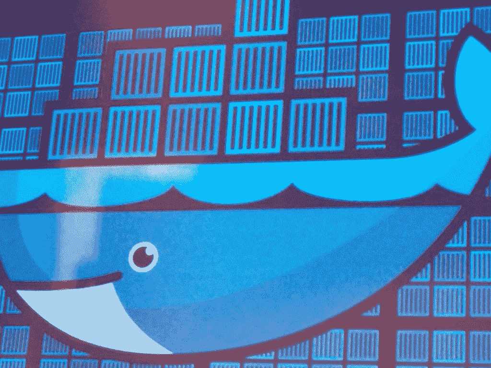

# 阿德里安·科克罗夫特谈微服务的现状

> 原文：<https://thenewstack.io/dockercon-europe-adrian-cockcroft-on-the-state-of-microservices/>

2014-12-04 09:00:09

阿德里安·科克罗夫特谈微服务的现状

新堆栈的制造者，

# 阿德里安·科克罗夫特谈微服务的现状

Dec 4th, 2014 9:00am by [Tina Andrews](https://thenewstack.io/author/tinaandrews/ "Posts by Tina Andrews")

今天早上，Battery Ventures 的阿德里安·科克罗夫特在 Docker 上介绍了微服务的采用以及 Docker 在这种构建应用的新方式中所扮演的角色。推动增长的是越来越多的公司正在重建和采用微服务和开发运维实践。这是微服务领域出现大量新业务和创新的证明。

[阿德里安·科克罗夫特，电池风险投资公司:2014 年集装箱状况](https://thenewstack.simplecast.com/episodes/adrian-cockcroft-battery-ventures-the-state-of-containers-at-dockercon-2014)

## 关键注意事项

以下是阿德里安演讲的一些亮点:

*   2014 年，Docker 到来了，现在在每个人的 2015 年路线图上，从软件供应商到最终用户，都在弄清楚如何使用它，因为它又快又便宜。
*   在产品开发中，通过观察东方决定行为(OODA)循环持续交付，推动创新过程。
*   当用户希望回答如何修复不工作的东西的问题时，他们会翻遍数据文件。他们将试图挖掘您需要的日志文件数据，以得出答案和进行分析。

*   使用云:自动化的自助式 API 驱动的基础设施。您可以启动自动部署的增量功能。它让你发现并衡量客户的需求，然后，如果需要，再循环一次。
*   工作原理:基于微服务的产品团队和基于后端的平台团队之间有一个 API，API 调用由基础设施执行。
*   这种重组节省了时间。每个团队都有一个独立的发布计划。所有这些都独立工作，并且彼此独立部署。
*   从交付的角度来看，如果一个平台添加了 Docker Hub，并且知道如何交付 Docker 映像，那么里面的内容就无关紧要了。这种可移植性和灵活性非常强大。
*   特定微服务中的任何 bug 都是自己重新部署的。它不会阻塞其他任何东西，这有助于所有东西有效地运行。
*   微服务被定义为一种松散耦合的、面向服务的架构，具有有限的上下文。它允许更新，而不需要了解其他一切是如何工作的。
*   组织耦合:服务是跨组织构建的。所有权停留在一个地方。
*   微服务架构更多的是系统间的点对点调用。你必须有灵活的消息格式。不管版本如何，一切仍然正常。
*   构建微服务架构时，您需要一些工具来配置、发现、路由流量以及观察和构建系统。

<svg xmlns:xlink="http://www.w3.org/1999/xlink" viewBox="0 0 68 31" version="1.1"><title>Group</title> <desc>Created with Sketch.</desc></svg>

TNS 所有者 Insight Partners 是 Docker 的投资者。

新的堆栈更新一份时事通讯摘要，对本周最重要的新闻进行分析&。

新的堆栈不会出售您的信息，也不会与无关的第三方共享。如果继续，您同意我们的

[Terms of Use](/terms-of-use/)

和

[Privacy Policy](/privacy-policy/)

.