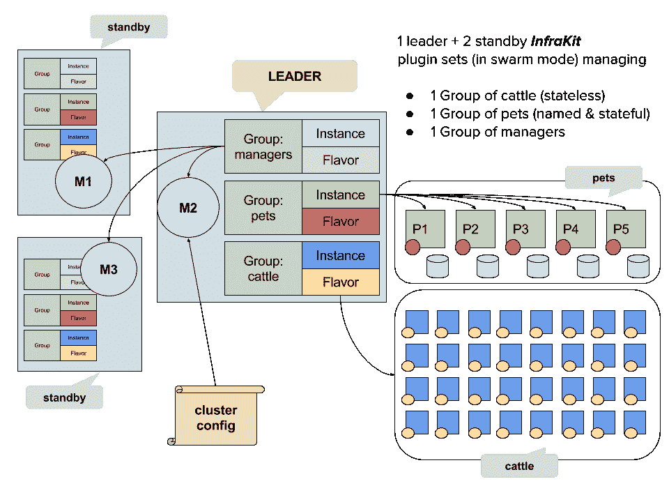

# 针对自我修复基础设施的 Docker 软件 Infrakit 得到了褒贬不一的评价

> 原文：<https://thenewstack.io/dockers-infrakit-gets-mixed-reviews/>

Docker 新推出的 [Infrakit](https://github.com/docker/infrakit) ，一个用于创建自我修复基础设施的工具包，受到了开发者和系统管理员的不同反应。

该公司推出了 Infrakit，通过在整个基础设施中实现一致的方法，作为供应和管理来自多个供应商的云实例的一种方式。换句话说，实现一组公共的声明性过程，特别是作为一种更准确地供应云服务器的方式。

“Infrakit 将基础设施自动化分解为简单的可插拔组件，用于声明基础设施状态、主动监控和自动协调该状态。这些组件协同工作，积极确保基础设施状态符合用户的规格，”Docker 软件工程师[比尔·法纳](https://github.com/wfarner)和[钟志文](https://github.com/chungers)，在介绍软件的博客文章[中说(Docker 拒绝参与本文)。](https://blog.docker.com/2016/10/introducing-infrakit-an-open-source-toolkit-for-declarative-infrastructure/)

Rackspace 的首席工程师 Igor Ljubuncic 对这一举措表示欢迎，认为这是确保复杂、多供应商环境中更可靠性能的一种方式，“随着组织规模的扩大，平均故障间隔时间(MTBF)开始变得越来越短。解决这个问题的唯一可持续方式是通过自我学习、自我修复系统，Infrakit 是一个更大的编排机制的架构组件，允许这样做，”他说。

然而，虽然 Ljubuncic 着眼于企业的吸引力，但分析公司 RedMonk 的创始人 James Governor 认为 Infrakit 工具包的主要吸引力将在小型初创企业中。“企业比较保守。我看他们像农民，他们有自己的栅栏和耕作方法，知道如何生产食物；初创企业就像觅食者——他们希望发现新事物，并与之玩耍。”

他同意 Ljubuncic 的观点，Infrakit 提供了一个增强健壮性的机会。“Infrakit 实际上是关于配置的，能够配置到不同的系统。它回答了如何更好地适应资源调配的问题。”

然而，对于一些开发者来说，这是一个错误的问题。一位经验丰富的美国系统管理员说，他对主要前提没有什么印象，即在配置服务器时需要准确性。

Docker 的观点是，想要 100 台服务器而看到其中一台失败的开发者将受到 Infrakit 的保护，不会受到任何严重的损害。

但是，他接着说，大多数管理员不会这样做。“如果我需要 100 台服务器，那么我将配置 110 台，因此如果一台服务器出现故障，不会有任何影响，”指出在任何时候都不太可能有一台或两台以上的服务器出现故障。

他承认，以这种方式过度供应成本略高，但他说，对于企业来说，这只是几块钱，尽管他承认初创企业有不同的方法。“如果我花的是他自己的钱，那么他可以想象 Infrakit 提供了一些有价值的东西。“如果是我自己的 30 美元，我肯定会更感兴趣，”他说。

但是有不同的反对意见。一位英国开发者说，虽然这是一个免费的附加软件，但会有相当大的安装费用。“我无法估计这将会有多大——Docker 在这方面向来不擅长。”

然而，自动化的想法可能会让一些组织担忧。英国的 dev 说，一些公司不会喜欢将这种事情交给计算机处理的想法——这不一定没有道理——并且会坚持让实际的人来确保一切顺利运行。他特别指出，自动化水平可能意味着知道系统如何工作的人越来越少。

一件有趣的事情是看 Infrakit 的到来将如何帮助 Docker 在容器技术方面的领先地位巩固其优势。总督说，Docker [一直在非常积极地](https://thenewstack.io/dockers-plan-dominate-enterprise-data-center/)建立其堆栈，Infrakit 是该公司如何满足其众多客户需求的另一个例子。

这位英国开发商也预测这种产品会成功。“它会做得很好，如果只是因为在适当规模上采用 Docker 的公司无论如何都倾向于进步，”他补充说，在这一领域没有 Docker 的竞争，“即使有，使用 Docker 的公司也可能会采用它，因为它是免费的，他们已经在使用 Docker 了。”

“我怀疑使用 Docker 的公司可能会采用这种方式，而不是任何竞争，因为它是免费的，而且他们已经在使用 Docker 了，”他说。据我们所知，至少还有一家公司 [CloudSoft](https://cloudsoft.io/) 提供创建自我修复基础设施的软件。

对于 Ljubancic 来说，Infrakit 的长期未来取决于该产品的管理难易程度，过于复杂可能会为其敲响丧钟。“如果云客户需要投入大量的精力和金钱来开发自己的工具和应用程序，以适应新的业务流程模型，任何此类平台的额外激励都将失去，”他说。

而且，他提醒道，码头工人不会永远是街区里的新人。“总会有一些新的、更精简、更便宜的技术被创造出来，取代现有的技术。这就是技术世界如此令人兴奋的原因。”

[云软](https://cloudsoft.io/)和 [Docker](https://www.mirantis.com/software/docker/kubernetes/) 是新堆栈的赞助商

通过 Pixabay 的特征图像。

<svg xmlns:xlink="http://www.w3.org/1999/xlink" viewBox="0 0 68 31" version="1.1"><title>Group</title> <desc>Created with Sketch.</desc></svg>