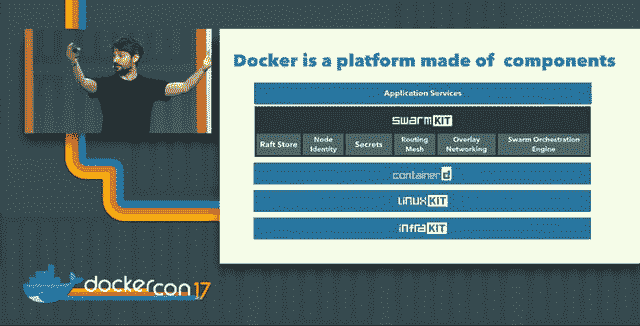

# Docker 的莫比项目旨在将容器的使用扩展到云之外

> 原文：<https://thenewstack.io/dockers-moby-project-aims-expand-container-usage-beyond-clouds/>

周二上午，在奥斯汀，关于什么是框架、什么是平台、什么是生态系统的问题有了更彻底——如果更复杂——的答案。在那里，在 Docker Inc .的美国年会期间，它正式推出了第二个基于自己的标准和实践的开源项目，名为莫比项目，这是一个用于组装定制的基于容器的系统的框架，也是系统构建者“进行实验和交流想法”的聚会场所

你可以称之为“堆栈”，如果不能迅速解释清楚，事情就会变得非常混乱。从我们到目前为止所看到的，可以认为莫比为容器系统构建者提供了 OpenStack 为云平台构建者提供的东西:来自不同创作者的开源组件的集合，但用于容器。在莫比的案例中，该组件使系统构建者能够快速建立微服务就绪平台，包括在裸机上。

至于一个“实验和交流思想的地方”，这可能有点理想化的装饰。但是莫比确实采用了一些持续部署的原则，这些原则将有助于，也许有必要，不同利益相关者之间的沟通。(OpenStack 贡献者[不断强调类似合作的必要性](http://superuser.openstack.org/articles/cross-project-collaboration-in-the-openstack-community/)，结果喜忧参半。尽管如此，莫比可能最终会与品牌集装箱部署平台竞争，如 HPE 上周推出的。

“集装箱生态系统刚刚成为主流，”Docker Inc .首席技术官 [Solomon Hykes](https://github.com/shykes) 在周二上午的主题演讲中告诉与会者。“随着主流而来的是巨大的责任。

https://twitter.com/dberkholz/status/854361210074148864

“这不再仅仅是云原生应用。您几乎可以拥有任何类型的应用程序，无论是旧的还是新的，传统的还是现代的。任何行业—医疗保健、零售、数据科学。你能想到的任何可能的应用都在容器化；有人正在这么做。和部署这些应用程序的系统也变得更加多样化和专业化。它不再仅仅是 Linux 服务器了。这是 Windows 服务器；它是桌面；是电话。[是主机](http://destinationz.org/Mainframe-Solution/Trends/Develop-With-Docker)。工业物联网；消费物联网；这就是云——基本上，任何有电脑的东西都在采用容器的过程中。”

这是对容器是云原生开发的专有产品这一观点的有力反驳。但这也是一种手段，将 Docker 的潜在影响力扩展到仅仅是云原生开发领域之外，并最终向系统和软件集成商做出容器化尚未成功做出的重要推介。

Hykes 说，因为所有这些不同模型的用例都是高度专业化的，所以参与单一生态系统(用他的话说，就是“一个运动”)需要一种稍微不同的方法，这种方法的灵感来自于他自己公司的经验。

“大约在 2015 年，事情开始变得有点疯狂，”首席技术官讲述了这个故事。“突然之间，容器成了热门的新事物，你开始看到许多可靠的容器部署。你仍然需要知道自己在做什么，但在那个时候，如果你在 Linux 服务器上构建云原生应用程序——这种下一代应用程序、无状态、12 因素、DevOps、所有这些东西、微服务——你有机会进入容器，甚至将它们部署到生产环境中。”

大约就在这个时候，Hykes 的公司升级了生产模式，他继续说道，转向组件化的平台，每个组件本身就是一个项目。其中几个组件，如 libnetwork、containerd、[的 SwarmKit 编排平台](https://github.com/docker/swarmkit)和[周二的 LinuxKit](https://thenewstack.io/finally-linux-containers-really-will-run-windows-linuxkit/) ，都被剥离出来(Docker 的内置 Swarm 模式就是基于这些组件)成为独立的项目。与此同时，Docker 的版本已经变得专业化，基于它们被设计运行的平台。

“真正有趣的事情发生了:我们通常的生产模式——开放组件、单一产品——开始崩溃了，”CTO 承认。“我们开始看到裁员；我们开始看到徒劳的努力。我们有不同的团队来构建专门的系统:Mac 的 Docker，Google Cloud 的 Docker，Windows Server 的 Docker。你仍然希望在开放组件上进行合作，但之后你必须自己完成所有其他事情。”

因此，尽管 GitHub 可能是为一个连续项目工作的几个贡献者的完美协作平台，但当该项目分支时，连续性的需求与独立性和符合特殊情况的需求相冲突。Hykes 可能发现了 OpenStack 似乎陷入困境的一个关键点，或者说是唯一的一点，他可能正在积极努力避免类似的情况。

“Docker 不是一家大公司。我们有 150 名工程师在做所有这些工作，”他说。“因此，当我们说，‘太好了，平台又多了十个版本’，这不是我们可以让数百名工程师去做的事情。我们必须有效率。这就是开放对我们如此重要的原因。”

从我们在早期阶段收集的信息来看，莫比似乎整合了 Docker Inc .必须为自己创建的流程，以便管理和适应其核心项目的多个并发版本。没有多少其他公司，无论其规模大小，可能不得不做这样的事情；可以说，Docker 现在的整个目的可能是为每个平台提供平等的竞争环境，使任何单个服务器都可以整合到一个集群中，并全部或部分地运行任何单个容器化的应用程序。如果 Docker 成功地做到了这一点，可以想象，没有人会去做，除非 Docker 的竞争对手愿意在这个水平上与莫比竞争。

这就留下了一个问题，莫比到底是为谁服务的？对世界开放和透明是件好事，但如果世界找到了分享的方式，这可能是一项巨大的成就。

<svg xmlns:xlink="http://www.w3.org/1999/xlink" viewBox="0 0 68 31" version="1.1"><title>Group</title> <desc>Created with Sketch.</desc></svg>