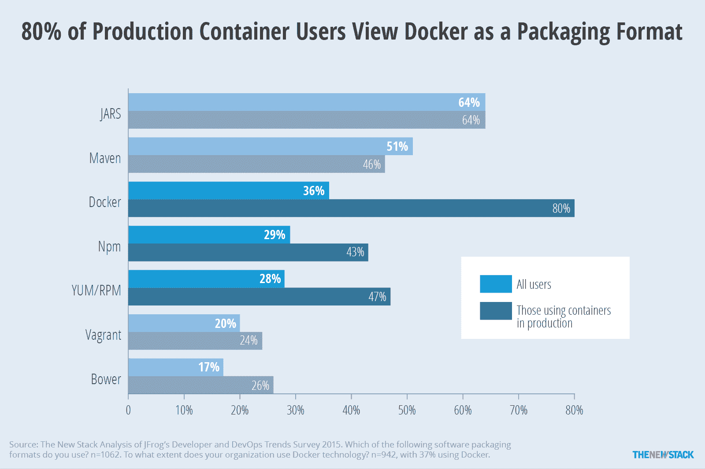

# DockerCon 2016: Docker 主导企业数据中心的计划

> 原文：<https://thenewstack.io/dockers-plan-dominate-enterprise-data-center/>

上周，西雅图举办了 2016 年 DockerCon 大会，这是业界最大的集装箱技术大会。像大多数供应商一样， [Docker](https://www.mirantis.com/software/docker/kubernetes/) 已经利用其用户大会宣布了一系列新产品、功能和服务。这些公告揭示了 Docker 雄心勃勃的计划，即让容器成为企业数据中心的基本构件。

## Docker 引擎的内置编排

Docker 引擎的最新测试版带有对 Swarm 的内置支持，Swarm 是 Docker 的官方容器编排引擎。这消除了安装、配置和管理单独的集群来运行微服务和分布式容器化工作负载的需要。在保持向后兼容性的同时，核心引擎和工具获得了额外的功能，可以在一组服务器上运行容器。管理容器化应用程序的应用程序包、节点和服务有了新的命名。在其最新版本中，Swarm 提供了最受欢迎的功能，如服务发现、负载平衡和弹性，缩小了与市场上一些竞争对手的编排引擎的差距。

这种看似常规的整合有许多含义。生产中运行的容器通常跨越多台机器。容器编排引擎(Coe)使客户能够管理工作负载和底层基础设施。底线是编排是运行生产工作负载的关键。客户可以选择 Coe——Kubernetes、Docker Swarm 和 meso sphere DC/OS——来管理容器基础设施。

有趣的是，所有可用的容器编排引擎都是为 Docker 引擎构建的。尽管它们可以与其他容器技术一起工作，但它们主要是为支持 Docker 公开的图像格式、API 和运行时而设计的。作为先行者，Docker 已经在核心引擎层面赢得了战斗。但是真正的机会在于管理分布式工作负载，而不是一次管理一个容器。Docker Swarm、Kubernetes 和 Mesosphere 正在争夺这个机会。

> 虽然获得开发人员的认可很重要，但容器化主要是一种面向操作的技术。

在新的 Swarm 环境中配置和部署容器化的工作负载是显而易见的。只需几个命令，开发人员和运营商将能够使用内置的编排功能，而不是处理配置 Kubernetes 或 Marathon 所涉及的复杂设置过程。

开始使用 Docker 1.12 群体模式的客户可能会更喜欢 Docker，Inc .的商业产品 Docker Datacenter，该产品带有私有注册表、管理层和针对生产工作负载优化的强大 Docker 引擎。因此，游戏计划很明确——Docker Swarm 用于开发/测试，Docker Datacenter 用于生产。这一举措不仅影响了竞争，也影响了整个集装箱生态系统。

Docker 通过支持运营团队标准化打包和部署单元，重新定义了 DevOps。根据最新的 Artifactory 调查，80%的用户投票选择 Docker 作为打包软件的格式。

不管语言、运行时和部署目标如何，软件都可以打包成 Docker 映像。Dockerfile 是描述图像的声明性格式，广泛用于定义构建管道。

描述一起部署的多个相关容器映像；DevOps 团队正在使用 Docker 合成文件。大多数现代软件栈都有这些格式中的一种。 [Bitnami](https://bitnami.com/) 已经开始提供 Docker 镜像以及其传统的预打包虚拟机系列。[在脸书开源解析](https://thenewstack.io/shuttering-parse-future-mobile-backend-service/)之后，许多组织已经依赖 Docker 在多个环境中部署流行的移动后端即服务(MBaaS)堆栈。

Docker 宣布了一种叫做[分布式应用捆绑包](https://blog.docker.com/2016/06/docker-app-bundle/) (DAB)的新格式，使得部署多容器应用变得容易。与 Docker 合成文件相比，dab 更加优雅和高效。每次部署堆栈时，它们都会产生一致的结果，这符合“基础设施即代码”的理念。当与诸如 Jenkins 之类的 CI 工具集成时，DAB 能够以统一的方式打包复杂的分布式应用程序所需的所有工件。Docker 正在从 [AWS CloudFormation](https://aws.amazon.com/cloudformation/) 剧本中吸取经验，定义一个比现有规范更干净、更简单的规范。

## Mac、Windows、AWS 和 Azure 上的 Docker

随着应用生命周期管理逐渐转向容器，Docker 正在边缘化操作系统的角色。一旦安装了 Docker 引擎，操作系统就变成了一个责任非常有限的薄层。这种转变产生了精简的操作系统，如 Alpine、CoreOS、Atomic Hosts、Snappy Core、RancherOS，这些操作系统针对运行容器进行了优化。当部署在公共云环境中时，这些新品种的操作系统与 Docker 相结合，为应用程序带来了网络规模。

随着最新推出的[Mac 和 Windows 本地安装程序](https://thenewstack.io/native-docker-comes-windows-mac/)，Docker 正在入侵开发者工作站。桌面上的 Docker 将减轻为不同的语言、运行时、框架和库配置和重新配置开发环境的痛苦。代码编辑器和 ide 可以与 Docker 引擎本地集成，实现无缝开发和测试工作流。

在大型企业中，每个部门通常都依赖一个满足其需求的环境。LAMP，Java，和。NET 是企业使用的主要平台。企业 IT 可以将标准化的容器映像发布到 [Docker Trusted Registry](https://docs.docker.com/docker-trusted-registry/) 以促进整个组织内一致的环境设置。这加强了更好的治理和一致的应用程序开发和部署策略。

Docker 还使得在最受欢迎的企业公共云平台——AWS 和 Azure——上配置其商业[容器即服务](https://thenewstack.io/the-year-ahead-ops-and-the-rise-of-container-as-a-service/) (CaaS)产品变得更加容易。它已经发布了 AWS CloudFormation 和 [Azure 资源管理](https://thenewstack.io/azure-resource-manager-microsoft-shifts-services-resources/)模板，以实现 Docker 数据中心的一键式部署。

开发机器上的 Docker、测试和试运行环境中的 Swarm 以及生产环境中的 Docker 数据中心带来了与 Docker 的构建、交付和运行愿景相一致的连续性。

不考虑栈、环境和工具，Docker 正朝着成为软件开发事实上的标准前进。与 Mac 和 Windows 的本机集成将是朝着这个方向迈出的一大步。

## 码头商店——集装箱市场

随着主流应用程序走向容器化，生态系统将被应用程序淹没。这可能会影响打包应用程序的质量。

Docker Store 是一个以容器形式打包的免费、开源和商业软件的市场。它将成为 Docker 的权威来源，供用户搜索和安装软件。对于独立软件厂商来说，Docker Store 将是一个发布其应用的目的地。Docker 将通过确保发布的软件符合容器化软件的安全标准和最佳实践来维持市场。

Docker Store 是 Docker 在容器生态系统中争取更大份额的尝试。Docker 希望一个运营良好的应用程序商店能够将公司变成未来应用程序的保管人。

## 必要且充分？

Docker 在集装箱市场肯定有先发优势。它在简单性方面得分也很高。毫无疑问，Docker Swarm 使部署分布式容器化应用变得轻而易举。但是社区参与的相对缺乏是 Swarm 中一个明显的缺陷。与 Kubernetes 相比，Swarm 是一个主要由 Docker 驱动的工具。

虽然谷歌仍然是 Kubernetes 的最大贡献者，但红帽、CoreOS、华为和许多其他公司也为此做出了贡献。凭借充满活力的社区和更广泛生态系统的支持，Kubernetes 的目标是成为一个强大的企业 CaaS 平台。

Docker 声称，使用 Docker 数据中心可以提供终极的可移植性，而不会受到供应商的限制。这并不是企业选择 Swarm 的充分理由。一旦软件被打包成一组容器映像，它就变得可移植了。部署机制和术语可能会有所不同，但是只要最小公分母仍然是映像，应用程序就是可移植的。

诸如 Docker 合成文件、Kubernetes 部署定义和 DC/OS 马拉松应用程序配置等部署描述符的格式互不相同。但这只是描述部署的元数据。一个经过全面设计和测试的微服务应用可以无缝运行在任何部署在物理或虚拟基础设施上的编排引擎上。

捆绑销售策略并不是在所有情况下都能影响企业决策者。如果是这样的话，几乎每个运行 JVM 的企业都会采用 Oracle 的应用服务器。企业 Java 应用服务器市场由 IBM WebSphere 和 Red Hat JBoss 主导。Docker Swarm 可能会为开发人员提供一个低摩擦的集群环境，但对于生产环境，客户会选择一个符合其业务需求的平台。

客户中还有一种看法，即 Docker 与开发者的关系比与运营商的关系更密切。虽然获得开发人员的认可很重要，但容器化主要是一种面向操作的技术。

HashiCorp 和 Chef 等传统 DevOps 公司正在扩展其产品组合以支持容器。Chef 最近宣布的[栖息地](https://thenewstack.io/chef-offers-habitat-application-automation-alternative-bimodal/)就是这一趋势的典型例子。哈希公司的[流浪者](https://github.com/hashicorp/nomad)与流浪者、打包者、地形者和奥托的生态系统配合得很好。

Docker 必须更加关注 DevOps 的运营部分，让运营商更容易将容器与现有工具链集成。

Docker 渴望在基础设施栈中向上移动，追求容器管理的低挂果实。在容器成为企业的主流之前，有许多缺口需要填补。存储、网络和安全性至关重要，需要引起重视。与虚拟化市场类似，容器化将是一个生态系统。有着良好记录的传统供应商刚刚开始关注集装箱化趋势。他们的贡献对于推动企业数据中心下一波基础设施建设至关重要。

异构对于企业客户来说并不陌生。他们和微软打过交道。NET 应用程序与运行在大型机上的 DB2 数据库进行对话。客户总是会选择旨在交付结果的最佳工具。集装箱市场也不例外。准备好在运行包括 Docker 在内的十几种基础设施技术的堆栈上部署应用。

愿最好的平台胜出！

[Bitnami](https://bitnami.com/) ， [CoreOS](https://coreos.com/) ， [Docker](https://www.mirantis.com/software/docker/kubernetes/) ， [IBM](https://www.ibm.com/cloud) ， [Mesosphere](https://d2iq.com/) 和 [Red Hat](https://www.openshift.com/) 是新栈的赞助商。

专题图片:Docker CEO 本·戈卢布(Ben Golub)，Dockercon 2016

<svg xmlns:xlink="http://www.w3.org/1999/xlink" viewBox="0 0 68 31" version="1.1"><title>Group</title> <desc>Created with Sketch.</desc></svg>